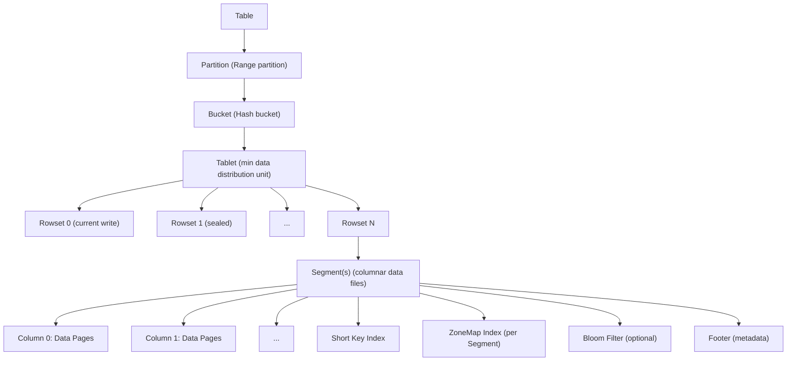
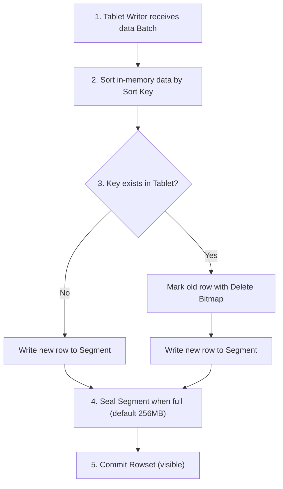
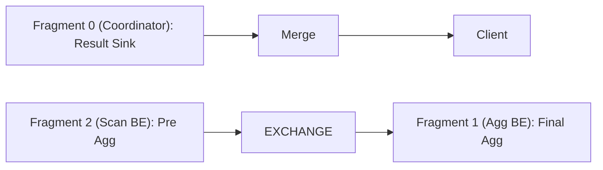
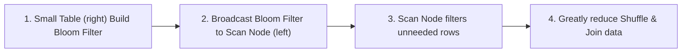
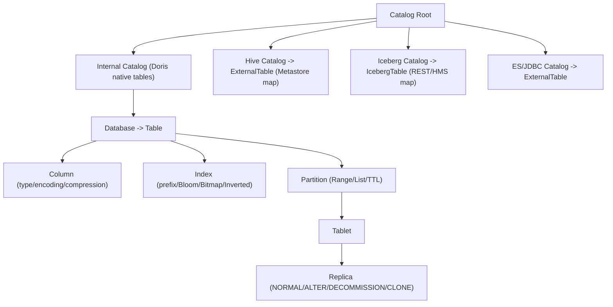
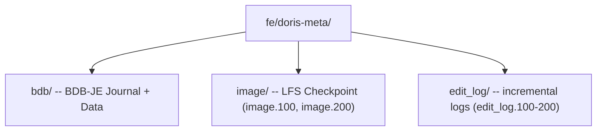
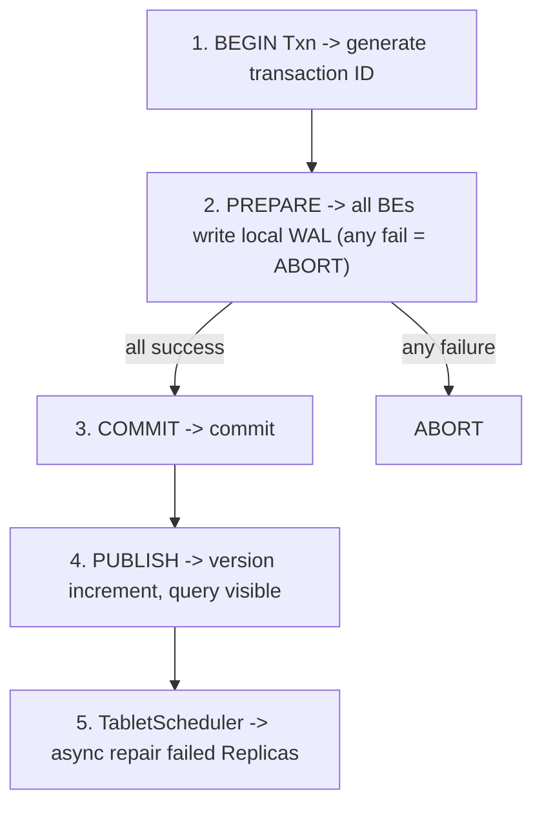
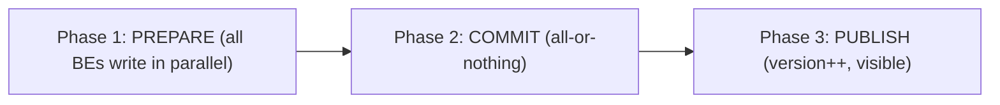

## Apache Doris 实时分析数据库深度调研报告

> **作者**: Stark (CTO, CHANG_AI_TEAM)
> **日期**: 2026-06-12
> **版本**: v1.1
> **摘要**: 涵盖 Apache Doris 核心概念、存储引擎（Segment/Page/Compaction）、查询流程（MPP 向量化）、元数据存储与一致性复制、以及关键架构演进（Palo → Doris 0.x → 1.x → 2.x → 3.0 存算分离）的全面技术调研。

---

## 目录

1. [概述与核心概念](#1-概述与核心概念)
2. [存储引擎](#2-存储引擎)
3. [查询流程](#3-查询流程)
4. [架构演进](#4-架构演进)
5. [元数据存储与一致性复制](#5-元数据存储与一致性复制)
6. [总结与选型建议](#6-总结与选型建议)

---

## 1. 概述与核心概念


Apache Doris 是由百度于 2017 年开源、2022 年进入 Apache 孵化器并毕业的 **MPP（大规模并行处理）架构实时分析数据库**。它专为 OLAP 场景设计，支持高并发、低延迟的多维分析和实时报表查询。

### 1.2 历史沿革

| 时期 | 名称 | 关键事件 |
|------|------|----------|
| 2013~2017 | Palo (内部) | 百度广告报表业务驱动开发，C++ 实现 |
| 2017~2022 | Palo → Doris | 开源，2018 年捐赠 Apache 进入孵化器，2022 年毕业 |
| 2022~2024 | Doris 1.x~2.x | 功能爆发期：Unique Key MoW、倒排索引、湖仓一体 |
| 2024.07 | Doris 3.0 | **里程碑：存算分离架构**正式发布 |
| 2025+ | Doris 3.x~4.x | Nereids 优化器、Falcon 新引擎、Parquet 原生支持 |

### 1.3 整体架构 (Doris 3.0)


Apache Doris 架构分为两大模式：

**A. Shared-Nothing 模式 (v1.x~v2.x，也支持 3.0)**

- **FE (Frontend)**：Java 实现，负责元数据管理、查询解析、查询计划、调度
- **BE (Backend)**：C++ 实现，负责数据存储和查询执行
- FE 元数据存储在 **BDB-JE**（类 BerkeleyDB Java 实现）中，通过类 Paxos 协议 (bdb-je replication) 实现多 FE Master-Follower 一致性
- BE 数据存储为自研 **Segment v2** 格式，多副本通过 Tablet 机制实现

**B. 存算分离模式 (v3.0+)**

在 Shared-Nothing 基础上新增：
- **Compute Group**：计算集群（BE 节点），可弹性扩缩
- **Remote Storage**：对象存储 (S3/HDFS/MinIO)，数据持久层
- **File Cache**：本地 SSD 缓存远程数据，保证查询性能
- **Meta Service**：集中式元数据服务（替代 BDB-JE 单机瓶颈）

---

## 2. 核心概念

### 2.1 数据模型

Doris 提供三种表模型，针对不同场景：

| 模型 | 应用场景 | 写入语义 | 读写性能 |
|------|----------|----------|----------|
| **Duplicate** | 明细数据、日志 | Append-only，无聚合 | 最高吞吐 |
| **Aggregate** | 预聚合指标 | 同 Key 行聚合 (SUM/MAX/MIN/REPLACE) | 写入有聚合开销 |
| **Unique (MoW)** | 主键更新（宽表、CDC） | 同 Key UPSERT | 写入有去重开销，查询最优 |
| **Unique (MoR)** | 追加为主，偶尔去重 | 同 Key 追加，查询时多版本合并 | 写入快，查询有合并开销 |

**MoW (Merge-on-Write)** 是 Doris 2.1+ 默认推荐策略，在写入时完成数据去重合并，读路径无需额外合并开销。

### 2.2 Tablet & Replica

Doris 数据分布以 **Tablet** 为单位：

```
Table → Partition → Bucket (Hash) → Tablet → Replica (多副本)
                ↓
        按日期 Range 分区
                        ↓
                   Hash 分桶到 Tablet
```

- 每个 Tablet 包含一个或多个 **Rowset**（数据文件组）
- Rowset 由多个 **Segment** 文件组成
- 每个 Tablet 的副本数通过 `replication_num` 控制

### 2.3 索引体系

Doris 采用多层索引策略，逐级过滤数据：

| 索引类型 | 层级 | 存储位置 | 过滤效果 |
|----------|------|----------|----------|
| **前缀索引** (Short Key Index) | Tablet 级 | 稀疏索引，内存 | 粗粒度过滤（前 36 字节） |
| **ZoneMap** | Segment 级 | Segment Footer 元数据 | Min/Max/HasNull 统计过滤 |
| **Bloom Filter** | Block 级 | Segment 内 | 快速判不存在 HASH 值 |
| **Bitmap Index** | 列级 | 独立索引文件 | 低基数列精准过滤 |
| **Inverted Index** | 列级 | 独立索引文件 | 全文搜索、Token 匹配 |

### 2.4 Unique Key 模型详解

Unique Key 是 Doris 最重要的模型之一，支持两种实现：

```mermaid
block-beta
    block:Title
        columns 1
        T["<b>Unique Key 表写入流程</b>"]
    end
    block:Comparison
        columns 2
        block:MoW
            H1["<b>Merge-on-Write (MoW)</b><br/><i>Doris 2.1+ 默认</i>"]
            M1["写入时立即查询去重"]
            M2["新增 Key: INSERT"]
            M3["重复 Key: 找到旧行并覆盖"]
            M4["查询: 直接读最新版本"]
            M5["写入延迟: 略高"]
            M6["适用: 实时报表、CDC 同步"]
        end
        block:MoR
            H2["<b>Merge-on-Read (MoR)</b><br/><i>传统实现</i>"]
            R1["写入时不验证 Key"]
            R2["新增 Key: 追加新版本行"]
            R3["重复 Key: 追加新版本行"]
            R4["查询: 多版本行合并取最新值"]
            R5["查询延迟: 较高"]
            R6["适用: 大量追加偶尔查询"]
        end
    end
```




---

## 2. 存储引擎


Doris 存储引擎采用自研 **Segment v2** 格式，基于列式存储思想，结合 LSM-tree 写入和高效 Compaction 策略。

### 2.2 存储层级结构




### 2.3 Segment v2 存储格式

Doris 的 Segment 是自研列式存储格式，核心特点：

**数据组织**：
- 以 **Page** 为最小 I/O 单元（默认 1MB）
- 每个 Column 的数据按 Page 组织，同一 Column 的 Page 物理连续
- Column Page 内部采用 **RLE (Run-Length Encoding)** + **Bit-Packing** 压缩

**元数据布局**：
- **Footer**：存储 Segment 层级元数据（版本号、Column 数量、索引偏移量）
- **Short Key Index**：稀疏索引，每 N 行记录一个 Key，用于快速定位
- **ZoneMap Index**：每 Segment 每列的 Min/Max/NullCount，用于读取剪枝

**与 Parquet 的对比**：

| 维度 | Doris Segment v2 | Apache Parquet |
|------|-----------------|----------------|
| 设计哲学 | OLAP 写入优化，低延迟 | 数据湖通用，压缩优先 |
| Page 大小 | 1MB (可配置) | ~1MB (Row Group) |
| 索引粒度 | Segment + Page 级 | Row Group + Page 级 |
| 编码方式 | RLE + BitPacking + LZ4/ZSTD | Dictionary + RLE + Delta |
| 主键支持 | 原生 Prefix Sort Key | 无 |
| 更新支持 | MoW DELETE_BITMAP | 不可变 |

### 2.4 Compaction 策略

Doris Compaction 负责将多个小 Rowset 合并为大 Rowset，减少碎片、加速查询。

**Compaction 触发机制**：

| 类型 | 触发条件 | 作用 |
|------|----------|------|
| **Cumulative Compaction** | Cumulate Point 之前的 Rowset 数量 > 阈值 | 合并大量小 Rowset |
| **Base Compaction** | Base Rowset 版本过期 | 合并所有 Rowset 为一个 |
| **Quick Compaction** | MoW 表 Segment 数 > 阈值 | 局部合并 Delete Bitmap 过多的小 Segment |
| **Vertical Compaction** | 宽表 (大 Column 数) | 按列组合并，减少内存开销 |

**Compaction 流程**：
1. BE 的 Compaction 线程池定期扫描 Tablet 状态
2. 选取待合并 Rowset 列表
3. 读取源 Rowset 所有 Segment，按 Sort Key 归并排序
4. 对于 MoW 表：同时合并 DELETE_BITMAP，物理删除标记行
5. 写入新 Rowset 到磁盘
6. 原子替换旧 Rowset 元数据

### 2.5 Merge-on-Write 存储实现

MoW 是 Doris 2.1+ 的核心创新，在写入时处理主键冲突：

**写入 MoW Tablet 流程**：



**DELETE_BITMAP**：
- 行级删除标记，位图存储在 Segment 同层
- 查询时先加载 DELETE_BITMAP，跳过被标记行
- Quick Compaction 时物理清除被标记行，释放空间

### 2.6 索引实现

Doris 索引分为内存索引和文件索引两类：

**内存索引**：
- **Tablet 级 Key Index**：全量 Sort Key → Rowset+Segment+RowID 映射，MoW 写入去重的核心
- 采用 Flat Map 实现（高基数 Table 谨慎）

**文件索引**：
- **ZoneMap**：每 Segment 每列的 Min/Max/NullCount →
- **Bloom Filter**：可选择列建 Bloom Filter，判不存在
- **Inverted Index**：2.0+ 支持，底层 CLucene，支持全文检索、模糊匹配
- **N-Gram Bloom Filter**：2.0+ 支持，模糊 LIKE 查询加速


---

## 3. 查询流程


Doris 查询引擎是其高性能的核心，基于自研 C++ 向量化执行引擎，支持标准 SQL 和 MPP 分布式执行。

### 3.2 查询架构总览

```mermaid
flowchart TD
    Client["Client (MySQL Protocol / HTTP / Arrow Flight)"]
    Client --> FE["FE (Frontend) - Java"]

    subgraph FE_["FE (Frontend)"]
        FE --> Parser["SQL Parser (ANSI SQL compat)"]
        FE --> Analyzer["Analyzer (semantic check, Catalog metadata)"]
        FE --> Opt["Optimizer"]
        Opt --> RBO["RBO (Rule-Based, v1.x-2.x)"]
        Opt --> Nereids["Nereids (CBO, v2.1+ exp., v3.0 stable)"]
        Nereids --> Stats["Statistics collection"]
        Nereids --> Cost["Cost Model (CBO best plan)"]
        Nereids --> Rewrite["Plan Rewrite (prune/pushdown/fold)"]
        FE --> Coord["Coordinator"]
        Coord --> Frag["Plan Fragment gen (MPP distributed plan)"]
        Coord --> Par["Parallelism calc"]
        Coord --> Sched["Schedule to BEs"]
        FE --> RM["Result Merger (merge results -> Client)"]
    end

    FE --> BE["BE (Backend) - C++"]

    subgraph BE_["BE (Backend)"]
        BE --> PFE["Plan Fragment Executor"]
        PFE --> Scan["Scan Node -> Segment Reader"]
        Scan --> ZM["ZoneMap pruning"]
        Scan --> Blm["Bloom Filter"]
        Scan --> PIO["Page-level IO"]
        PFE --> Join["Join Node"]
        Join --> HJ["Hash Join (Build/Probe)"]
        Join --> BCJ["Broadcast Join (small table)"]
        Join --> SJ["Shuffle Join (large table)"]
        PFE --> Agg["Agg Node (pre-agg)"]
        PFE --> SL["Sort / Limit / Exchange"]
        BE --> VE["Vectorized Engine"]
        VE --> CB["Columnar Batch (4096 rows/batch)"]
        VE --> SIMD["SIMD accel (SSE/AVX2)"]
        VE --> MP["Memory pool (anti-frag)"]
        BE --> RF["Runtime Filter"]
        RF --> BFG["Bloom Filter gen (Join Build side)"]
        RF --> BCF["Broadcast to Scan Node (early filter)"]
    end
```




### 3.3 分布式执行模型

Doris MPP 执行分为三个阶段：

**Phase 1：Plan Fragment 分发**

FE 将 SQL Plan 拆分为多个 Fragment，每个 Fragment 由 BE 上的一个 Instance 执行：



**Phase 2：Data Shuffle**

BE 间通过 BRPC 进行数据交换，交换策略：

| 策略 | 触发条件 | 说明 |
|------|----------|------|
| **Broadcast** | 右表数据量 < broadcast_row_limit | 全量广播到所有 Scan Node |
| **Hash Shuffle (Partition)** | Join Key 或 Agg Key | 按 Key Hash 重分布 |
| **Bucket Shuffle** | Join Key 与分桶键一致 | 直接按 Bucket 映射，避免 Shuffle |
| **Colocate Join** | 两张表 Colocation Group 相同 | 零 Shuffle，本地 Join |

**Phase 3：Vectorized Execution**

BE 内部以 4096 行为一个 Columnar Batch 流水线处理：
- Scan → Filter → Project → Join → Agg → Sort → Sink
- 全程列式操作，利用 SIMD 加速

### 3.4 Optimizer 演进

| 阶段 | 优化器 | 特点 |
|------|--------|------|
| v0.x~v1.x | 无优化器 | 手工编写的 SQL Rewrite 规则 |
| v1.x~v2.x | RBO (Rule-Based) | 固定规则重写，无成本模型 |
| v2.1+ | Nereids (CBO, 实验) | 基于成本的优化器，统计信息驱动 |
| v3.0+ | Nereids (CBO, 稳定) | 默认优化器，支持 Join Reorder、CTE 重用 |
| v4.0 (计划) | Nereids + Falcon | 新执行引擎，Runtime Filter 增强 |

**Nereids CBO 核心能力**：
- **Join Reorder**：基于表统计信息 (RowCount/NDV) 动态调整 Join 顺序
- **CTE 物化**：公共表表达式物化重用，避免重复计算
- **Runtime Filter**：Join Build 侧生成 Bloom Filter，提前下推过滤 Scan
- **Derived Column Rewrite**：派生列改写，消除不必要的列计算

### 3.5 Runtime Filter

Doris Runtime Filter 是查询加速的核心技术：



**典型收益**：大表 Join 小表，Runtime Filter 可过滤 50%~99% 的无效数据。

### 3.6 Lakehouse 联邦查询

Doris 3.0 支持原生联邦查询多种数据源：

| Catalog 类型 | 支持引擎 | 能力 |
|-------------|----------|------|
| **Hive** | Hive Metastore | 读 Hive 表，支持多文件格式 |
| **Iceberg** | Iceberg REST / HMS | 读 Iceberg v2 表，支持 Time Travel |
| **Paimon** | Filesystem / HMS | 读 Paimon 表，支持 CDC |
| **Hudi** | HMS | 读 Hudi MOR/COW 表 |
| **JDBC** | MySQL/PG/Oracle | 联邦查询 RDBMS |
| **ES** | Elasticsearch | 联邦查询 ES |

```sql
-- 创建 Iceberg Catalog
CREATE CATALOG iceberg_catalog PROPERTIES (
    "type" = "iceberg",
    "iceberg.catalog.type" = "rest",
    "uri" = "http://iceberg-rest:8181/"
);

-- 联邦 Join 查询
SELECT d.user_id, d.order_count, i.item_name
FROM doris_db.user_order_daily d
JOIN iceberg_catalog.item_db.items i ON d.item_id = i.item_id;
```


---

## 4. 架构演进


Apache Doris 经历了从百度内部 OLAP 引擎到 Apache 顶级项目的十多年演进，架构不断进化以应对日益复杂的分析需求。

### 4.2 演进全景


### 4.3 各阶段详解

**Phase 1: Palo (2013~2017) — 百度内部时代**

- **背景**：百度广告报表需要实时多维分析，单机 MySQL 无法满足
- **架构**：Shared-Nothing MPP，单 FE + 多 BE
- **存储格式**：Segment v1，基础列式存储，无 Page 级索引
- **查询引擎**：C++ 解释执行，无向量化
- **数据模型**：仅 Aggregate 模型
- **关键成就**：验证 MPP + 列存方案可行性，支撑百度内部广告报表

**Phase 2: Doris 0.x (2017~2021) — 开源孵化期**

- **架构**：正式开源 Apache 孵化，FE 多 Master 支持 (BDB-JE replication)
- **存储格式**：Segment v2，引入 Page 级索引、ZoneMap、Bloom Filter
- **查询引擎**：引入向量化引擎 (SIMD)，性能 5-10x 提升
- **数据模型**：新增 Duplicate 模型、Unique Key 模型 (MoR)
- **关键功能**：
  - Routine Load (Kafka 实时导入)
  - Broker Load (HDFS/S3 批量导入)
  - Colocate Join (本地 Join 优化)
- **生态**：进入 Apache 孵化器，社区逐步活跃

**Phase 3: Doris 1.x~2.x (2022~2024) — 功能爆发期**

- **架构**：Shared-Nothing 成熟，FE 多节点高可用，BE 横向扩展
- **存储格式**：Segment v2 完善，新增 DELETE_BITMAP 支持
- **数据模型**：Unique Key MoW 成为默认
- **索引增强**：Inverted Index (全文搜索)、N-Gram Bloom Filter (模糊 LIKE)
- **查询引擎**：Nereids CBO 优化器（实验→稳定）
- **湖仓一体**：Multi-Catalog 联邦查询 (Hive/Iceberg/Hudi)
- **半结构化**：Variant 类型、半结构化自动 Schema 推导
- **其他亮点**：
  - Workload Group (资源隔离)
  - Auto Partition (自动分区)
  - Arrow Flight SQL (高速数据传输协议)

**Phase 4: Doris 3.0+ (2024~至今) — 存算分离**

- **核心变革**：引入 Compute-Storage Separation
- **存储层**：支持 S3/HDFS/MinIO 作为 Remote Storage
- **计算层**：Compute Group 弹性扩缩
- **缓存层**：File Cache 保证查询延迟不退化
- **元数据层**：Meta Service (集中式元数据管理)
- **新功能**：
  - 读写分离 (Read/Write Compute Group)
  - 远程 Compaction (存算分离专用)
  - Partition Pruning 增强
  - Lakehouse 性能接近本地表

**Phase 5: 4.x+ Roadmap (2025+ 规划中)**

- **Falcon 执行引擎**：全新 C++ 向量化引擎，替代现有引擎
- **Parquet 原生存储**：Segment v2 → Parquet 格式，与数据湖生态深度打通
- **Streaming SQL**：流批一体计算
- **Multi-Warehouse**：多计算集群共享同一份数据
- **AI/ML 集成**：内置 ML 推理算子、Python UDF

### 4.4 关键架构决策回顾

| 时间 | 决策 | 影响 |
|------|------|------|
| 2013 | C++ 实现 BE | 极致性能基础，无 GC 开销 |
| 2017 | 开源 + Apache 捐赠 | 生态增长，社区贡献 |
| 2021 | Segment v2 + 向量化 | 查询性能超越 Impala/Kylin |
| 2022 | Unique Key MoW | 实时 Upsert 能力，CDC 场景突破 |
| 2023 | Nereids CBO 优化器 | Join 优化重大提升 |
| 2023 | Multi-Catalog 湖仓 | 架构从独立数仓扩展到联邦查询 |
| 2024 | 存算分离 3.0 | 成本优化 + 弹性扩展 |
| 2025 | 倒排索引 2.0 | 日志搜索场景直接竞争 ES |

### 4.5 生态位置

**Doris 在实时分析 OLAP 领域的定位：**

| 能力维度 | Doris 覆盖情况 | 主要替代方案 |
|---------|--------------|------------|
| 高性能查询 | ★ (核心优势) | ClickHouse, StarRocks |
| 实时导入 | ★ (核心优势) | Kafka+Flink → Doris |
| 统一模型 | ★ (核心优势) | StarRocks |

**Doris vs 主要竞品:**

| 维度 | Doris | ClickHouse | StarRocks | Impala |
|------|-------|-----------|-----------|--------|
| 架构 | MPP+C++ | MPP+C++ | MPP+C++ | MPP+C++ |
| Upsert 能力 | ★★★★★ | ★★ | ★★★★ | ★★ |
| 高并发查询 | ★★★★ | ★★ | ★★★★ | ★★ |
| 大宽表扫描 | ★★★★ | ★★★★★ | ★★★★ | ★★★ |
| 湖仓一体 | ★★★★ | ★★★ | ★★★★ | ★★★★★ |
| 实时导入 | ★★★★★ | ★★★ | ★★★★ | ★★ |
| 存算分离 | ★★★★ | ★★★★★ | ★★★★ | ★★ |
| 运维复杂度 | ★★★(中) | ★★★★(高) | ★★★(中) | ★★★★★(高) |

> 💡 **核心差异化优势**：Doris 在 **Upsert (MoW) + 高并发查询 + 实时导入** 三个维度形成了独特优势组合，这是 ClickHouse/Impala 无法同时覆盖的。


---

## 5. 元数据存储与一致性复制


## 6. 元数据存储与一致性复制

### 6.1 Meta Service：元数据存储结构

Doris 元数据管理经历了从 **BDB-JE 单机** → **BDB-JE Replication（类 Paxos）** → **Meta Service 存算分离** 的演进。


#### 6.1.1 元数据存储分层

Doris 元数据采用 **三层存储模型**，渐进式加载以减少内存压力：

| 层级 | 存储位置 | 内容 | 特点 |
|------|----------|------|------|
| **Catalog (FE)** | FE 元数据持久化层 (BDB-JE / Meta Service) | 所有元数据全集 | 持久化，版本化，支持事务 |
| **FE 内存缓存** | FE Heap | 热点元数据 | LRU 淘汰，被动加载 |
| **BE 内存** | BE Heap | 本地 Tablet 元数据子集 | 仅自己所管理 Tablet |

#### 6.1.2 元数据核心对象关系



#### 6.1.3 BDB-JE 元数据存储 (v0.x~v2.x)

Doris 0.x~2.x 使用 **BDB-JE** 作为 FE 元数据持久化引擎：

- **单 Leader 写入**：通过 BDB-JE 类 Paxos 协议实现 FE 间复制
- **事务性写入**：CREATE TABLE / schema change 以 BDB-JE 事务提交
- **EditLog 机制**：每次变更生成 EditLog Entry，Follower 重放
- **Checkpoint**：定期 Snapshot，减少 EditLog 回放开销

FE 元数据文件布局：



**Follower 回放流程：** BRPC 拉取最新 EditLog → 校验 CheckSum → 逐 Entry 回放到本地内存 → 更新版本号

#### 6.1.4 Meta Service：存算分离元数据 (Doris 3.0+)

Doris 3.0 将元数据从 FE 内嵌 BDB-JE 剥离到**独立集中式 Meta Service**：

- **存储引擎**：BDB-JE → FoundationDB (FDB) 或自研 Raft-based KV Store
- **多客户端并发写**：多 FE 可并发写不同 Key 范围，不再受单写锁限制
- **弹性恢复**：新 FE 启动直接查询 Meta Service，无需回放完整 EditLog
- **存算分离**：元数据和数据层彻底解耦

#### 6.1.5 Meta Service 元数据 Key 设计

分层 Key-Value 命名空间，按前缀组织，支持 CAS Write（revision 字段）：

```
/meta/{cluster}/db/{db}/table/{table}         → 表层元数据
/meta/{cluster}/tablet/{tablet}                → Tablet 元数据
/meta/{cluster}/tablet/{tablet}/replica/{be}   → Replica 状态
/txn/{cluster}/db/{db}/txn/{txn}               → 事务元数据
```

#### 6.1.6 元数据缓存与淘汰

FE ImageCache 采用 **LRU 链表 + 版本校验**：
- 每次查询先校验本地版本号 vs Meta Service 版本号
- 惰性加载：未命中时从 Meta Service 增量拉取
- 热点表标记 Pinned，不参与淘汰

---

### 6.2 控制面：多副本复制 (Tablet Replication)

#### 6.2.1 Shared-Nothing 复制 (v0.x~v2.x)

写入路径：Load Job → FE 分配 Tablet → BE 本地写入 Segment → Rowset 提交 → **TabletScheduler 异步 Clone 补齐副本**

**TabletScheduler** 控制面核心组件：

| 功能 | 说明 |
|------|------|
| 修复 | Replica 缺失/版本落后/故障时创建 Clone Task |
| 均衡 | BE 间 Tablet 数量不均衡时创建 Balance Task |
| 变更 | Alter Job 触发 Tablet 重写 |
| 退役 | Decommission BE 时迁移 Tablets |
| 优先级 | **REPAIR > BALANCE > ALTER** |

**Clone Task 状态机：** PENDING → SCHEDULED → RUNNING → FINISHED / TIMEOUT（重试 3 次后放弃）

**多副本一致性保障：**

| 阶段 | 策略 |
|------|------|
| 写入 | Single-Replica Write（单副本成功即完成） |
| 复制 | Asynchronous Clone（TabletScheduler 异步调度） |
| 读取 | Replica Version Check（仅选版本足够的 Replica） |
| 健康 | 定期心跳 + VersionReport（BE 每 10s 上报） |
| 修复 | 自动检测版本缺失 → 触发 Clone 补齐 |

#### 6.2.2 存算分离复制 (Doris 3.0+)

复制策略从「BE 间 Clone」变为「Object Store 为中心」：

写入路径：BE 写 WAL → Flush Object Store → Meta Service 更新版本 → 其他 Compute Node 感知 → File Cache 预热

**核心差异：**

| 维度 | Shared-Nothing | 存算分离 |
|------|---------------|----------|
| 复制目标 | BE 间 Clone | Object Store 持久数据 |
| 副本数 | 3 | 1 (Object Store 高可用) |
| 一致性 | 最终一致性 | 写后即持久 |
| 故障恢复 | TabletScheduler 克隆 | 直读 Object Store |
| 存储成本 | 3× | 1× + Object Store 副本 |

---

### 6.3 数据面：写入路径一致性


#### 6.3.1 单 Tablet 写入一致性

三层保证：**FE 2PC 事务协调 + BE 本地 WAL + TabletScheduler 修复**



**失败处理：**
- PREPARE 部分成功 → FE 发 ABORT，BE 撤销 WAL
- COMMIT 部分到达 → BE 重启后 Gossip 同步版本 + TabletScheduler 修复
- PUBLISH 后部分不可见 → 查询跳过不可见 Replica，补齐后恢复

#### 6.3.2 事务模型

**A. 单 Tablet 事务**（Routine Load / Small Batch）：延迟最低，写入结束即提交

**B. 2PC 分布式事务**（Broker Load / INSERT INTO SELECT）：


**Label 幂等性：** 每个 Load Job 全局唯一 Label，FE 持久化 `Label → TxnId`，重试返回已存在 TxnId → Exactly-Once Write

#### 6.3.3 Compaction 一致性

每个 Replica 独立执行 Compaction，不依赖跨副本一致性：

| 阶段 | 保证 |
|------|------|
| 选择 Rowset | 仅选已 Publish 版本 |
| 合并执行 | 读取源 → 合并 → 写新文件（不修改源） |
| 原子替换 | CAS 替换元数据指针 |
| 并发安全 | 每 Tablet 同时最多 1 个 Compaction |

---

### 6.4 故障恢复矩阵

| 故障 | 检测 | 恢复 | RTO |
|------|------|------|-----|
| FE Master 宕机 | BDB-JE 心跳 | Follower 提升，重放 EditLog | ~10-30s |
| FE Follower 宕机 | BDB-JE 心跳 | 其他 Follower/Observer 承接查询 | 0 |
| BE 宕机 (SN) | FE 心跳 10s | TabletScheduler Clone Task | 分钟级 |
| BE 宕机 (存算分离) | FE 心跳 | 新 Compute Node 直读 Object Store | 秒级 |
| 磁盘故障 | BE 自检 | TabletScheduler 修复 | 分钟级 |
| 版本不一致 | VersionReport | TabletScheduler 自动补齐 | 分钟级 |
| Meta Service 宕机 | FE 检测 | RAFT 自身高可用 | 秒级 |

### 6.5 核心设计哲学

> 💡 Doris 采用 **控制面集中协调 + 数据面去中心化执行** 架构。FE 负责元数据一致性和全局调度（2PC、TabletScheduler），BE 间无中心依赖，数据复制通过异步 Clone 或 Object Store 共享实现。存算分离 3.0 进一步将控制面元数据从 FE 剥离到独立 Meta Service，实现完全解耦。

**控制面：** BDB-JE/Meta Service + Paxos/RAFT + TabletScheduler + 2PC + Load Manager

**数据面：** Segment v2 + WAL/MoW + Compaction + Clone + File Cache


---

## 6. 总结与选型建议

### 6.1 关键差异总结

| 维度 | Doris 2.x (Shared-Nothing) | Doris 3.x (存算分离) |
|------|---------------------------|---------------------|
| 架构模式 | Shared-Nothing MPP | Compute-Storage Separation |
| 存储层 | 本地 SSD/HDD | Object Store (S3/HDFS/MinIO) |
| 弹性扩缩 | 数据重分布，小时级 | 计算节点秒级弹性 |
| 成本 | 高 (计算+存储绑定) | 低 (按需弹性，存储下沉) |
| 写路径 | MoW 本地写入 | MoW + 远程 Compaction |
| 读路径 | 本地 Segment 读取 | File Cache + 远程拉取 |
| 高可用 | Multi-Replica | Multi-Replica + 远程副本 |
| 成熟度 | 7年+，稳定 | 1年+，快速发展中 |

### 6.2 关键能力总结

| 能力 | 描述 |
|------|------|
| 数据模型 | Duplicate / Aggregate / Unique (MoW/MoR) |
| 存储格式 | Segment v2 (自研列式) → 未来 Parquet |
| 索引 | 前缀索引 + Bloom Filter + Bitmap + Inverted Index |
| 查询引擎 | 自研 C++ 向量化引擎 → 4.0 Nereids + Falcon |
| 湖仓一体 | 原生 Catalog 联邦查询 (Hive/Iceberg/Paimon/Hudi) |
| 半结构化 | 原生 Variant 类型、倒排索引 (ES 级搜索) |
| 并发扩展 | 3.0 Workload Group + 读写分离 Compute Group |

### 6.3 选型建议

| 场景 | 推荐方案 | 原因 |
|------|----------|------|
| **实时报表 / 多维分析** | Doris 3.x | 极致查询性能，标准 SQL，亚秒级响应 |
| **广告归因 / 用户行为分析** | Doris 3.x Unique MoW | 高效 Upsert，QPS 万级 |
| **日志分析 + 全文搜索** | Doris 3.x + Inverted Index | 倒排索引性能接近 Elasticsearch 2~5x |
| **数据湖查询加速** | Doris 3.x Lakehouse | 原生 Iceberg/Paimon/Hudi 联邦查询 |
| **IoT 时序 / 监控指标** | 考虑 InfluxDB 3 或 ClickHouse | Doris 非专为高基数时序优化 |
| **ETL 宽表加工** | Doris 2.x / Doris 3.x | 支持增量 Upsert，CDC 实时导入 |

### 6.4 我们的建议

对于 CHANG_AI_TEAM 的可观测性平台项目，Apache Doris 作为分析层而非热存储层：

1. **定位为分析层**：Doris 擅长大规模数据多维聚合分析，适合查询层、报表层
2. **不替代时序存储**：热指标数据仍用 InfluxDB，Doris 聚焦聚合结果和用户行为分析
3. **Lakehouse 补充**：使用 Doris Iceberg Catalog 对接数据湖，实现分析查询加速
4. **关注 3.x 存算分离**：降低成本、提升弹性，适配云原生部署策略
5. **Nereids + Falcon 值得关注**：全新优化器 + 执行引擎，预计 4.x 主推

---

## 参考资料

- [Apache Doris 官方文档](https://doris.apache.org/docs/)
- [Doris 3.0 Release Notes](https://github.com/apache/doris/issues/37502)
- [Compute-Storage Decoupled Architecture](https://www.velodb.io/blog/slash-your-cost-90-apache-doris-compute)
- [Unique Key & Merge-on-Write](https://doris.apache.org/docs/dev/key-features/unique-key/)
- [Doris Roadmap 2025](https://github.com/apache/doris/issues/47948)
- [Doris Compaction Principles](https://doris.apache.org/docs/dev/admin-manual/trouble-shooting/compaction-principles/)
- [Data Update Overview (MoW vs MoR)](https://doris.apache.org/docs/3.x/data-operate/update/update-overview/)

## 附录：图表清单

| 图 | 文件 | 内容 |
|----|------|------|
| 01 | `Doris调研/diagram/01-architecture-overview.svg` | Apache Doris 整体架构 |
| 02 | `Doris调研/diagram/02-storage-engine.svg` | 存储引擎 Segment/Page 体系 |
| 03 | `Doris调研/diagram/03-write-path-mow.svg` | Merge-on-Write 写入路径 |
| 04 | `Doris调研/diagram/04-query-execution.svg` | MPP 向量化查询执行 |
| 05 | `Doris调研/diagram/05-architecture-evolution.svg` | Palo → Doris 3.0 架构演进 |
| 06 | `Doris调研/diagram/06-metadata-store.svg` | Meta Service 元数据存储三层模型 |
| 07 | `Doris调研/diagram/07-write-consistency.svg` | 写入路径 2PC 事务一致性流程 |

---

> **修订历史**:
> - 2026-06-12 v1.1: 新增第 5 章「元数据存储与一致性复制」，含 2 张新增技术图（06、07）
> - 2026-06-12 v1.0: 初始版本，含 5 张技术图、4 个子文档
