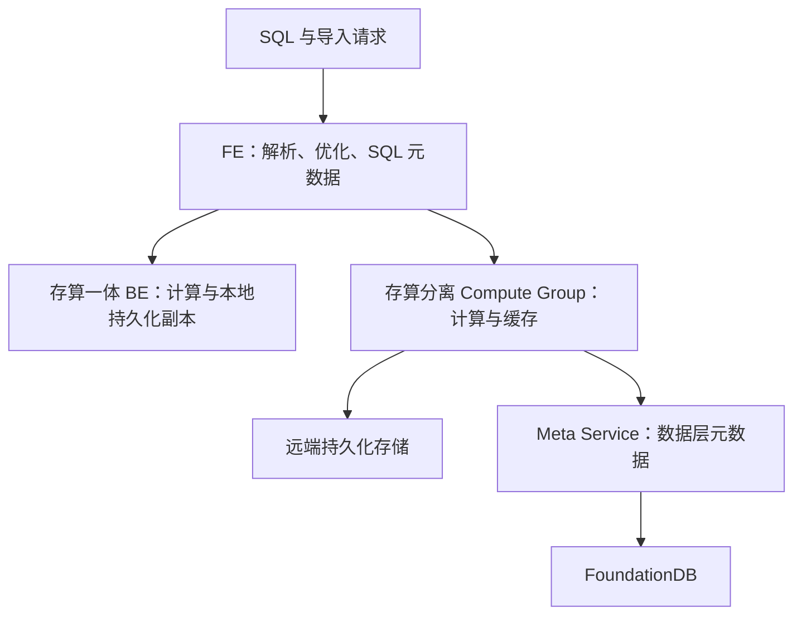
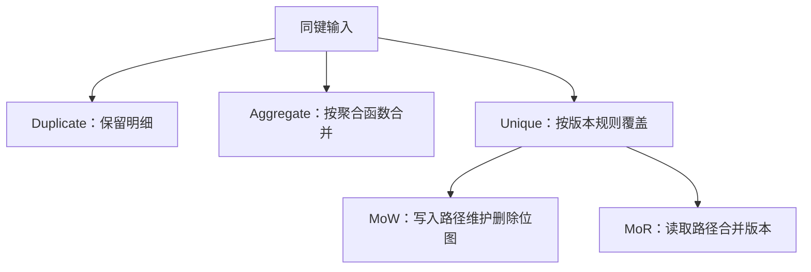
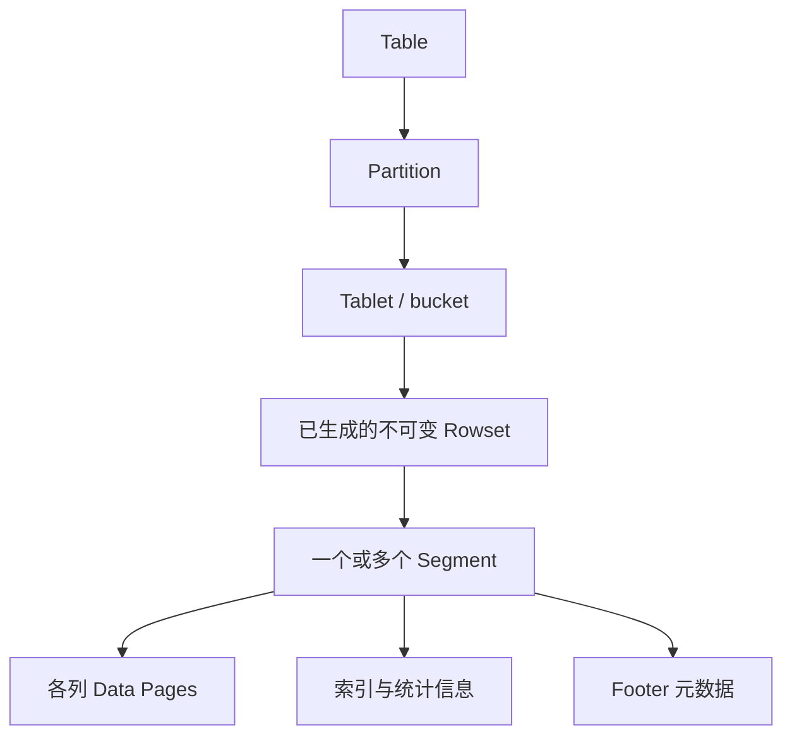
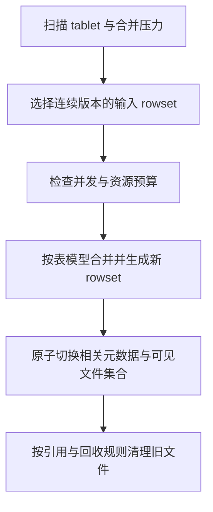
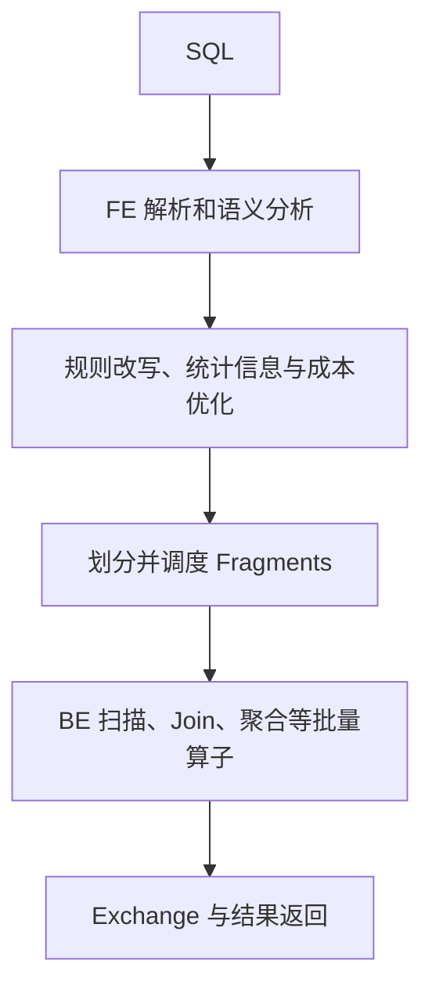
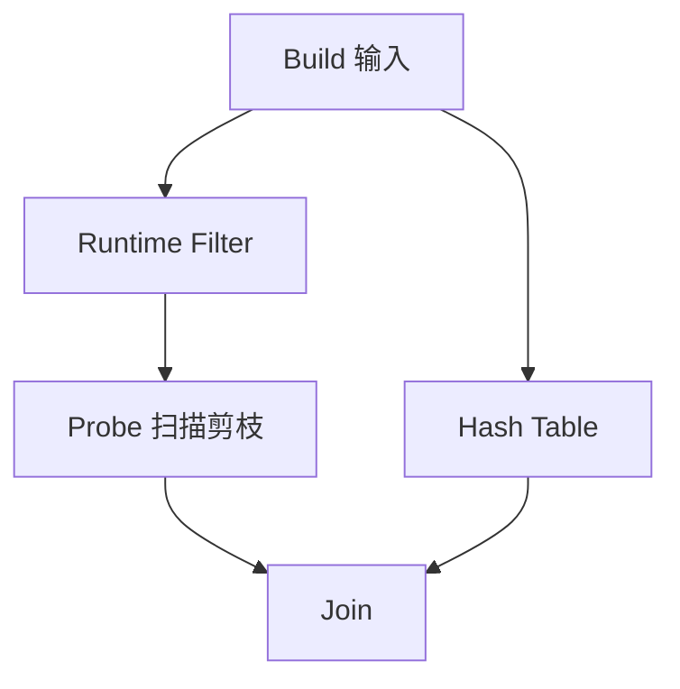
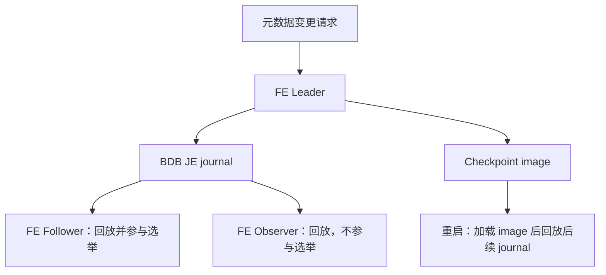
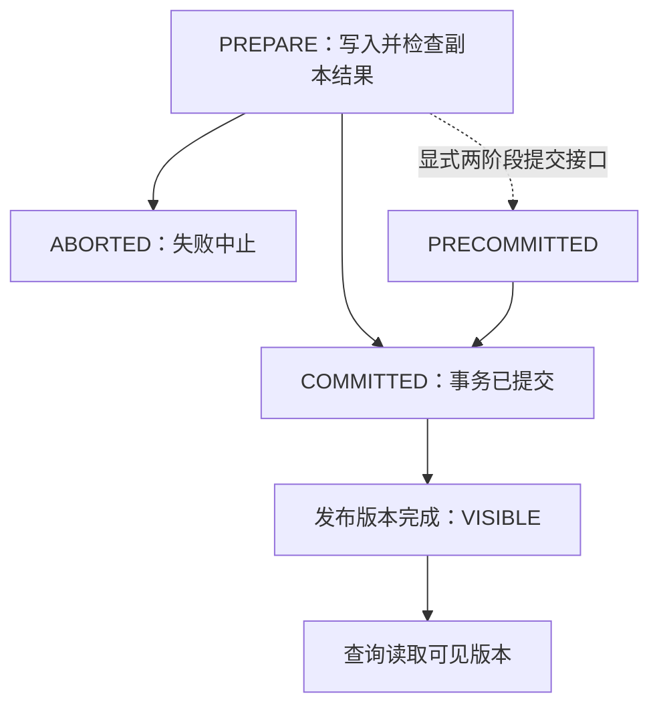

## Apache Doris 实时分析数据库深度调研报告

> **作者**: Stark (CTO, CHANG_AI_TEAM)
> **日期**: 2026-06-12
> **版本**: v1.1
> **摘要**: 涵盖 Apache Doris 核心概念、存储引擎（Segment/Page/Compaction）、查询流程（MPP 向量化）、元数据存储与一致性复制、以及关键架构演进（Palo → Doris 0.x → 1.x → 2.x → 3.0 存算分离）的全面技术调研。

---

## 目录

1. [概述与核心概念](#1-概述与核心概念)
2. [存储引擎](#2-存储引擎)
3. [查询流程](#3-查询流程)
4. [架构演进](#4-架构演进)
5. [元数据存储与一致性复制](#5-元数据存储与一致性复制)
6. [总结与选型建议](#6-总结与选型建议)

---

## 1. 概述与核心概念

## Doris 概述与模型

本次修订保留原文章路径；以下按已核对的主题重组。详细的版本与证据范围在各节说明。

## Doris 架构演进：共同的查询入口与两种存储部署

本文按架构职责比较经典存算一体和 3.0 引入的存算分离模式。版本功能首次出现的时间，需要逐版本发布说明佐证；旧稿中未找到依据的 Falcon、全面改用 Parquet 等路线图已撤回。

两条分支是可选部署模式，不是一个查询顺次经过的流水线。FE 仍负责规划和 SQL 层元数据；Meta Service 负责数据层元数据，不能理解为替换所有 FE/BDB JE 职责。

### 架构变化解决了什么

| 维度 | 存算一体 | 存算分离 |
|---|---|---|
| 扩容 | 本地数据与计算一同规划 | 计算组可独立调整，持久数据共享 |
| 数据访问 | 本地副本读取 | 缓存命中或远端读取 |
| 运维重点 | 副本分布、磁盘、compaction | 远端存储、元数据服务、缓存预热及隔离 |
| 延迟风险 | 数据倾斜、合并竞争 | 冷缓存、网络、远端存储与元数据依赖 |

本地 File Cache 降低远端读取成本，但不保证扩容或故障后延迟完全不变。“无状态计算”描述持久化职责，不表示节点没有缓存状态，也不意味着扩容瞬时完成。

### 与查询和存储演进的关系

Nereids 影响计划选择，向量化执行影响算子效率，Unique MoW 影响主键更新和读取合并，存算分离影响资源配置。这些是不同维度，不能把某次向量化基准的倍数直接套在架构升级的全部负载上。

学习路径：[Doris 数据模型：三种模型与 Unique 的两种实现]({{ '/knowledge/Doris-数据模型/' | relative_url }}) → [Doris Segment v2：文件布局与表级语义]({{ '/knowledge/Doris-Segment-v2-存储格式/' | relative_url }}) → [Doris Compaction：选哪些文件与怎样合并]({{ '/knowledge/Doris-Compaction-策略/' | relative_url }}) → [Doris MPP 向量化查询引擎]({{ '/knowledge/Doris-MPP-向量化查询引擎/' | relative_url }}) → [Doris 元数据、复制与导入可见性]({{ '/knowledge/Doris-元数据与一致性复制/' | relative_url }})。

### 核验来源

- [Doris 系统架构](https://doris.apache.org/docs/dev/features-architecture/system-architecture/)
- [存算分离部署与 FoundationDB](https://doris.apache.org/docs/4.x/install/deploy-on-kubernetes/separating-storage-compute/install-doris-cluster/)

## Doris 数据模型：三种模型与 Unique 的两种实现

模型先决定“同键数据的业务含义”，再影响写入、读取和合并成本。Duplicate、Aggregate、Unique 是三种表模型；MoW 与 MoR 是 Unique 模型的实现方式，不应再计为第四种模型。

| 模型 | 同键两行的含义 | 必须承担的工作 | 适合的问题 |
|---|---|---|---|
| Duplicate | 保留两条明细，排序键不等于唯一约束 | 查询按需要聚合 | 日志、事件明细 |
| Aggregate | 按声明的聚合函数合并值 | 导入、compaction、查询阶段可能继续合并 | 固定维度指标 |
| Unique | 同一主键保留逻辑上的有效版本 | 判定版本、覆盖与删除 | CDC、主键更新 |

### 用三条记录检验模型

设输入为 `(A, 10), (A, 20), (B, 5)`。Duplicate 保留三行；Aggregate 的 value 列声明 SUM 时，A 的聚合结果为 30；Unique 的结果取决于版本顺序、sequence 配置等，不能把任意到达较晚的网络包都理解为业务上最新的数据。

### MoW 的逻辑删除不等于立即回收空间

MoW 将新行写入新 rowset，同时维护旧行的删除位图。查询跳过不可见的旧行；旧数据的物理字节仍可能保留到 compaction 等回收过程。它减少了查询时合并主键版本的工作，但不承诺所有查询都最快，也不是“磁盘只存最新版本”。部分列更新还可能需要查找、补齐未更新列。

MoR 把更多版本合并工作留在读取路径。二者的取舍应结合更新比例、主键宽度、批次大小、查询选择性与 compaction 压力实测。不能用一个没有硬件和负载条件的吞吐排序代替选型。

Aggregate 也不保证查询无需聚合：多个 rowset 中的同键聚合状态仍需合并，查询维度更粗时还要再次聚合。预聚合会失去一部分明细可恢复性，因此应先验证需要保留的查询能力。

关联：[Doris Segment v2：文件布局与表级语义]({{ '/knowledge/Doris-Segment-v2-存储格式/' | relative_url }})、[Doris Compaction：选哪些文件与怎样合并]({{ '/knowledge/Doris-Compaction-策略/' | relative_url }})、[LSM-Tree 与 RUM 猜想]({{ '/knowledge/LSM-Tree-RUM猜想/' | relative_url }})。

### 核验来源

- [Doris 4.x 更新与删除](https://doris.apache.org/docs/4.x/key-features/data-update-delete/)
- [Doris 预聚合与 Rollup](https://doris.apache.org/docs/dev/key-features/preaggregation-and-rollup/)

---

## 2. 存储引擎

## Doris 存储引擎

本次修订保留原文章路径；以下按已核对的主题重组。详细的版本与证据范围在各节说明。

## Doris Segment v2：文件布局与表级语义

Segment 是列式数据文件；Rowset 由一个或多个 segment 组成；tablet 的可见版本由 rowset 与相关元数据组织。写入先在内存处理，生成不可变文件，而不是不断原地修改“Rowset 0”。

### 读取为什么能跳过数据

排序键、短键索引、列统计和可选索引共同帮助定位候选范围。Bloom filter 的“不存在”可排除数据，命中仍可能是误判；ZoneMap 根据范围统计剪枝，不能保证任意谓词都有效。具体 Page 大小、编码和索引文件布局取决于类型、版本与配置，旧稿固定 1MB、所有列物理连续等说法不再作为统一保证。

### Unique MoW 的删除位图

删除位图记录旧行的可见性，查询跳过这些行。它不是在 segment 数据区原地改值；compaction 生成新 rowset 时可清理不再需要的旧版本。回收不应只归因于一个未经版本核实的 Quick Compaction 名称。

### 与 Parquet 的合理比较

两者都是列式文件组织。Parquet 的 row group 与 page 是不同层级，不能把“约 1MB Page”写成“1MB Row Group”。主键唯一性、事务提交和 MoW 可见性来自 Doris 引擎及元数据协议，不能把前缀排序索引本身当成文件格式的主键约束。开放格式是否适用，还要考虑更新、索引、生态和引擎接口。

关联：[Doris 数据模型：三种模型与 Unique 的两种实现]({{ '/knowledge/Doris-数据模型/' | relative_url }})、[Doris Compaction：选哪些文件与怎样合并]({{ '/knowledge/Doris-Compaction-策略/' | relative_url }})、[Doris 元数据、复制与导入可见性]({{ '/knowledge/Doris-元数据与一致性复制/' | relative_url }})。

### 核验来源

- [Doris 更新与删除](https://doris.apache.org/docs/4.x/key-features/data-update-delete/)
- [Compaction 原理](https://doris.apache.org/docs/4.x/admin-manual/trouble-shooting/compaction-principles/)

## Doris Compaction：选哪些文件与怎样合并

不能把 Cumulative、Base、Vertical 和一次导入内的 Segment Compaction 当成四个互斥的同级策略：前两者偏向 rowset 选择与合并范围，Vertical 是执行算法，Segment Compaction 位于导入内的 segment 合并过程。

| 机制 | 主要解决的问题 | 代价或限制 |
|---|---|---|
| Cumulative | 小增量 rowset 积累 | 与导入和读取竞争资源 |
| Base / Full | 更大范围的历史 rowset 整理 | 大任务的 I/O 与运行时间 |
| Vertical | 分列组处理，降低宽表合并工作集 | 需要维护行来源顺序；收益依赖宽度与 I/O |
| Segment Compaction | 单次大批量导入产生过多 segment | 需结合导入路径与版本配置 |

新输出必须保持原来版本范围和表模型的逻辑结果。更多线程并非必然更快：当磁盘或内存已饱和，会放大前台尾延迟。观察 rowset 数、compaction score、待处理字节、写入失败和查询 P99，再结合批量大小及时间序列策略调整。

官方宽表案例中的内存和速度收益只适用于其条件，不应改写为全部表的性能保证。LSM 的写放大框架有助于分析，但 Doris 的 rowset/version 与标准 RocksDB 层级并不一一对应。

关联：[Doris Segment v2：文件布局与表级语义]({{ '/knowledge/Doris-Segment-v2-存储格式/' | relative_url }})、[LSM-Tree 合并优化 (Merge Optimization)]({{ '/knowledge/LSM-Tree-合并优化/' | relative_url }})。

### 核验来源

- [Compaction 原理](https://doris.apache.org/docs/4.x/admin-manual/trouble-shooting/compaction-principles/)
- [Vertical 与 Segment Compaction](https://doris.apache.org/docs/dev/admin-manual/trouble-shooting/compaction/)

---

## 3. 查询流程

## Doris 查询流程：规划、分布与执行

一个 Fragment 可以有多个并行实例，实例分布与查询计划相关。向量化以列式批次减少解释与函数调用成本，批次大小和 SIMD 使用取决于配置、类型及算子，不能固定写成所有执行都为 4096 行。

## 数据分布和 Join

| 方式 | 作用 | 需要的条件 |
|---|---|---|
| Broadcast | 将一侧数据送到所需执行节点 | 大小估计、内存、Join 语义与成本 |
| Hash Shuffle | 按连接/聚合键重新分布 | 网络代价与数据倾斜可接受 |
| Bucket Shuffle | 利用已有 bucket 分布减少一侧重分布 | 键与分布条件匹配；不等于完全没有 shuffle |
| Colocate | 利用兼容放置执行本地 Join | 表组、分桶和放置满足要求 |

Runtime Filter 来自 Join 的 build 输入，可下推到适用的 probe 侧扫描。左右表不是固定角色；过滤率取决于数据选择性，旧稿没有数据集依据的 50%–99% 不作为保证。

## 优化器与联邦查询

Nereids 结合规则、统计信息和成本模型选择计划。统计信息过期、相关性估计错误及倾斜都会影响结果；使用 EXPLAIN 与 profile 看真实计划，而非根据版本名预设必然更快。外部 Catalog 扩展数据源访问，但不能把某一数据源支持的读写、时间旅行或 schema 能力推广到其他 Catalog。

本次未对每个历史版本逐条核实首次引入时间，因此撤回旧“v4 Falcon”等未经证实的路线图。阅读 [Doris Nereids CBO 优化器]({{ '/knowledge/Doris-Nereids-CBO-优化器/' | relative_url }}) 与 [Doris MPP 向量化查询引擎]({{ '/knowledge/Doris-MPP-向量化查询引擎/' | relative_url }}) 时应同样以具体版本为准。

## 核验来源

- [Doris 系统架构](https://doris.apache.org/docs/dev/features-architecture/system-architecture/)

---

## 4. 架构演进

## Doris 架构演进：共同的查询入口与两种存储部署

本文按架构职责比较经典存算一体和 3.0 引入的存算分离模式。版本功能首次出现的时间，需要逐版本发布说明佐证；旧稿中未找到依据的 Falcon、全面改用 Parquet 等路线图已撤回。

两条分支是可选部署模式，不是一个查询顺次经过的流水线。FE 仍负责规划和 SQL 层元数据；Meta Service 负责数据层元数据，不能理解为替换所有 FE/BDB JE 职责。

## 架构变化解决了什么

| 维度 | 存算一体 | 存算分离 |
|---|---|---|
| 扩容 | 本地数据与计算一同规划 | 计算组可独立调整，持久数据共享 |
| 数据访问 | 本地副本读取 | 缓存命中或远端读取 |
| 运维重点 | 副本分布、磁盘、compaction | 远端存储、元数据服务、缓存预热及隔离 |
| 延迟风险 | 数据倾斜、合并竞争 | 冷缓存、网络、远端存储与元数据依赖 |

本地 File Cache 降低远端读取成本，但不保证扩容或故障后延迟完全不变。“无状态计算”描述持久化职责，不表示节点没有缓存状态，也不意味着扩容瞬时完成。

## 与查询和存储演进的关系

Nereids 影响计划选择，向量化执行影响算子效率，Unique MoW 影响主键更新和读取合并，存算分离影响资源配置。这些是不同维度，不能把某次向量化基准的倍数直接套在架构升级的全部负载上。

学习路径：[Doris 数据模型：三种模型与 Unique 的两种实现]({{ '/knowledge/Doris-数据模型/' | relative_url }}) → [Doris Segment v2：文件布局与表级语义]({{ '/knowledge/Doris-Segment-v2-存储格式/' | relative_url }}) → [Doris Compaction：选哪些文件与怎样合并]({{ '/knowledge/Doris-Compaction-策略/' | relative_url }}) → [Doris MPP 向量化查询引擎]({{ '/knowledge/Doris-MPP-向量化查询引擎/' | relative_url }}) → [Doris 元数据、复制与导入可见性]({{ '/knowledge/Doris-元数据与一致性复制/' | relative_url }})。

## 核验来源

- [Doris 系统架构](https://doris.apache.org/docs/dev/features-architecture/system-architecture/)
- [存算分离部署与 FoundationDB](https://doris.apache.org/docs/4.x/install/deploy-on-kubernetes/separating-storage-compute/install-doris-cluster/)

---

## 5. 元数据存储与一致性复制

## Doris 元数据、复制与导入可见性

## 先分清三类状态

FE 的 SQL 元数据、BE 上的数据副本、存算分离模式的存储元数据，不能画成一条统一的 Raft 日志。

| 状态 | 经典存算一体模式 | 存算分离模式中的变化 |
|---|---|---|
| 库表 schema、权限、集群信息 | FE 管理 | FE 仍保留 SQL 层职责 |
| FE 元数据持久化和复制 | image + BDB JE journal；单 Leader 接受变更 | 不能据 Meta Service 的存在推断 FE 元数据全部消失 |
| tablet / rowset 等数据层元数据 | BE 与 FE 按职责管理 | Meta Service 承担数据层元数据及相关事务职责，依赖 FoundationDB |
| 数据文件 | BE 本地副本 | 远端存储持久化，计算节点本地缓存 |

FE 元数据设计文档说明各 FE 在内存中保存完整元数据，Follower 回放 Leader 复制的 journal。Observer 接收同步但不参加选举。这里的 BDB JE 复制机制不应直接标成 Raft；也不应画成只缓存热点表、LRU 淘汰其余 schema。

## 写入成功、提交、查询可见是不同阶段

经典多副本导入默认要求 tablet 的多数副本成功；相关配置可以改变要求。因此，“任一副本成功就默认完成，剩余靠异步 Clone”不成立。副本修复是故障处理机制，不等于正常写入确认协议。

图是导入事务状态的概念图；并非每种导入 API 都把 PRECOMMITTED 暴露给用户。COMMITTED 后仍需发布版本才能进入 VISIBLE。收到超时不代表事务一定失败，应使用 label/事务状态查询处理重试，避免业务重复提交。

## 故障分析应检查什么

FE 故障检查元数据选举、journal 同步和恢复；BE 故障检查副本数量、版本完整性及调度修复；存算分离再检查 Meta Service、FoundationDB、对象存储和缓存预热。恢复时间取决于故障类型、数据规模和配置，不能统一写成“10–30 秒”或“秒级”。

单个旧副本暂时落后，不意味着系统只提供任意陈旧数据的最终一致性读取。分析一致性要具体到事务可见版本、可读副本选择及读写接口，而不是只看后台是否有异步修复。

关联：[Doris 架构演进：共同的查询入口与两种存储部署]({{ '/knowledge/Doris-架构演进/' | relative_url }})、[事务模型深度调研：从 ACID 到全球分布式事务]({{ '/posts/transaction-model-survey/' | relative_url }})、[Raft 共识算法协议核心]({{ '/knowledge/Raft-共识算法协议核心/' | relative_url }})。Raft 卡片用于比较协议，不代表 Doris FE 实现了 Raft。

## 核验来源

- [FE 元数据设计](https://doris.apache.org/community/design/metadata-design/)
- [两种部署模式](https://doris.apache.org/docs/dev/features-architecture/system-architecture/)
- [导入事务状态](https://doris.apache.org/docs/dev/key-features/load-transaction/)
- [导入高可用](https://doris.apache.org/docs/dev/data-operate/import/load-best-practices/load-high-availability/)

---

## 6. 总结与选型建议

### 6.1 关键差异总结

| 维度 | Doris 2.x (Shared-Nothing) | Doris 3.x (存算分离) |
|------|---------------------------|---------------------|
| 架构模式 | Shared-Nothing MPP | Compute-Storage Separation |
| 存储层 | 本地 SSD/HDD | Object Store (S3/HDFS/MinIO) |
| 弹性扩缩 | 数据重分布，小时级 | 计算节点秒级弹性 |
| 成本 | 高 (计算+存储绑定) | 低 (按需弹性，存储下沉) |
| 写路径 | MoW 本地写入 | MoW + 远程 Compaction |
| 读路径 | 本地 Segment 读取 | File Cache + 远程拉取 |
| 高可用 | Multi-Replica | Multi-Replica + 远程副本 |
| 成熟度 | 7年+，稳定 | 1年+，快速发展中 |

### 6.2 关键能力总结

| 能力 | 描述 |
|------|------|
| 数据模型 | Duplicate / Aggregate / Unique (MoW/MoR) |
| 存储格式 | Segment v2 (自研列式) → 未来 Parquet |
| 索引 | 前缀索引 + Bloom Filter + Bitmap + Inverted Index |
| 查询引擎 | 自研 C++ 向量化引擎 → 4.0 Nereids + Falcon |
| 湖仓一体 | 原生 Catalog 联邦查询 (Hive/Iceberg/Paimon/Hudi) |
| 半结构化 | 原生 Variant 类型、倒排索引 (ES 级搜索) |
| 并发扩展 | 3.0 Workload Group + 读写分离 Compute Group |

### 6.3 选型建议

| 场景 | 推荐方案 | 原因 |
|------|----------|------|
| **实时报表 / 多维分析** | Doris 3.x | 极致查询性能，标准 SQL，亚秒级响应 |
| **广告归因 / 用户行为分析** | Doris 3.x Unique MoW | 高效 Upsert，QPS 万级 |
| **日志分析 + 全文搜索** | Doris 3.x + Inverted Index | 倒排索引性能接近 Elasticsearch 2~5x |
| **数据湖查询加速** | Doris 3.x Lakehouse | 原生 Iceberg/Paimon/Hudi 联邦查询 |
| **IoT 时序 / 监控指标** | 考虑 InfluxDB 3 或 ClickHouse | Doris 非专为高基数时序优化 |
| **ETL 宽表加工** | Doris 2.x / Doris 3.x | 支持增量 Upsert，CDC 实时导入 |

### 6.4 我们的建议

对于 CHANG_AI_TEAM 的可观测性平台项目，Apache Doris 作为分析层而非热存储层：

1. **定位为分析层**：Doris 擅长大规模数据多维聚合分析，适合查询层、报表层
2. **不替代时序存储**：热指标数据仍用 InfluxDB，Doris 聚焦聚合结果和用户行为分析
3. **Lakehouse 补充**：使用 Doris Iceberg Catalog 对接数据湖，实现分析查询加速
4. **关注 3.x 存算分离**：降低成本、提升弹性，适配云原生部署策略
5. **Nereids + Falcon 值得关注**：全新优化器 + 执行引擎，预计 4.x 主推

---

## 参考资料

- [Apache Doris 官方文档](https://doris.apache.org/docs/)
- [Doris 3.0 Release Notes](https://github.com/apache/doris/issues/37502)
- [Compute-Storage Decoupled Architecture](https://www.velodb.io/blog/slash-your-cost-90-apache-doris-compute)
- [Unique Key & Merge-on-Write](https://doris.apache.org/docs/dev/key-features/unique-key/)
- [Doris Roadmap 2025](https://github.com/apache/doris/issues/47948)
- [Doris Compaction Principles](https://doris.apache.org/docs/dev/admin-manual/trouble-shooting/compaction-principles/)
- [Data Update Overview (MoW vs MoR)](https://doris.apache.org/docs/3.x/data-operate/update/update-overview/)

## 附录：图表清单

| 图 | 文件 | 内容 |
|----|------|------|
| 01 | `Doris调研/diagram/01-architecture-overview.svg` | Apache Doris 整体架构 |
| 02 | `Doris调研/diagram/02-storage-engine.svg` | 存储引擎 Segment/Page 体系 |
| 03 | `Doris调研/diagram/03-write-path-mow.svg` | Merge-on-Write 写入路径 |
| 04 | `Doris调研/diagram/04-query-execution.svg` | MPP 向量化查询执行 |
| 05 | `Doris调研/diagram/05-architecture-evolution.svg` | Palo → Doris 3.0 架构演进 |
| 06 | `Doris调研/diagram/06-metadata-store.svg` | Meta Service 元数据存储三层模型 |
| 07 | `Doris调研/diagram/07-write-consistency.svg` | 写入路径 2PC 事务一致性流程 |

---

> **修订历史**:
> - 2026-06-12 v1.1: 新增第 5 章「元数据存储与一致性复制」，含 2 张新增技术图（06、07）
> - 2026-06-12 v1.0: 初始版本，含 5 张技术图、4 个子文档
