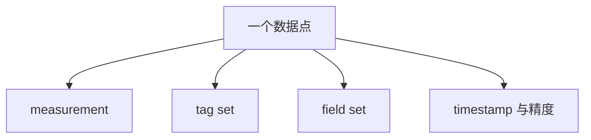
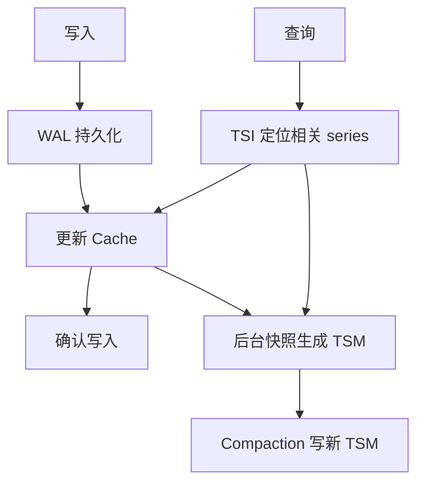
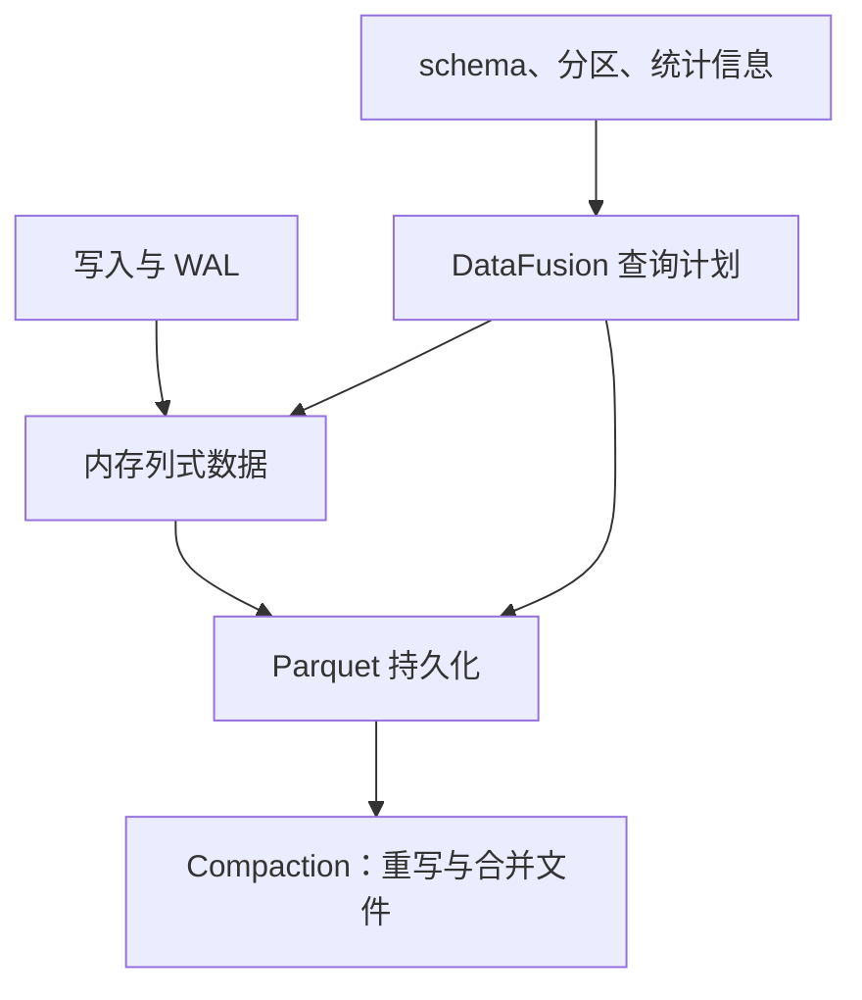
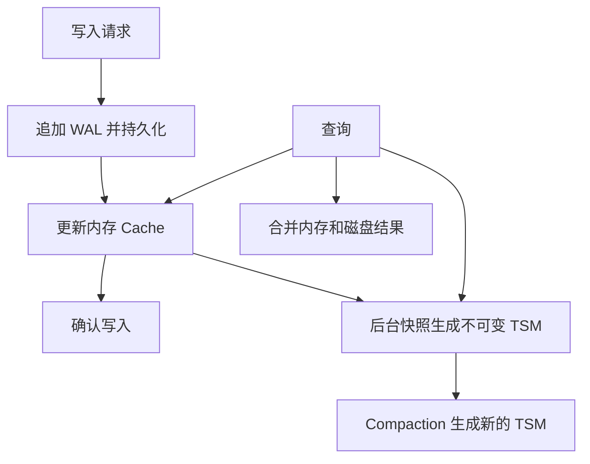
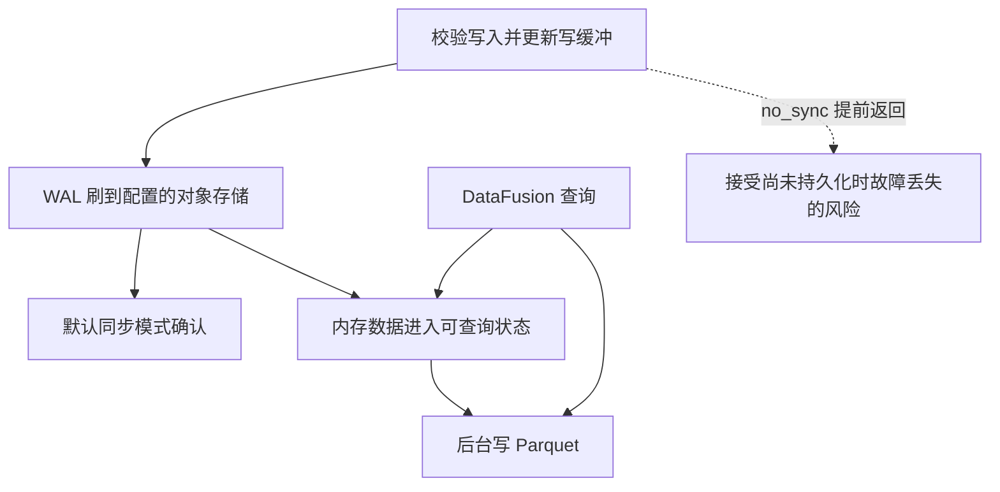
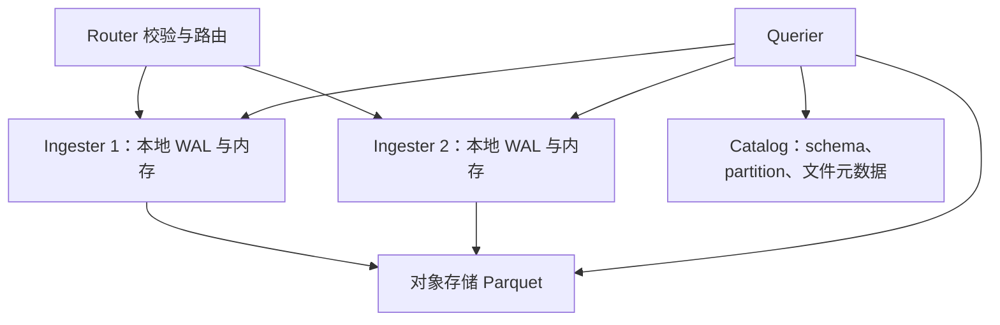
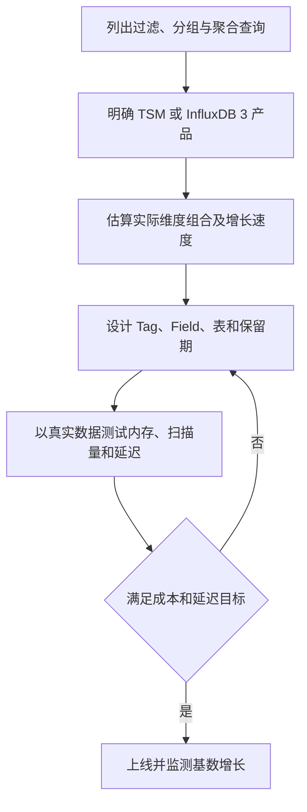
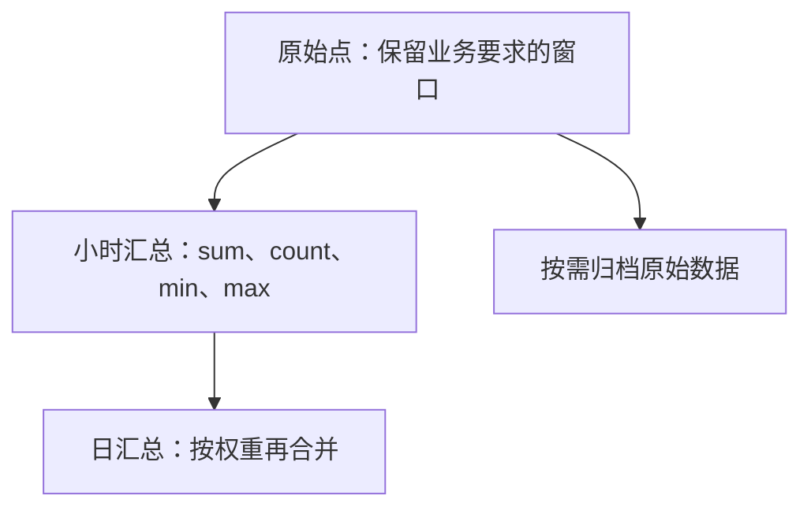
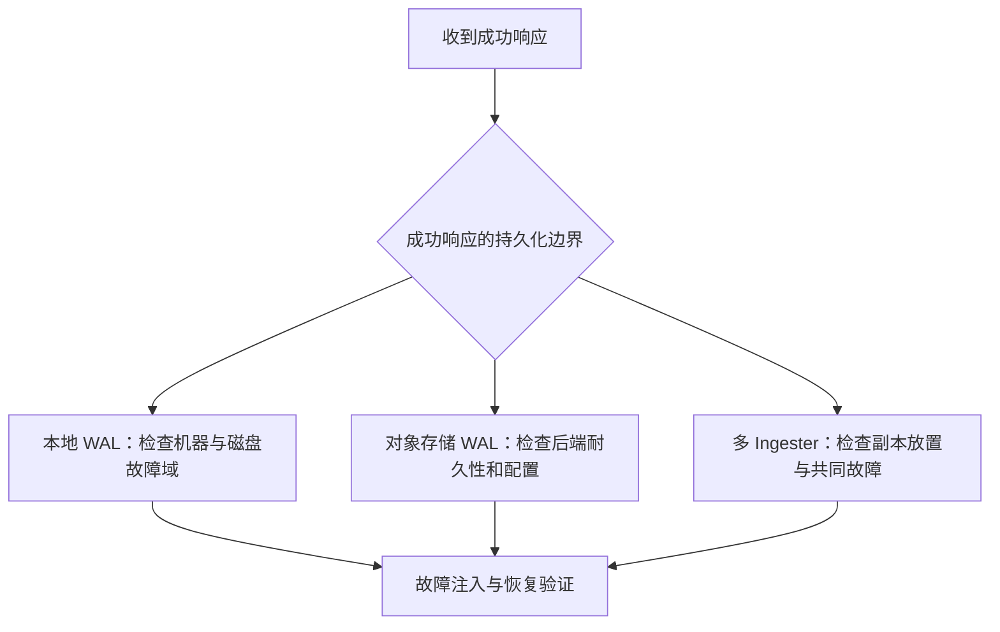
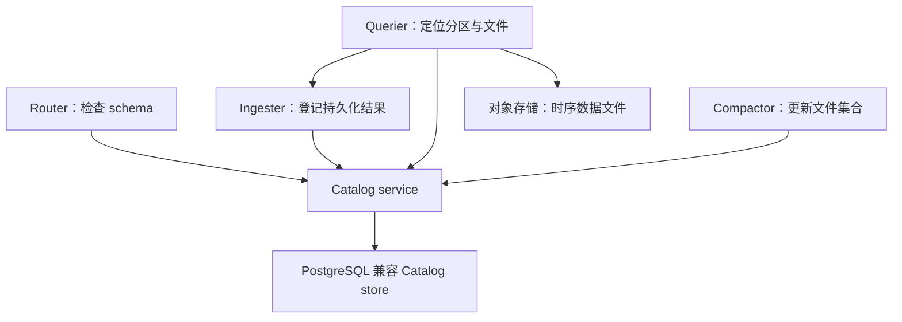

## InfluxDB 时序数据库深度调研报告

> **作者**: Stark (CTO, CHANG_AI_TEAM)
> **日期**: 2026-06-12
> **版本**: v1.0
> **摘要**: 涵盖 InfluxDB 核心概念、存储引擎演进（TSM/TSI → InfluxDB 3 列存引擎）、写入路径、查询路径、指标设计最佳实践、多副本复制与高可用、以及元数据存储（Catalog）的全面技术调研。

---

## 目录

1. [概述与核心概念](#1-概述与核心概念)
2. [存储引擎](#2-存储引擎)
3. [写入与查询路径](#3-写入与查询路径)
4. [指标设计最佳实践](#4-指标设计最佳实践)
5. [多副本复制与元数据存储](#5-多副本复制与元数据存储)
6. [总结与选型建议](#6-总结与选型建议)

---

## 1. 概述与核心概念


## InfluxDB 数据模型与产品差异

Line Protocol 描述 measurement、可选 tags、fields 和可选 timestamp。时间戳精度由写入约定或 API 参数解释，不能把一个整数不加说明地都当作纳秒。

```text
cpu,host=server-a,region=west usage_user=64.5,usage_sys=12.3 1718200000000000000
```

此示例按纳秒解释时间戳。measurement 是 cpu；tags 为 host、region；两个 fields 保存度量值。转义、字段类型和重复点合并语义仍需按版本校验。



## Series 的统计口径

逻辑上常按 measurement 与 tag-set 识别 series；TSM 存储键进一步包含 field key。报告基数时需注明统计工具和口径。维度取值数乘积是组合上界，只有实际全部出现且满足相应条件时才等于 distinct 数；fields 的内部序列数量应另列。

## 容器概念不能跨版本硬套

v1 的 database / retention policy 与 v2 的 bucket 不是两个同层次必经目录；InfluxDB 3 又有自己的 database / table 与保留配置。Clustered 的按天分区、Catalog 与多 Ingester 也不能自动套到 Core。

TSM 的 tag 索引特征需要和 3.x 列式读取分开描述：不能对全部版本统一打出“Tag 有索引、Field 没索引”的选型表，或宣称 3.x 任意基数免费。先列出真实过滤、分组、范围扫描需求，再设计表与字段。

继续阅读：[InfluxDB 指标设计与基数管理]({{ '/knowledge/InfluxDB-指标设计与基数管理/' | relative_url }})、[InfluxDB 写入与查询：先区分产品形态]({{ '/knowledge/InfluxDB-写入与查询路径/' | relative_url }})、[InfluxDB Catalog：元数据边界取决于产品]({{ '/knowledge/InfluxDB-Catalog元数据/' | relative_url }})。


## 核验来源

- [TSM 数据与索引](https://docs.influxdata.com/influxdb/v2/reference/internals/storage-engine/)
- [Clustered 产品架构](https://docs.influxdata.com/influxdb3/clustered/reference/internals/storage-engine/)


---

## 2. 存储引擎


## InfluxDB 引擎调研


本次修订保留原文章路径；以下按已核对的主题重组。详细的版本与证据范围在各节说明。

## InfluxDB TSM 存储引擎

TSM 是 v1/v2 时序存储路线中的不可变列式文件组织，与 WAL、Cache 和 TSI 索引共同工作。不能把 TSM 与所有 InfluxDB 产品的部署架构等同。



TSM 把相关 field 的值按时间组织为块，利用数据类型及分布选择编码压缩；不能把 WAL 使用的压缩方式推广为所有 TSM 列统一采用的编码，更不能给出无数据集条件的固定压缩倍数。

Cache 支持读取最近数据，查询合并 Cache 与 TSM。重启使用未被安全淘汰的 WAL 恢复内存，而非无条件重放数据库全部历史。Compaction 通过新文件重组数据，旧文件按引用及删除规则回收；删除标记不等于直接原地覆盖文件中的值。

### TSI 与过滤器不是同一种索引

TSI 支持从 measurement、tag 等条件定位 series；Bloom filter 回答的是一个候选文件中某键是否可能存在。两者不能作为一一对应组件交换。高基数会增加索引、内存和查询成本，但“百万即必然 OOM”不成立，应结合机器、版本、分布和查询测量。

持久化和后台合并思想与 [LSM-Tree (Log-Structured Merge-Tree)]({{ '/knowledge/LSM-Tree/' | relative_url }}) 相近，具体文件层级和调度不可照搬 RocksDB 的任意层数模型。比较新引擎见 [InfluxDB 3 的列式引擎：格式、执行与部署]({{ '/knowledge/InfluxDB-3-列存引擎/' | relative_url }})，数据设计见 [InfluxDB 指标设计与基数管理]({{ '/knowledge/InfluxDB-指标设计与基数管理/' | relative_url }})。


### 核验来源

- [InfluxDB OSS v2 存储引擎](https://docs.influxdata.com/influxdb/v2/reference/internals/storage-engine/)

## InfluxDB 3 的列式引擎：格式、执行与部署

Arrow 面向内存列式表示，DataFusion 执行查询计划，Parquet 面向持久化列式数据。三者分别回答“如何表示数据、如何计算、如何落盘”，不能合并成“没有索引、没有合并、无限基数零成本”。



图描述数据职责，不代表独立进程数。Core 与 Clustered 的 WAL 及组件拓扑见 [InfluxDB 写入与查询：先区分产品形态]({{ '/knowledge/InfluxDB-写入与查询路径/' | relative_url }})。

### 与 TSM 的比较应避免什么

| 维度 | 可用的比较 | 错误的绝对结论 |
|---|---|---|
| 格式 | TSM 是时序专用格式；Parquet 是开放列式格式 | TSM 文件可变、Parquet 不可变 |
| 剪枝 | 分区和列统计帮助减少读取 | 不需要任何索引或元数据 |
| 基数 | 避开原 TSI 设计的部分扩展限制 | 任意基数都不增加内存与查询成本 |
| 写放大 | 取决于刷盘、文件大小、合并与重写 | Parquet 只写一次，没有 compaction |
| 扩容 | 取决于具体产品部署形态 | 所有 3.x 版本原生同样水平扩展 |

压缩倍数受排序、列类型、分布、编码与压缩算法共同影响；没有同一数据集、相同统计口径，就不能宣称固定降低十倍成本。开放文件格式方便工具互操作，但还需遵守 Catalog、权限和一致性约束，直接扫描所有对象文件可能包含已被逻辑替换的数据。

关联：[InfluxDB TSM 存储引擎]({{ '/knowledge/InfluxDB-TSM存储引擎/' | relative_url }})、[InfluxDB 指标设计与基数管理]({{ '/knowledge/InfluxDB-指标设计与基数管理/' | relative_url }})、[InfluxDB Catalog：元数据边界取决于产品]({{ '/knowledge/InfluxDB-Catalog元数据/' | relative_url }})。


### 核验来源

- [Clustered 引擎及 compactor](https://docs.influxdata.com/influxdb3/clustered/reference/internals/storage-engine/)
- [Core 存储引擎](https://docs.influxdata.com/influxdb3/core/reference/internals/storage-engine/)


---

## 3. 写入与查询路径


## InfluxDB 写入与查询：先区分产品形态

TSM 是 v1/v2 的引擎路线；InfluxDB 3 Core 与 Clustered 虽共享列式技术方向，其进程拓扑和 WAL 持久化路径不能混画。以下比较的是官方文档描述的默认路径，部署时还需核对版本和配置。

## v1/v2：WAL、Cache、TSM



查询合并 Cache 和 TSM；WAL 用于恢复 Cache，不是普通查询扫描的数据源。TSM compaction 写新文件，因此不能说 TSM 文件可变、只有 Parquet 才不可变。

## InfluxDB 3 Core：对象存储 WAL 与内存可查询数据



`no_sync=true` 改变确认边界；不能套用默认同步模式的数据耐久性结论。文件尚未变成 Parquet，不代表数据不可查询。

## InfluxDB Clustered：Router、Ingester、Querier



Clustered 默认把写入复制到多个 Ingester，WAL 在各 Ingester 本地持久化。Querier 需要最近写入数据时会访问 Ingester，并按 Catalog 信息读取已持久化文件。它不是“所有组件只通过对象存储通信”。

## 调优前先定位瓶颈

把写入确认延迟、内存可见延迟、Parquet 持久化延迟、compaction 积压分别观测。对查询区分最近数据和历史扫描，记录时间范围、过滤选择性、并发及冷热缓存；仅比较文件格式无法解释端到端延迟。

关联：[InfluxDB TSM 存储引擎]({{ '/knowledge/InfluxDB-TSM存储引擎/' | relative_url }})、[InfluxDB 3 的列式引擎：格式、执行与部署]({{ '/knowledge/InfluxDB-3-列存引擎/' | relative_url }})、[InfluxDB 耐久性与高可用：确认边界和故障边界]({{ '/knowledge/InfluxDB-多副本与高可用/' | relative_url }})。


## 核验来源

- [OSS v2 存储引擎](https://docs.influxdata.com/influxdb/v2/reference/internals/storage-engine/)
- [3 Core 数据耐久性](https://docs.influxdata.com/influxdb3/core/reference/internals/durability/)
- [Clustered 存储架构](https://docs.influxdata.com/influxdb3/clustered/reference/internals/storage-engine/)
- [Clustered 数据耐久性](https://docs.influxdata.com/influxdb3/clustered/reference/internals/durability/)


---

## 4. 指标设计最佳实践


## InfluxDB 指标设计与基数管理

## 先定义统计口径

一组实际出现的 measurement 与 tag-set 构成时序维度。TSM 内部还按 field key 组织各字段的时间序列；谈“series 数”必须注明使用产品监控指标还是内部存储键口径。维度取值数相乘只是所有组合都出现时的上界，不是实际 distinct 数。

例如 500 台主机总共运行 2,000 个 Pod，而非每台各运行 2,000 个 Pod，不能直接把 host 与 pod 基数相乘成一百万条实际维度。字段数还要另列，避免把字段序列数和 tag-set 数混为一谈。

## Tag 与 Field 取决于查询和引擎



在 TSM 中，tag 索引使高基数维度的成本尤其值得注意；字段也能过滤，但访问路径不同。InfluxDB 3 的存储设计缓解了旧引擎的一些限制，不能因此推断任意基数没有成本。也不能把“超过十万绝不能做 Tag”作为跨版本规则。唯一标识符放在哪里，应结合检索需求与实测决定。

## 保留期与降采样

用业务问题决定原始数据窗口和聚合粒度；降低采样率会不可逆地丢失瞬时峰值或细粒度分布。均值的均值只有在样本权重一致时才正确，分层汇总通常应同时保留 sum 与 count；分位数不能直接平均。



图表示业务生命周期示例，不表示所有版本都使用相同 Task 或 Retention Policy API。实际生产还需处理迟到数据、重算窗口、重复点、时区和 timestamp 精度。

关联：[InfluxDB 数据模型与产品差异]({{ '/knowledge/InfluxDB-数据模型/' | relative_url }})、[InfluxDB TSM 存储引擎]({{ '/knowledge/InfluxDB-TSM存储引擎/' | relative_url }})、[InfluxDB 3 的列式引擎：格式、执行与部署]({{ '/knowledge/InfluxDB-3-列存引擎/' | relative_url }})。


## 核验来源

- [TSM 存储与索引口径](https://docs.influxdata.com/influxdb/v2/reference/internals/storage-engine/)
- [InfluxData 基数说明](https://www.influxdata.com/glossary/cardinality/)


---

## 5. 多副本复制与元数据存储


## InfluxDB 耐久性与高可用：确认边界和故障边界

## 三条不同的持久化路径

| 产品形态 | 确认写入依赖什么 | 查询最近数据 | 不应推断的保证 |
|---|---|---|---|
| v1/v2 TSM | 本地 WAL 持久化与 Cache 更新 | Cache 与 TSM 合并 | 单机 WAL 不等于跨节点容灾 |
| 3 Core 默认同步模式 | WAL 刷到配置的对象存储 | 内存缓冲与 Parquet | 不意味着自带多个 Ingester 副本 |
| Clustered | 多 Ingester 本地 WAL，默认复制配置见文档 | Querier 访问 Ingester 与 Parquet | 副本数不直接等于任意多故障容忍 |



Core 开启 `no_sync` 时可能在 WAL 持久化前应答，必须单独评估丢失窗口。Clustered 的近期数据尚未写成 Parquet 时仍可查询，WAL 在持久化数据安全落地前承担恢复职责。

## 不可变文件仍需要元数据与备份

TSM 与 Parquet 都通过生成新文件进行合并，不可变不等于不会误删或无需备份。对象存储的故障域与冗余策略取决于所选后端；Catalog 的备份和文件回收策略也有独立边界。旧稿所写“所有 InfluxDB 3 自动三 AZ、固定 100 天、RPO 一律为 0”没有跨产品依据。

测试至少覆盖：写入确认后进程终止、节点磁盘丢失、对象存储暂时不可用、Catalog 恢复，以及 compaction 期间故障。分别记录可用性、数据完整性和恢复耗时；不能只凭一次写入成功判断容灾达标。

关联：[InfluxDB Catalog：元数据边界取决于产品]({{ '/knowledge/InfluxDB-Catalog元数据/' | relative_url }})、[InfluxDB 写入与查询：先区分产品形态]({{ '/knowledge/InfluxDB-写入与查询路径/' | relative_url }})。


## 核验来源

- [Core 确认与 WAL](https://docs.influxdata.com/influxdb3/core/reference/internals/durability/)
- [Clustered 副本与 WAL](https://docs.influxdata.com/influxdb3/clustered/reference/internals/durability/)
- [TSM 引擎](https://docs.influxdata.com/influxdb/v2/reference/internals/storage-engine/)

## Catalog 补充

这里的独立 Catalog 服务图专指 InfluxDB Clustered，不应推广为全部 InfluxDB 3 Core / Enterprise 部署的固定要求。

Clustered 把 Catalog 分成缓存及访问管理服务和 PostgreSQL 兼容的 Catalog store。它描述 schema、分区及对象存储中文件的位置；实际时序列值仍位于 Ingester 的近期数据和持久化 Parquet 中。



## 为什么不能只备份数据文件

文件存在和文件属于哪张表、哪个分区，是两个问题。恢复方案需要 Catalog 与对象数据的对应关系，必须按所用产品的备份恢复流程验证。上图也显示 Querier 与 Ingester 直接通信，因此 Catalog 不是“组件唯一的通信渠道”。

Catalog 数据库的复制、备份周期、保留期和故障域配置依赖部署。旧稿把“固定 100 天备份、三可用区、自动 PostgreSQL 主从”写成产品普遍保证，没有足够依据，已移除。也不能把 v1/v2 的 BoltDB、旧集群元数据服务、etcd 与新产品 Catalog 简单合并为一条实现史。

## 应验证的恢复不变量

1. Catalog 引用的有效文件仍可读。
2. Compaction 切换后的旧文件不会被新的读取计划当作额外有效数据重复统计。
3. 备份恢复与写入恢复路径共同覆盖最近确认的数据。

这些是审查设计的工程问题，不是本文声称已对所有产品做过的故障注入结果。

关联：[InfluxDB 耐久性与高可用：确认边界和故障边界]({{ '/knowledge/InfluxDB-多副本与高可用/' | relative_url }})、[InfluxDB 写入与查询：先区分产品形态]({{ '/knowledge/InfluxDB-写入与查询路径/' | relative_url }})。


## 核验来源

- [Clustered：Catalog store 与 service](https://docs.influxdata.com/influxdb3/clustered/reference/internals/storage-engine/)


---

## 6. 总结与选型建议

### 6.1 关键差异总结

| 维度 | InfluxDB v1/v2 (TSM) | InfluxDB 3.0 (Columnar) |
|------|---------------------|------------------------|
| 存储格式 | TSM (自研列式) | Apache Parquet (开放标准) |
| 索引方式 | TSI 倒排索引 | Parquet Statistics 剪枝 |
| 基数上限 | ≤ 百万级 | 理论上无上限 |
| 查询引擎 | Iterator (Go) | DataFusion 向量化 (Rust) |
| 压缩比 | ~5-10x | 10-100x |
| 写放大 | 严重 (WAL+Flush+Compaction) | 低 (单次 Parquet 写入) |
| 存储位置 | 本地磁盘 | Object Store (S3/MinIO) |
| 扩展方式 | 手动分片 (Enterprise) | 原生水平扩展 |
| 元数据 | BoltDB 嵌入式 KV | PostgreSQL 兼容 RDBMS |
| 成熟度 | 10年+，稳定 | 3年，快速发展中 |

### 6.2 选型建议

| 场景 | 推荐版本 | 原因 |
|------|----------|------|
| **新项目 · 中等规模** | InfluxDB 3 Edge (OSS) | 未来方向，Parquet 生态，低成本 |
| **新项目 · 大规模/高基数** | InfluxDB 3 Clustered | 无基数限制，存算分离，弹性伸缩 |
| **存量 v1/v2 · 稳定运行** | 暂不迁移 | v1/v2 维护模式，待 v3 Community 成熟 |
| **IoT 边缘计算** | InfluxDB 3 Edge | 单进程轻量，嵌入式 VM，离线运行 |
| **数据分析 · 需要 SQL** | InfluxDB 3 | 原生 SQL (FlightSQL)，与现有工具兼容 |
| **仅需简单监控 · 低基数** | 考虑 VictoriaMetrics/Prometheus | 更轻量，生态更匹配 |

### 6.3 我们的建议

对于 CHANG_AI_TEAM 的可观测性平台项目，建议关注 InfluxDB 3 生态：

1. **先评估 v3 Edge** 作为单机方案的可行性（即将开源，MIT/Apache2 许可）
2. **关键优势**：Parquet 格式可直接用 DuckDB/Polars 做离线分析，无需额外 ETL
3. **劣势关注**：v3 生态系统仍在建设中，部分 v1/v2 功能（如 Flux Tasks）不可用，需评估迁移成本
4. **长期策略**：以 Parquet 为数据湖格式中心，选择支持 Parquet 原生的存储方案（InfluxDB 3 / ClickHouse / DuckDB）

---

## 参考资料

- [InfluxDB 3.0 System Architecture](https://www.influxdata.com/blog/influxdb-3-0-system-architecture/) — Nga Tran, Paul Dix, Andrew Lamb, Marko Mikulicic
- [InfluxDB 3 Storage Engine Internals](https://docs.influxdata.com/influxdb3/cloud-dedicated/reference/internals/storage-engine/) — InfluxData Official Docs
- [InfluxDB Internals 101: Data Model & Write Path](https://www.influxdata.com/blog/influxdb-internals-101-part-one/) — Ryan Betts
- [Data Layout and Schema Design Best Practices](https://www.influxdata.com/blog/data-layout-and-schema-design-best-practices-for-influxdb/) — Anais Dotis-Georgiou
- [The Plan for InfluxDB 3 Open Source](https://www.influxdata.com/blog/the-plan-for-influxdb-3-0-open-source/) — Paul Dix

## 附录：图表清单

| 图 | 文件 | 内容 |
|----|------|------|
| 01 | `InfluxDB调研/diagram/01-architecture-overview.svg` | InfluxDB 3.0 整体架构 |
| 02 | `InfluxDB调研/diagram/02-storage-engine.svg` | 存储引擎演进对比 |
| 03 | `InfluxDB调研/diagram/03-write-path.svg` | 写入路径全流程对比 |
| 04 | `InfluxDB调研/diagram/04-query-path.svg` | DataFusion 向量化查询 |
| 05 | `InfluxDB调研/diagram/05-schema-best-practices.svg` | Tag/Field 决策 + 基数管理 |
| 06 | `InfluxDB调研/diagram/06-replication-ha.svg` | 多副本复制与高可用 |
| 07 | `InfluxDB调研/diagram/07-catalog-metadata.svg` | Catalog 元数据存储 |

---

> **修订历史**:
> - 2026-06-12 v1.0: 初始版本，含 7 张技术图、5 个子文档
