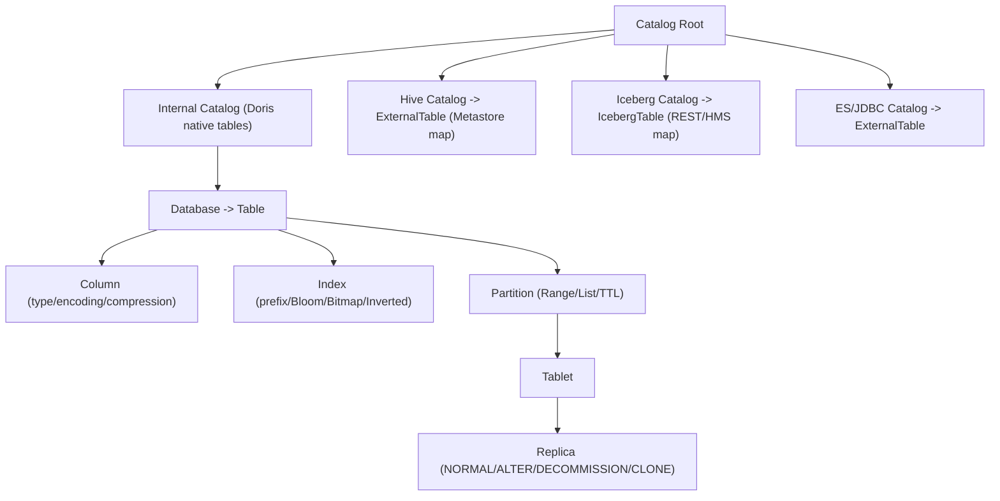
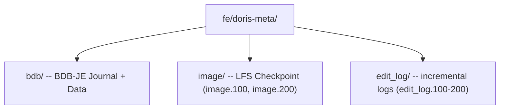
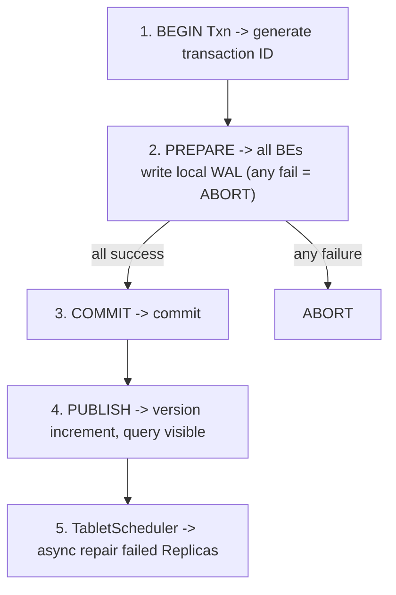
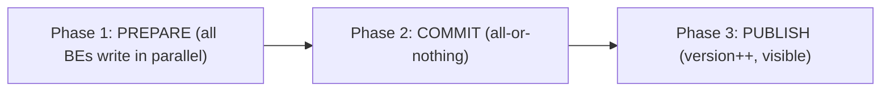

## 6. 元数据存储与一致性复制

### 6.1 Meta Service：元数据存储结构

Doris 元数据管理经历了从 **BDB-JE 单机** → **BDB-JE Replication（类 Paxos）** → **Meta Service 存算分离** 的演进。


#### 6.1.1 元数据存储分层

Doris 元数据采用 **三层存储模型**，渐进式加载以减少内存压力：

| 层级 | 存储位置 | 内容 | 特点 |
|------|----------|------|------|
| **Catalog (FE)** | FE 元数据持久化层 (BDB-JE / Meta Service) | 所有元数据全集 | 持久化，版本化，支持事务 |
| **FE 内存缓存** | FE Heap | 热点元数据 | LRU 淘汰，被动加载 |
| **BE 内存** | BE Heap | 本地 Tablet 元数据子集 | 仅自己所管理 Tablet |

#### 6.1.2 元数据核心对象关系



#### 6.1.3 BDB-JE 元数据存储 (v0.x~v2.x)

Doris 0.x~2.x 使用 **BDB-JE** 作为 FE 元数据持久化引擎：

- **单 Leader 写入**：通过 BDB-JE 类 Paxos 协议实现 FE 间复制
- **事务性写入**：CREATE TABLE / schema change 以 BDB-JE 事务提交
- **EditLog 机制**：每次变更生成 EditLog Entry，Follower 重放
- **Checkpoint**：定期 Snapshot，减少 EditLog 回放开销

FE 元数据文件布局：



**Follower 回放流程：** BRPC 拉取最新 EditLog → 校验 CheckSum → 逐 Entry 回放到本地内存 → 更新版本号

#### 6.1.4 Meta Service：存算分离元数据 (Doris 3.0+)

Doris 3.0 将元数据从 FE 内嵌 BDB-JE 剥离到**独立集中式 Meta Service**：

- **存储引擎**：BDB-JE → FoundationDB (FDB) 或自研 Raft-based KV Store
- **多客户端并发写**：多 FE 可并发写不同 Key 范围，不再受单写锁限制
- **弹性恢复**：新 FE 启动直接查询 Meta Service，无需回放完整 EditLog
- **存算分离**：元数据和数据层彻底解耦

#### 6.1.5 Meta Service 元数据 Key 设计

分层 Key-Value 命名空间，按前缀组织，支持 CAS Write（revision 字段）：

```
/meta/{cluster}/db/{db}/table/{table}         → 表层元数据
/meta/{cluster}/tablet/{tablet}                → Tablet 元数据
/meta/{cluster}/tablet/{tablet}/replica/{be}   → Replica 状态
/txn/{cluster}/db/{db}/txn/{txn}               → 事务元数据
```

#### 6.1.6 元数据缓存与淘汰

FE ImageCache 采用 **LRU 链表 + 版本校验**：
- 每次查询先校验本地版本号 vs Meta Service 版本号
- 惰性加载：未命中时从 Meta Service 增量拉取
- 热点表标记 Pinned，不参与淘汰

---

### 6.2 控制面：多副本复制 (Tablet Replication)

#### 6.2.1 Shared-Nothing 复制 (v0.x~v2.x)

写入路径：Load Job → FE 分配 Tablet → BE 本地写入 Segment → Rowset 提交 → **TabletScheduler 异步 Clone 补齐副本**

**TabletScheduler** 控制面核心组件：

| 功能 | 说明 |
|------|------|
| 修复 | Replica 缺失/版本落后/故障时创建 Clone Task |
| 均衡 | BE 间 Tablet 数量不均衡时创建 Balance Task |
| 变更 | Alter Job 触发 Tablet 重写 |
| 退役 | Decommission BE 时迁移 Tablets |
| 优先级 | **REPAIR > BALANCE > ALTER** |

**Clone Task 状态机：** PENDING → SCHEDULED → RUNNING → FINISHED / TIMEOUT（重试 3 次后放弃）

**多副本一致性保障：**

| 阶段 | 策略 |
|------|------|
| 写入 | Single-Replica Write（单副本成功即完成） |
| 复制 | Asynchronous Clone（TabletScheduler 异步调度） |
| 读取 | Replica Version Check（仅选版本足够的 Replica） |
| 健康 | 定期心跳 + VersionReport（BE 每 10s 上报） |
| 修复 | 自动检测版本缺失 → 触发 Clone 补齐 |

#### 6.2.2 存算分离复制 (Doris 3.0+)

复制策略从「BE 间 Clone」变为「Object Store 为中心」：

写入路径：BE 写 WAL → Flush Object Store → Meta Service 更新版本 → 其他 Compute Node 感知 → File Cache 预热

**核心差异：**

| 维度 | Shared-Nothing | 存算分离 |
|------|---------------|----------|
| 复制目标 | BE 间 Clone | Object Store 持久数据 |
| 副本数 | 3 | 1 (Object Store 高可用) |
| 一致性 | 最终一致性 | 写后即持久 |
| 故障恢复 | TabletScheduler 克隆 | 直读 Object Store |
| 存储成本 | 3× | 1× + Object Store 副本 |

---

### 6.3 数据面：写入路径一致性


#### 6.3.1 单 Tablet 写入一致性

三层保证：**FE 2PC 事务协调 + BE 本地 WAL + TabletScheduler 修复**



**失败处理：**
- PREPARE 部分成功 → FE 发 ABORT，BE 撤销 WAL
- COMMIT 部分到达 → BE 重启后 Gossip 同步版本 + TabletScheduler 修复
- PUBLISH 后部分不可见 → 查询跳过不可见 Replica，补齐后恢复

#### 6.3.2 事务模型

**A. 单 Tablet 事务**（Routine Load / Small Batch）：延迟最低，写入结束即提交

**B. 2PC 分布式事务**（Broker Load / INSERT INTO SELECT）：


**Label 幂等性：** 每个 Load Job 全局唯一 Label，FE 持久化 `Label → TxnId`，重试返回已存在 TxnId → Exactly-Once Write

#### 6.3.3 Compaction 一致性

每个 Replica 独立执行 Compaction，不依赖跨副本一致性：

| 阶段 | 保证 |
|------|------|
| 选择 Rowset | 仅选已 Publish 版本 |
| 合并执行 | 读取源 → 合并 → 写新文件（不修改源） |
| 原子替换 | CAS 替换元数据指针 |
| 并发安全 | 每 Tablet 同时最多 1 个 Compaction |

---

### 6.4 故障恢复矩阵

| 故障 | 检测 | 恢复 | RTO |
|------|------|------|-----|
| FE Master 宕机 | BDB-JE 心跳 | Follower 提升，重放 EditLog | ~10-30s |
| FE Follower 宕机 | BDB-JE 心跳 | 其他 Follower/Observer 承接查询 | 0 |
| BE 宕机 (SN) | FE 心跳 10s | TabletScheduler Clone Task | 分钟级 |
| BE 宕机 (存算分离) | FE 心跳 | 新 Compute Node 直读 Object Store | 秒级 |
| 磁盘故障 | BE 自检 | TabletScheduler 修复 | 分钟级 |
| 版本不一致 | VersionReport | TabletScheduler 自动补齐 | 分钟级 |
| Meta Service 宕机 | FE 检测 | RAFT 自身高可用 | 秒级 |

### 6.5 核心设计哲学

> 💡 Doris 采用 **控制面集中协调 + 数据面去中心化执行** 架构。FE 负责元数据一致性和全局调度（2PC、TabletScheduler），BE 间无中心依赖，数据复制通过异步 Clone 或 Object Store 共享实现。存算分离 3.0 进一步将控制面元数据从 FE 剥离到独立 Meta Service，实现完全解耦。

**控制面：** BDB-JE/Meta Service + Paxos/RAFT + TabletScheduler + 2PC + Load Manager

**数据面：** Segment v2 + WAL/MoW + Compaction + Clone + File Cache
