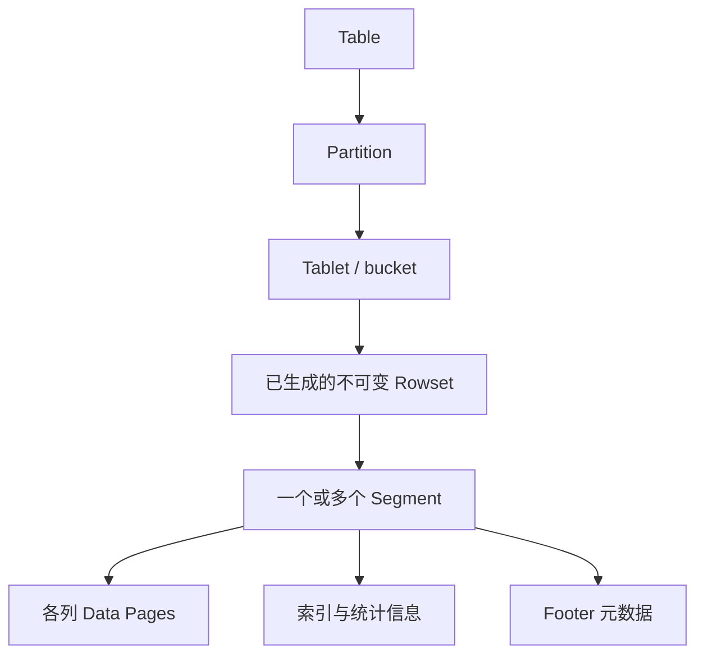

Segment 是列式数据文件；Rowset 由一个或多个 segment 组成；tablet 的可见版本由 rowset 与相关元数据组织。写入先在内存处理，生成不可变文件，而不是不断原地修改“Rowset 0”。

## 读取为什么能跳过数据

排序键、短键索引、列统计和可选索引共同帮助定位候选范围。Bloom filter 的“不存在”可排除数据，命中仍可能是误判；ZoneMap 根据范围统计剪枝，不能保证任意谓词都有效。具体 Page 大小、编码和索引文件布局取决于类型、版本与配置，旧稿固定 1MB、所有列物理连续等说法不再作为统一保证。

## Unique MoW 的删除位图

删除位图记录旧行的可见性，查询跳过这些行。它不是在 segment 数据区原地改值；compaction 生成新 rowset 时可清理不再需要的旧版本。回收不应只归因于一个未经版本核实的 Quick Compaction 名称。

## 与 Parquet 的合理比较

两者都是列式文件组织。Parquet 的 row group 与 page 是不同层级，不能把“约 1MB Page”写成“1MB Row Group”。主键唯一性、事务提交和 MoW 可见性来自 Doris 引擎及元数据协议，不能把前缀排序索引本身当成文件格式的主键约束。开放格式是否适用，还要考虑更新、索引、生态和引擎接口。

关联：[Doris 数据模型：三种模型与 Unique 的两种实现]({{ '/knowledge/Doris-数据模型/' | relative_url }})、[Doris Compaction：选哪些文件与怎样合并]({{ '/knowledge/Doris-Compaction-策略/' | relative_url }})、[Doris 元数据、复制与导入可见性]({{ '/knowledge/Doris-元数据与一致性复制/' | relative_url }})。

## 核验来源

- [Doris 更新与删除](https://doris.apache.org/docs/4.x/key-features/data-update-delete/)
- [Compaction 原理](https://doris.apache.org/docs/4.x/admin-manual/trouble-shooting/compaction-principles/)

## 来源与关联阅读

- [Doris 存储引擎]({{ '/posts/doris-storage-engine/' | relative_url }})
- [Apache Doris 深度调研导航]({{ '/knowledge/Doris-深度调研/' | relative_url }})
- [LSM-Tree (Log-Structured Merge-Tree)]({{ '/knowledge/LSM-Tree/' | relative_url }})
- [LSM-Tree 存储引擎体系：成本模型到部署决策]({{ '/posts/wiki-synthesis-lsm-tree/' | relative_url }})
