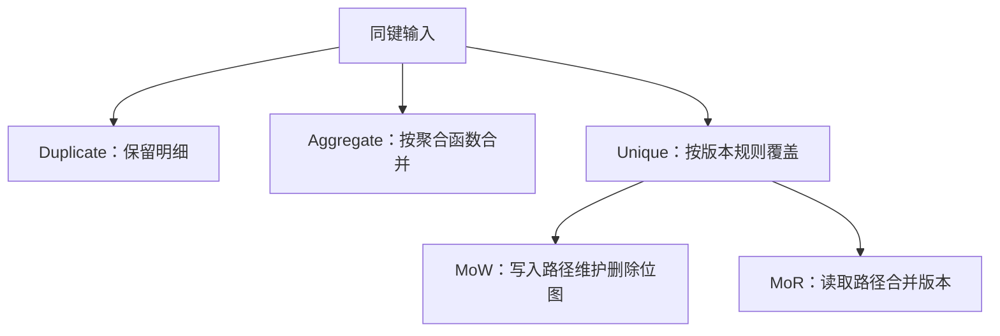

模型先决定“同键数据的业务含义”，再影响写入、读取和合并成本。Duplicate、Aggregate、Unique 是三种表模型；MoW 与 MoR 是 Unique 模型的实现方式，不应再计为第四种模型。

| 模型 | 同键两行的含义 | 必须承担的工作 | 适合的问题 |
|---|---|---|---|
| Duplicate | 保留两条明细，排序键不等于唯一约束 | 查询按需要聚合 | 日志、事件明细 |
| Aggregate | 按声明的聚合函数合并值 | 导入、compaction、查询阶段可能继续合并 | 固定维度指标 |
| Unique | 同一主键保留逻辑上的有效版本 | 判定版本、覆盖与删除 | CDC、主键更新 |

## 用三条记录检验模型

设输入为 `(A, 10), (A, 20), (B, 5)`。Duplicate 保留三行；Aggregate 的 value 列声明 SUM 时，A 的聚合结果为 30；Unique 的结果取决于版本顺序、sequence 配置等，不能把任意到达较晚的网络包都理解为业务上最新的数据。

## MoW 的逻辑删除不等于立即回收空间

MoW 将新行写入新 rowset，同时维护旧行的删除位图。查询跳过不可见的旧行；旧数据的物理字节仍可能保留到 compaction 等回收过程。它减少了查询时合并主键版本的工作，但不承诺所有查询都最快，也不是“磁盘只存最新版本”。部分列更新还可能需要查找、补齐未更新列。

MoR 把更多版本合并工作留在读取路径。二者的取舍应结合更新比例、主键宽度、批次大小、查询选择性与 compaction 压力实测。不能用一个没有硬件和负载条件的吞吐排序代替选型。

Aggregate 也不保证查询无需聚合：多个 rowset 中的同键聚合状态仍需合并，查询维度更粗时还要再次聚合。预聚合会失去一部分明细可恢复性，因此应先验证需要保留的查询能力。

关联：[Doris Segment v2：文件布局与表级语义]({{ '/knowledge/Doris-Segment-v2-存储格式/' | relative_url }})、[Doris Compaction：选哪些文件与怎样合并]({{ '/knowledge/Doris-Compaction-策略/' | relative_url }})、[LSM-Tree 与 RUM 猜想]({{ '/knowledge/LSM-Tree-RUM猜想/' | relative_url }})。

## 核验来源

- [Doris 4.x 更新与删除](https://doris.apache.org/docs/4.x/key-features/data-update-delete/)
- [Doris 预聚合与 Rollup](https://doris.apache.org/docs/dev/key-features/preaggregation-and-rollup/)

## 来源与关联阅读

- [Doris 概述与模型]({{ '/posts/doris-overview/' | relative_url }})
- [Doris 存储引擎]({{ '/posts/doris-storage-engine/' | relative_url }})
- [Apache Doris 深度调研导航]({{ '/knowledge/Doris-深度调研/' | relative_url }})
