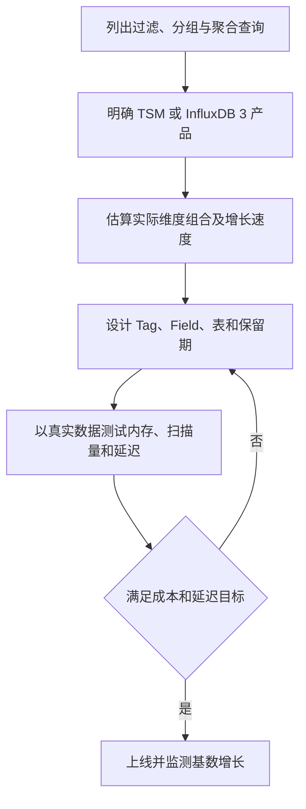
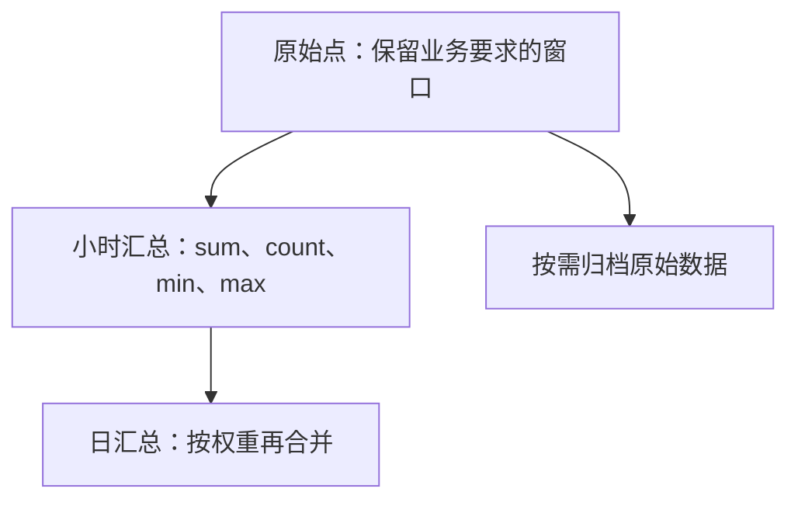

## 先定义统计口径

一组实际出现的 measurement 与 tag-set 构成时序维度。TSM 内部还按 field key 组织各字段的时间序列；谈“series 数”必须注明使用产品监控指标还是内部存储键口径。维度取值数相乘只是所有组合都出现时的上界，不是实际 distinct 数。

例如 500 台主机总共运行 2,000 个 Pod，而非每台各运行 2,000 个 Pod，不能直接把 host 与 pod 基数相乘成一百万条实际维度。字段数还要另列，避免把字段序列数和 tag-set 数混为一谈。

## Tag 与 Field 取决于查询和引擎

在 TSM 中，tag 索引使高基数维度的成本尤其值得注意；字段也能过滤，但访问路径不同。InfluxDB 3 的存储设计缓解了旧引擎的一些限制，不能因此推断任意基数没有成本。也不能把“超过十万绝不能做 Tag”作为跨版本规则。唯一标识符放在哪里，应结合检索需求与实测决定。

## 保留期与降采样

用业务问题决定原始数据窗口和聚合粒度；降低采样率会不可逆地丢失瞬时峰值或细粒度分布。均值的均值只有在样本权重一致时才正确，分层汇总通常应同时保留 sum 与 count；分位数不能直接平均。

图表示业务生命周期示例，不表示所有版本都使用相同 Task 或 Retention Policy API。实际生产还需处理迟到数据、重算窗口、重复点、时区和 timestamp 精度。

关联：[InfluxDB 数据模型与产品差异]({{ '/knowledge/InfluxDB-数据模型/' | relative_url }})、[InfluxDB TSM 存储引擎]({{ '/knowledge/InfluxDB-TSM存储引擎/' | relative_url }})、[InfluxDB 3 的列式引擎：格式、执行与部署]({{ '/knowledge/InfluxDB-3-列存引擎/' | relative_url }})。

## 核验来源

- [TSM 存储与索引口径](https://docs.influxdata.com/influxdb/v2/reference/internals/storage-engine/)
- [InfluxData 基数说明](https://www.influxdata.com/glossary/cardinality/)

## 来源与关联阅读

- [InfluxDB 指标设计与基数管理]({{ '/knowledge/InfluxDB调研-04-指标设计最佳实践/' | relative_url }})
- [InfluxDB 深度调研导航]({{ '/knowledge/InfluxDB深度调研/' | relative_url }})
