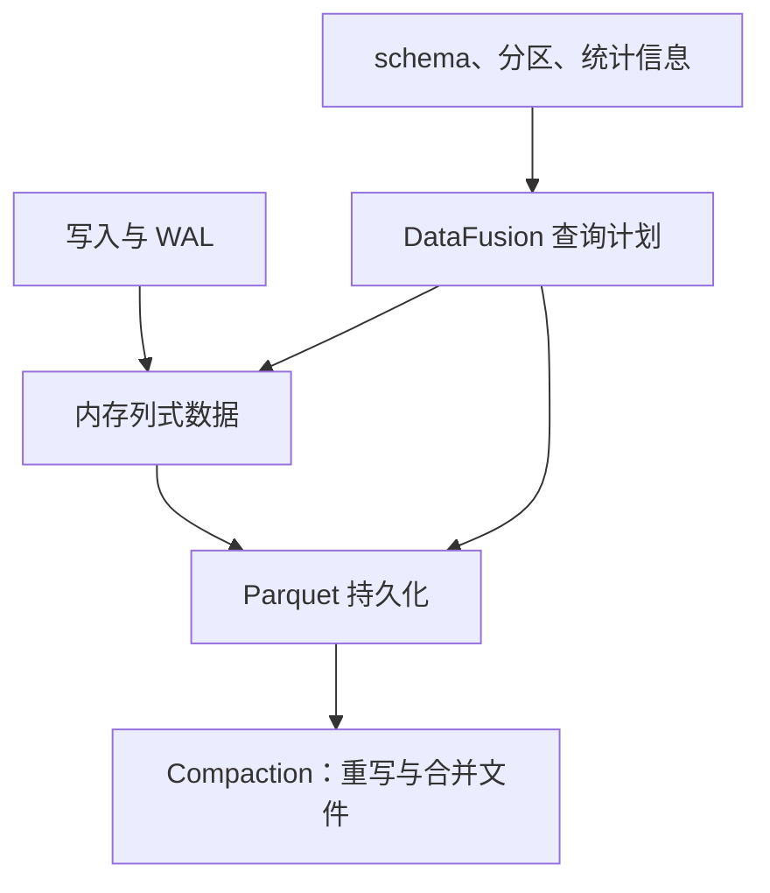

Arrow 面向内存列式表示，DataFusion 执行查询计划，Parquet 面向持久化列式数据。三者分别回答“如何表示数据、如何计算、如何落盘”，不能合并成“没有索引、没有合并、无限基数零成本”。

图描述数据职责，不代表独立进程数。Core 与 Clustered 的 WAL 及组件拓扑见 [InfluxDB 写入与查询：先区分产品形态]({{ '/knowledge/InfluxDB-写入与查询路径/' | relative_url }})。

## 与 TSM 的比较应避免什么

| 维度 | 可用的比较 | 错误的绝对结论 |
|---|---|---|
| 格式 | TSM 是时序专用格式；Parquet 是开放列式格式 | TSM 文件可变、Parquet 不可变 |
| 剪枝 | 分区和列统计帮助减少读取 | 不需要任何索引或元数据 |
| 基数 | 避开原 TSI 设计的部分扩展限制 | 任意基数都不增加内存与查询成本 |
| 写放大 | 取决于刷盘、文件大小、合并与重写 | Parquet 只写一次，没有 compaction |
| 扩容 | 取决于具体产品部署形态 | 所有 3.x 版本原生同样水平扩展 |

压缩倍数受排序、列类型、分布、编码与压缩算法共同影响；没有同一数据集、相同统计口径，就不能宣称固定降低十倍成本。开放文件格式方便工具互操作，但还需遵守 Catalog、权限和一致性约束，直接扫描所有对象文件可能包含已被逻辑替换的数据。

关联：[InfluxDB TSM 存储引擎]({{ '/knowledge/InfluxDB-TSM存储引擎/' | relative_url }})、[InfluxDB 指标设计与基数管理]({{ '/knowledge/InfluxDB-指标设计与基数管理/' | relative_url }})、[InfluxDB Catalog：元数据边界取决于产品]({{ '/knowledge/InfluxDB-Catalog元数据/' | relative_url }})。

## 核验来源

- [Clustered 引擎及 compactor](https://docs.influxdata.com/influxdb3/clustered/reference/internals/storage-engine/)
- [Core 存储引擎](https://docs.influxdata.com/influxdb3/core/reference/internals/storage-engine/)

## 来源与关联阅读

- [InfluxDB 引擎调研]({{ '/knowledge/InfluxDB调研-02-存储引擎/' | relative_url }})
- [InfluxDB 写入与查询：先区分产品形态]({{ '/knowledge/InfluxDB调研-03-写入与查询路径/' | relative_url }})
- [InfluxDB 深度调研导航]({{ '/knowledge/InfluxDB深度调研/' | relative_url }})
- [存储计算分离数据库的尾延迟：日志链与后台竞争]({{ '/knowledge/存储计算分离数据库的-Tail-Latency/' | relative_url }})
