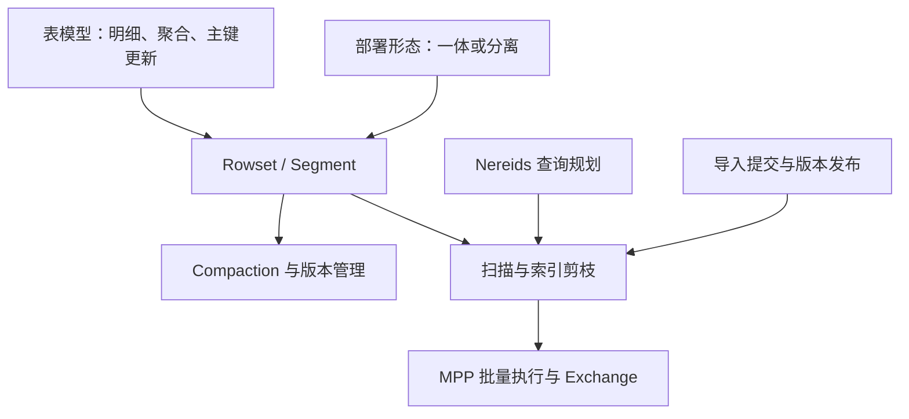

[Doris 数据模型：三种模型与 Unique 的两种实现]({{ '/knowledge/Doris-数据模型/' | relative_url }}) 先决定同键数据含义；Unique 的 MoW / MoR 再决定版本合并位置。Aggregate 预聚合不保证查询不再聚合，MoW 逻辑删除也不等于旧字节立即消失。

[Doris Segment v2：文件布局与表级语义]({{ '/knowledge/Doris-Segment-v2-存储格式/' | relative_url }}) 解释不可变列式文件；[Doris Compaction：选哪些文件与怎样合并]({{ '/knowledge/Doris-Compaction-策略/' | relative_url }}) 将 rowset 选择策略、按列组执行和导入内 segment 合并分开。读写权衡要同时观察合并积压与前台 P99。

[Doris Nereids CBO 优化器]({{ '/knowledge/Doris-Nereids-CBO-优化器/' | relative_url }}) 与 [Doris MPP 向量化查询引擎]({{ '/knowledge/Doris-MPP-向量化查询引擎/' | relative_url }}) 影响计划和执行效率。Colocate / Bucket Shuffle 需要数据分布和 Join 条件匹配，不是无需代价的“免费午餐”；数据倾斜和坏统计仍可能使计划失效。

[Doris 架构演进：共同的查询入口与两种存储部署]({{ '/knowledge/Doris-架构演进/' | relative_url }}) 区分经典一体与存算分离；[Doris 元数据、复制与导入可见性]({{ '/knowledge/Doris-元数据与一致性复制/' | relative_url }}) 区分 FE SQL 元数据、数据层元数据、BE 副本及导入可见版本。Meta Service 不替代全部 FE 职责，FE 也不是多主同时写元数据。

## 系统性检查

写入延迟高时先区分批次、主键查找、持久化、副本确认、版本发布和合并压力；查询慢时检查剪枝、Join 分布、缓存、Exchange 与并发，而不是只调整一个线程参数。冷缓存与扩容恢复是存算分离的重要测试，不应承诺所有负载延迟不退化。

与 [LSM-Tree 存储引擎体系：成本模型到部署决策]({{ '/posts/wiki-synthesis-lsm-tree/' | relative_url }}) 的联系在于不可变文件和合并成本；与 [分布式数据系统：一致性需要分层说明]({{ '/posts/wiki-synthesis-consistency/' | relative_url }}) 的联系在于持久化、提交和可见性边界。相似设计思想不意味着协议和数据结构完全相同。

## 来源与关联阅读

- [Doris调研]({{ '/knowledge/Doris调研/' | relative_url }})
- [Doris 概述与模型]({{ '/posts/doris-overview/' | relative_url }})
- [Doris 存储引擎]({{ '/posts/doris-storage-engine/' | relative_url }})
- [Doris 查询流程：规划、分布与执行]({{ '/posts/doris-query-engine/' | relative_url }})
- [Doris 架构演进：共同的查询入口与两种存储部署]({{ '/posts/doris-architecture-evolution/' | relative_url }})
- [Doris 元数据、复制与导入可见性]({{ '/posts/doris-metadata-replication/' | relative_url }})
- [事务模型深度调研：从 ACID 到全球分布式事务]({{ '/posts/transaction-model-survey/' | relative_url }})
- [LSM-Tree (Log-Structured Merge-Tree)]({{ '/knowledge/LSM-Tree/' | relative_url }})
- [LSM-Tree 与 RUM 猜想]({{ '/knowledge/LSM-Tree-RUM猜想/' | relative_url }})
