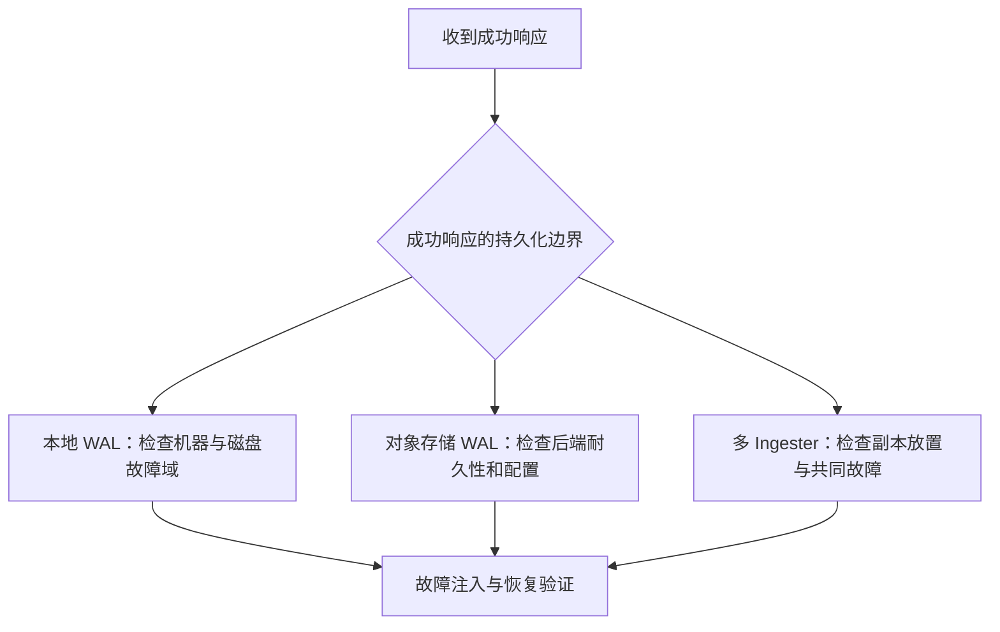

## 三条不同的持久化路径

| 产品形态 | 确认写入依赖什么 | 查询最近数据 | 不应推断的保证 |
|---|---|---|---|
| v1/v2 TSM | 本地 WAL 持久化与 Cache 更新 | Cache 与 TSM 合并 | 单机 WAL 不等于跨节点容灾 |
| 3 Core 默认同步模式 | WAL 刷到配置的对象存储 | 内存缓冲与 Parquet | 不意味着自带多个 Ingester 副本 |
| Clustered | 多 Ingester 本地 WAL，默认复制配置见文档 | Querier 访问 Ingester 与 Parquet | 副本数不直接等于任意多故障容忍 |

Core 开启 `no_sync` 时可能在 WAL 持久化前应答，必须单独评估丢失窗口。Clustered 的近期数据尚未写成 Parquet 时仍可查询，WAL 在持久化数据安全落地前承担恢复职责。

## 不可变文件仍需要元数据与备份

TSM 与 Parquet 都通过生成新文件进行合并，不可变不等于不会误删或无需备份。对象存储的故障域与冗余策略取决于所选后端；Catalog 的备份和文件回收策略也有独立边界。旧稿所写“所有 InfluxDB 3 自动三 AZ、固定 100 天、RPO 一律为 0”没有跨产品依据。

测试至少覆盖：写入确认后进程终止、节点磁盘丢失、对象存储暂时不可用、Catalog 恢复，以及 compaction 期间故障。分别记录可用性、数据完整性和恢复耗时；不能只凭一次写入成功判断容灾达标。

关联：[InfluxDB Catalog：元数据边界取决于产品]({{ '/knowledge/InfluxDB-Catalog元数据/' | relative_url }})、[InfluxDB 写入与查询：先区分产品形态]({{ '/knowledge/InfluxDB-写入与查询路径/' | relative_url }})。

## 核验来源

- [Core 确认与 WAL](https://docs.influxdata.com/influxdb3/core/reference/internals/durability/)
- [Clustered 副本与 WAL](https://docs.influxdata.com/influxdb3/clustered/reference/internals/durability/)
- [TSM 引擎](https://docs.influxdata.com/influxdb/v2/reference/internals/storage-engine/)

## 来源与关联阅读

- [InfluxDB 耐久性与高可用：确认边界和故障边界]({{ '/knowledge/InfluxDB调研-05-多副本复制与元数据存储/' | relative_url }})
- [InfluxDB 深度调研导航]({{ '/knowledge/InfluxDB深度调研/' | relative_url }})
- [事务模型深度调研：从 ACID 到全球分布式事务]({{ '/posts/transaction-model-survey/' | relative_url }})
