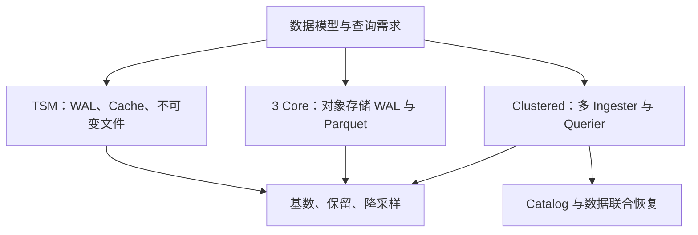

本领域最需要先纠正的是版本混用：v1/v2 TSM、InfluxDB 3 Core、Clustered 不能共享一张固定部署图。以下图是阅读路线。

从 [InfluxDB 数据模型与产品差异]({{ '/knowledge/InfluxDB-数据模型/' | relative_url }}) 理解 measurement、tags、fields 与时间戳，再用 [InfluxDB 指标设计与基数管理]({{ '/knowledge/InfluxDB-指标设计与基数管理/' | relative_url }}) 定义实际维度组合。基数相乘只是上界，不能把有关联的维度当作完全独立。

[InfluxDB TSM 存储引擎]({{ '/knowledge/InfluxDB-TSM存储引擎/' | relative_url }}) 与 [InfluxDB 3 的列式引擎：格式、执行与部署]({{ '/knowledge/InfluxDB-3-列存引擎/' | relative_url }}) 都涉及不可变文件及后台整理。Parquet 不意味着只写一次、没有 compaction；统计剪枝也不意味着所有查询不再需要索引或元信息。

[InfluxDB 写入与查询：先区分产品形态]({{ '/knowledge/InfluxDB-写入与查询路径/' | relative_url }}) 区分成功应答、内存可查询与文件持久化；[InfluxDB 耐久性与高可用：确认边界和故障边界]({{ '/knowledge/InfluxDB-多副本与高可用/' | relative_url }}) 区分本地 WAL、多 Ingester 和对象存储的故障边界；[InfluxDB Catalog：元数据边界取决于产品]({{ '/knowledge/InfluxDB-Catalog元数据/' | relative_url }}) 解释 Clustered 的独立元数据服务及其恢复要求。最近数据尚未变成 Parquet 时，Querier 仍可能访问 Ingester。

## 设计推论

开放列式格式有利于生态互操作，但读取所有对象文件不能代替系统 Catalog 的有效文件视图。高基数能力改善不等于零成本；冷数据扫描、短窗口最新查询和高并发写入应分别评价。

选型先固定产品与版本，再记录实际 series 口径、数据分布、保留策略、窗口、并发、冷热缓存、故障恢复和总成本。旧稿固定十倍压缩成本收益、自动三 AZ 与统一 100 天保留不是跨产品保证。

## 来源与关联阅读

- [InfluxDB 数据模型与产品差异]({{ '/knowledge/InfluxDB调研-01-概述与核心概念/' | relative_url }})
- [InfluxDB 引擎调研]({{ '/knowledge/InfluxDB调研-02-存储引擎/' | relative_url }})
- [InfluxDB 写入与查询：先区分产品形态]({{ '/knowledge/InfluxDB调研-03-写入与查询路径/' | relative_url }})
- [InfluxDB 指标设计与基数管理]({{ '/knowledge/InfluxDB调研-04-指标设计最佳实践/' | relative_url }})
- [InfluxDB 耐久性与高可用：确认边界和故障边界]({{ '/knowledge/InfluxDB调研-05-多副本复制与元数据存储/' | relative_url }})
- [InfluxDB调研]({{ '/knowledge/InfluxDB调研/' | relative_url }})
- [LSM-Tree (Log-Structured Merge-Tree)]({{ '/knowledge/LSM-Tree/' | relative_url }})
- [事务模型深度调研：从 ACID 到全球分布式事务]({{ '/posts/transaction-model-survey/' | relative_url }})
