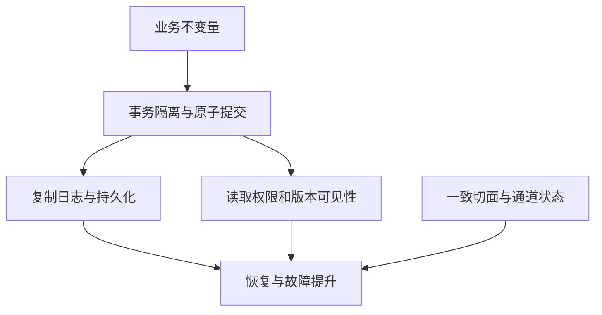

“强一致”不足以描述一个完整系统。事务隔离约束并发事务，复制协议约束副本历史，读接口约束能看到哪个版本；快照算法与异步灾备又有不同目标。

| 问题 | 知识入口 | 不能混淆的结论 |
|---|---|---|
| 同一复制组决定日志顺序 | [共识协议体系：安全条件、工程组件与使用边界]({{ '/knowledge/共识协议体系综述/' | relative_url }}) | Raft 多数提交不自动实现跨 shard 原子性 |
| 跨分片更新一起提交 | [事务模型深度调研：从 ACID 到全球分布式事务]({{ '/posts/transaction-model-survey/' | relative_url }}) | 2PC 不是隔离级别，也不是共识的替代品 |
| 副本可否本地读 | [CockroachDB Leader Lease：共享维护与安全读授权]({{ '/knowledge/CockroachDB-Leader-Lease-整体设计/' | relative_url }}) | 心跳正常不等于读到合法最新状态 |
| 分区异步备份 | [Rosé：分区数据库的异步复制]({{ '/knowledge/Rosé-异步复制协议设计/' | relative_url }}) | 有界积压不等于停机时仍有有界 RPO 时间 |
| 混合协调强度 | [Event Horizon：非对称依赖与半线性化]({{ '/knowledge/Event-Horizon-非对称依赖/' | relative_url }}) | 弱操作可能撤回/重排，不是任意操作都可交换 |
| 分布式状态快照 | [Chandy–Lamport 分布式快照算法]({{ '/knowledge/Chandy-Lamport-分布式快照算法/' | relative_url }}) | 一致切面不必是原执行真实同时出现过的状态 |

Event Horizon 依据具体操作间依赖做协调，强操作必须获得足够的弱操作水位与内容，不是看到本地 bag 就能提交。普通 consumer offset 覆盖更新也不能未经语义证明就当作可交换操作。

存算分离进一步拆开日志持久化、页面回放和查询可见性。[RaaS（Replay-as-a-Service）]({{ '/knowledge/RaaS-Replay-as-a-Service/' | relative_url }}) 处理回放竞争；[Doris 元数据、复制与导入可见性]({{ '/knowledge/Doris-元数据与一致性复制/' | relative_url }}) 需要区分 COMMITTED 与 VISIBLE；[InfluxDB 写入与查询：先区分产品形态]({{ '/knowledge/InfluxDB-写入与查询路径/' | relative_url }}) 则区分内存可查询和 Parquet 已持久化。它们没有统一的“只要日志落盘就任意节点可读”结论。

工程审查应画出成功响应前后的持久化点，列出可接受故障及恢复不变量，再测试网络分区、超时重试、重配置和延迟副本。设计推论与已发表实验分别记录，不能从架构相似直接推断相同保证。

## 来源与关联阅读

- [存储计算分离数据库的尾延迟：日志链与后台竞争]({{ '/knowledge/存储计算分离数据库的-Tail-Latency/' | relative_url }})
- [Log-as-the-Database 模式]({{ '/knowledge/Log-as-the-Database-模式/' | relative_url }})
- [InfluxDB 耐久性与高可用：确认边界和故障边界]({{ '/knowledge/InfluxDB-多副本与高可用/' | relative_url }})
- [LSM-Tree 存储引擎体系：成本模型到部署决策]({{ '/posts/wiki-synthesis-lsm-tree/' | relative_url }})
- [OLAP 与时序数据库：按工作负载阅读知识库]({{ '/posts/wiki-synthesis-olap-tsdb/' | relative_url }})
