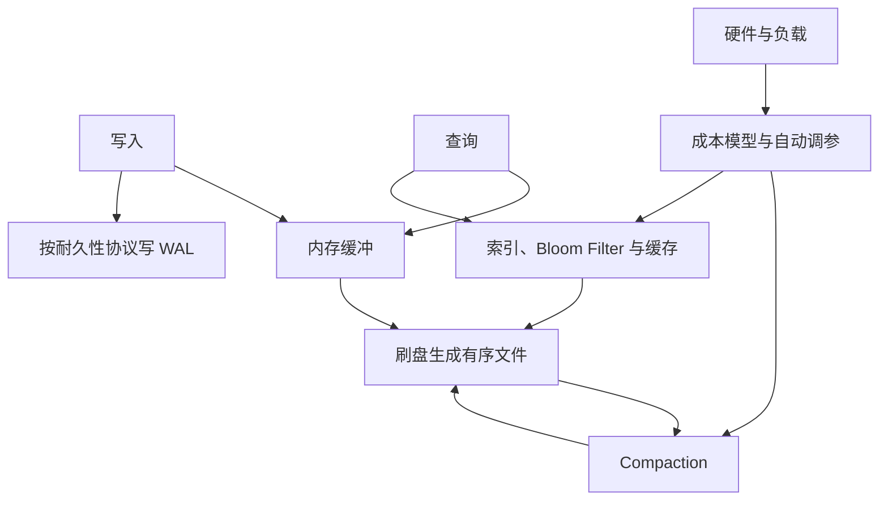

LSM 用内存缓冲、不可变有序文件和后台合并重组读写成本。WAL、过滤器、缓存、合并调度、并发控制分别承担不同职责；“有追加日志”不足以把一个系统归类为 LSM。

## 六个主题应怎样连起来

| 主题 | 解决的问题 | 不可忽略的代价 |
|---|---|---|
| [LSM-Tree 写放大 (Write Amplification)]({{ '/knowledge/LSM-Tree-写放大/' | relative_url }}) | 同一逻辑数据反复重写 | 降低写放大可能增加读与空间成本 |
| [LSM-Tree 合并优化 (Merge Optimization)]({{ '/knowledge/LSM-Tree-合并优化/' | relative_url }}) | 如何选文件、安排资源与控制积压 | 前台 P99、后台债务和崩溃恢复 |
| [LSM-Tree 硬件适配 (Hardware Adaptation)]({{ '/knowledge/LSM-Tree-硬件适配/' | relative_url }}) | DRAM、SSD、持久内存、网络的成本差异 | 并发、带宽、耐久性与故障域 |
| [LSM-Tree 自动调参：模型、过滤器与合并策略]({{ '/knowledge/LSM-Tree-自动调参/' | relative_url }}) | 过滤器、层级、冷热数据的资源分配 | 模型假设、观测延迟和在线调整代价 |
| [LSM-Tree 二级索引 (Secondary Indexing)]({{ '/knowledge/LSM-Tree-二级索引/' | relative_url }}) | 主键外的定位与索引维护 | 原子性、过期条目验证、恢复 |
| [LSM-Tree 与 RUM 猜想]({{ '/knowledge/LSM-Tree-RUM猜想/' | relative_url }}) | 讨论读、更新与内存/空间之间的取舍 | 不能当作禁止任何局部改进的无条件定理 |

## 容易误读的优化

Monkey 的非均匀 Bloom filter 分配，在相应模型中让靠近内存的较小层分得更多 bits/key；越往容量大的层，允许的误判率越高。不是“最大层每 key 分最多位”。层的总位数和每 key 位数也要区分。

Dostoevsky 的 Lazy Leveling 避免把所有层的合并政策锁成同一种：非底层保留更多 run，底层控制空间。它的成本结论依赖模型和查询组合，不是所有硬件上都最优。ElasticBF 动态启用过滤器的精度配置，不是任意停用覆盖某些键的唯一过滤器。

KV 分离减少 value 参与反复合并，却引入 value log 管理、垃圾回收和范围读取代价；不能仅看写入吞吐。bLSM 的调度是相关研究之一，旧稿“唯一解决停顿”“此后十年无人研究”没有综述范围外的充分依据，已撤回。

## 度量口径与复现实验

写放大应写清分母是用户字节、记录还是块 I/O，分子是否包含 WAL、flush、compaction、复制及设备内部写入。渐近更新 I/O 成本公式里的 block size 不能不加说明地当作字节写放大系数。

一个最小比较应固定数据总量、value 大小、读写比、偏斜、缓存预算、磁盘与线程，先灌入稳态数据，再观察足够长时间的合并。记录吞吐、P50/P99、读写放大、空间、stall 时长与恢复时间。只跑短期空库写入容易隐藏 compaction 债务。

## 系统关系和证据层级

Doris rowset/compaction 与 InfluxDB TSM 借鉴相近思想，却不是标准 RocksDB 层级的简单改名。FASTER 采用 hash index + hybrid log，也不应被列作 LSM 变体。HATS 在 Cassandra 上协调读与本地压实，CaaS/Hailstorm 等方向讨论卸载，二者需要区分。

本综述依赖两篇已核对的 LSM 综述和知识卡片；其中转述的每个子系统并非全部取得独立原文。继续阅读 [LSM 近期进展：调度、卸载和存储接口]({{ '/knowledge/LSM-Tree-存储引擎新进展-2026综述/' | relative_url }})、[Hailstorm：存算分离 LSM 的综述证据卡]({{ '/knowledge/Hailstorm-存算分离LSM数据库/' | relative_url }}) 与 [CXL 3.0：内存池化与共享的区别]({{ '/knowledge/CXL-3.0-内存池化新范式/' | relative_url }}) 时，应保留这条证据边界。

## 来源与关联阅读

- [LSM-Tree (Log-Structured Merge-Tree)]({{ '/knowledge/LSM-Tree/' | relative_url }})
- [InfluxDB 深度调研导航]({{ '/knowledge/InfluxDB深度调研/' | relative_url }})
- [Apache Doris 深度调研导航]({{ '/knowledge/Doris-深度调研/' | relative_url }})
- [Doris Compaction：选哪些文件与怎样合并]({{ '/knowledge/Doris-Compaction-策略/' | relative_url }})
- [Doris Segment v2：文件布局与表级语义]({{ '/knowledge/Doris-Segment-v2-存储格式/' | relative_url }})
- [事务模型深度调研：从 ACID 到全球分布式事务]({{ '/posts/transaction-model-survey/' | relative_url }})
