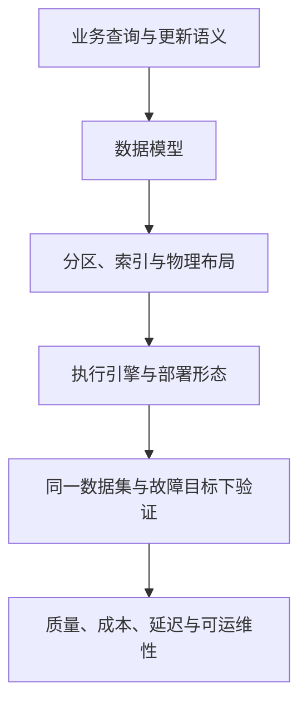

OLAP 与 TSDB 都可使用列式编码、批量执行和分区剪枝，但需要优化的问题不同。系统选型不能由“实时”“湖仓”或某个引擎名称直接决定。

| 工作负载问题 | 优先阅读 | 测量重点 |
|---|---|---|
| 明细分析、多表 Join、主键 CDC | [Apache Doris 体系：模型、文件、执行与可见性]({{ '/knowledge/Apache-Doris-OLAP-数据库体系综述/' | relative_url }}) | Join 分布、更新可见性、并发与合并压力 |
| 指标写入、时间窗口、保留与降采样 | [InfluxDB 体系：产品、引擎与数据生命周期]({{ '/knowledge/InfluxDB-时序数据库体系综述/' | relative_url }}) | 实际基数、最新数据可见性、窗口扫描与恢复 |
| 流式状态与历史湖表结合 | [Fluss 整体架构与 Kafka 2.7.2 对照]({{ '/knowledge/Fluss-流处理平台架构综述/' | relative_url }}) | Log/KV/Lake 三种进度和提交边界 |
| 存储底层读写成本 | [LSM-Tree 存储引擎体系：成本模型到部署决策]({{ '/posts/wiki-synthesis-lsm-tree/' | relative_url }}) | 放大、缓存、后台债务和尾延迟 |

读写确认、查询可见、备份可恢复是三种不同边界；列式文件、向量化执行、水平扩容也是三个不同维度。不要把 CockroachDB 的向量化等同于物理列存，或把 InfluxDB Clustered 的部署图套到 Core。

本综述是导航与比较框架，不提供未经统一测试的产品排名。各领域卡片中的版本、原文证据与待核验项优先于旧周报中的趋势判断。

## 来源与关联阅读

- [Apache Doris 深度调研导航]({{ '/knowledge/Doris-深度调研/' | relative_url }})
- [Doris 数据模型：三种模型与 Unique 的两种实现]({{ '/knowledge/Doris-数据模型/' | relative_url }})
- [Doris Segment v2：文件布局与表级语义]({{ '/knowledge/Doris-Segment-v2-存储格式/' | relative_url }})
- [Doris Compaction：选哪些文件与怎样合并]({{ '/knowledge/Doris-Compaction-策略/' | relative_url }})
- [Doris MPP 向量化查询引擎]({{ '/knowledge/Doris-MPP-向量化查询引擎/' | relative_url }})
- [Doris Nereids CBO 优化器]({{ '/knowledge/Doris-Nereids-CBO-优化器/' | relative_url }})
- [Doris 架构演进：共同的查询入口与两种存储部署]({{ '/knowledge/Doris-架构演进/' | relative_url }})
- [Doris 元数据、复制与导入可见性]({{ '/knowledge/Doris-元数据与一致性复制/' | relative_url }})
- [InfluxDB 深度调研导航]({{ '/knowledge/InfluxDB深度调研/' | relative_url }})
- [InfluxDB 数据模型与产品差异]({{ '/knowledge/InfluxDB-数据模型/' | relative_url }})
- [InfluxDB TSM 存储引擎]({{ '/knowledge/InfluxDB-TSM存储引擎/' | relative_url }})
- [InfluxDB 3 的列式引擎：格式、执行与部署]({{ '/knowledge/InfluxDB-3-列存引擎/' | relative_url }})
- [InfluxDB 写入与查询：先区分产品形态]({{ '/knowledge/InfluxDB-写入与查询路径/' | relative_url }})
- [InfluxDB 指标设计与基数管理]({{ '/knowledge/InfluxDB-指标设计与基数管理/' | relative_url }})
- [InfluxDB 耐久性与高可用：确认边界和故障边界]({{ '/knowledge/InfluxDB-多副本与高可用/' | relative_url }})
- [InfluxDB Catalog：元数据边界取决于产品]({{ '/knowledge/InfluxDB-Catalog元数据/' | relative_url }})
- [事务模型深度调研：从 ACID 到全球分布式事务]({{ '/posts/transaction-model-survey/' | relative_url }})
