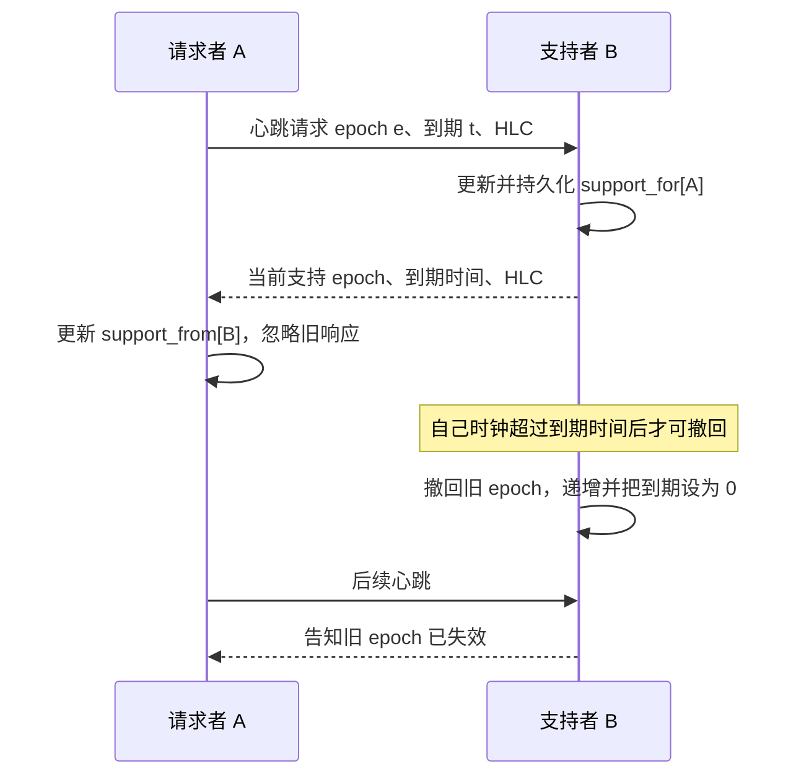

> 来源：Leader Leases 论文 §3.4、§4.1（PDF pp.6–8），Algorithms1–3、Figure4。完整分析见 [CockroachDB Leader Leases：精读分析]({{ '/knowledge/CockroachDB-Leader-Leases-精读分析/' | relative_url }})。

## 支持不是全局在线标志

A请求B支持自己的epoch e至时间戳t；B承诺在其时钟超过t前保持支持。A→B与A→C独立，B撤回支持只中断对应边，不要求C也切换epoch。生产实现以store为粒度，隔离单盘故障。

## 状态与重启

| 状态 | 作用 |
|---|---|
| max_epoch | 节点epoch历史的单调计数，不代表所有边当前epoch都相同 |
| support_from | 收到的每对端支持，非持久；旧响应不可倒退epoch/时间 |
| support_for | 给其他节点的支持，持久，重启后仍须兑现 |
| max_requested | 曾请求的最大截止时间，持久；约束新epoch的建立 |
| max_withdrawn | 曾撤回支持的最大时间戳，持久；防止撤回关系复活 |

重启时递增max_epoch，使时钟越过max_requested与max_withdrawn，清空并重建收到的支持，同时恢复给出的承诺。省掉这些步骤，只有一个“发ping/等timeout”的循环，不能获得论文性质。

## 两个性质不能混淆

**Support Durability**：若A收到了B至t的支持，B仍支持A，或B时钟已超过t。**Support Disjointness**：A还在旧epoch e支持对应的时间区间内时，不会接收一个更高epoch e′的重叠支持。约束的是不同epoch，不是同epoch续约不能重叠。

协议依赖单调时钟及HLC消息的因果推进；无须紧密同步，不等于毫无时钟假设。B与A在真实时间可能先后到达同一个时间戳，因此不要将证明改写为它们在同一墙钟瞬间同时超时。

## 开销和磁盘停顿

Figure8（p.11）每节点12 stores、5–150节点，600/1200/1800 stores对应约0.073/0.15/0.225核，说明测试观测的FabricCPU增长。它不证明全mesh总消息数线性，也不证明所有集群始终低于该值。

发Fabric心跳前同步磁盘写，使磁盘stall阻止支持续期；再由 [Leader Fortification：强化 Raft 领导权]({{ '/knowledge/CockroachDB-Leader-Fortification/' | relative_url }}) 把支持过期传递到领导权。Fabric只提供底层支持，不能单独替代Raft日志安全性或数据库事务语义。

## 来源与关联阅读

- [Scalable-Leader-Leases-SIGMOD2026]({{ '/media/knowledge/b427fd037a22-Scalable-Leader-Leases-SIGMOD2026.pdf' | relative_url }})
- [CockroachDB Leader Lease：共享维护与安全读授权]({{ '/knowledge/CockroachDB-Leader-Lease-整体设计/' | relative_url }})
- [事务模型深度调研：从 ACID 到全球分布式事务]({{ '/posts/transaction-model-survey/' | relative_url }})
