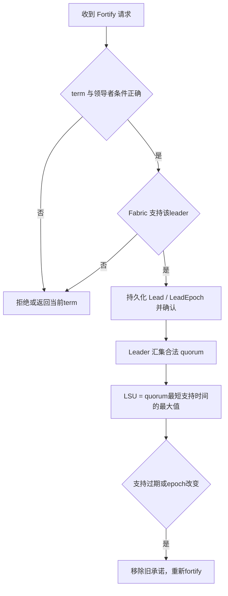

> 依据 Leader Leases 论文 §3.3、§4.2（PDF pp.4–6、9），Figures2–3。它是Raft的额外协议，不能视为基本Raft心跳天然提供的租约保证。

## 承诺与 LSU

Leader发送MsgFortifyLeader；follower核对term、没有强化另一leader、Fabric中确实支持该leader后，回复LeadEpoch。Leader收到含自身的quorum响应后建立fortification，并从本地Fabric查询每个已强化副本的有效支持截止τ。

`LSU=max_Q min_(r∈Q) τ_r` 只对有效且epoch匹配的支持计算。以自构三副本例，若可用支持到期时间分别为100、120、130，二副本quorum能给出的最大最短值为120；这里的数值是时间戳示例，不是论文配置。不能只取所有副本最大值130。

## 持久化与重配置

Follower若重启后忘记它已承诺不投票，就可能在旧lease有效期间选出新leader。因此§3.3.6新增持久字段Lead和LeadEpoch，恢复时结合Fabric检查承诺。

配置变化可能降低当前LSU，但不能让已经授出的较长授权凭空缩短。§3.3.5、Figure3引入MaxLSU，要求在提出配置变更前达到LSU=MaxLSU，先强化当前配置。成员变更不是仅重新算一个quorum公式即可。

## 退出与转移

显式MsgDefortify、观察到更高term的处理，以及经当前leader授权的leadership transfer，负责释放旧承诺并维持活性。合作lease转移暂用expiration lease，之后才把lease与新leader重新合并。未强化follower继续收到周期性Fortify请求，已强化follower可由Fabric代替常态Raft心跳。

## 安全证据和代价

§4.2的引理把Fabric的持久支持与新leader时间戳界连接起来，再由§4.3 Theorem4.7推出lease不重叠。不是依据随机选举超时猜测“应该还没有新leader”。

代价是故障时可能先等support到期再竞选。§5.1相同3秒lease配置下，相比旧类约多1–2秒；这是具体实验对照，不是协议在任意网络下的固定延迟。

前置阅读：[Raft 客户端交互：去重、读屏障和会话]({{ '/knowledge/Raft-客户端交互/' | relative_url }})、[Liveness Fabric：有向支持关系]({{ '/knowledge/CockroachDB-Liveness-Fabric-故障检测层/' | relative_url }})；整体见 [CockroachDB Leader Lease：共享维护与安全读授权]({{ '/knowledge/CockroachDB-Leader-Lease-整体设计/' | relative_url }})。

## 来源与关联阅读

- [Scalable-Leader-Leases-SIGMOD2026]({{ '/media/knowledge/b427fd037a22-Scalable-Leader-Leases-SIGMOD2026.pdf' | relative_url }})
- [事务模型深度调研：从 ACID 到全球分布式事务]({{ '/posts/transaction-model-survey/' | relative_url }})
