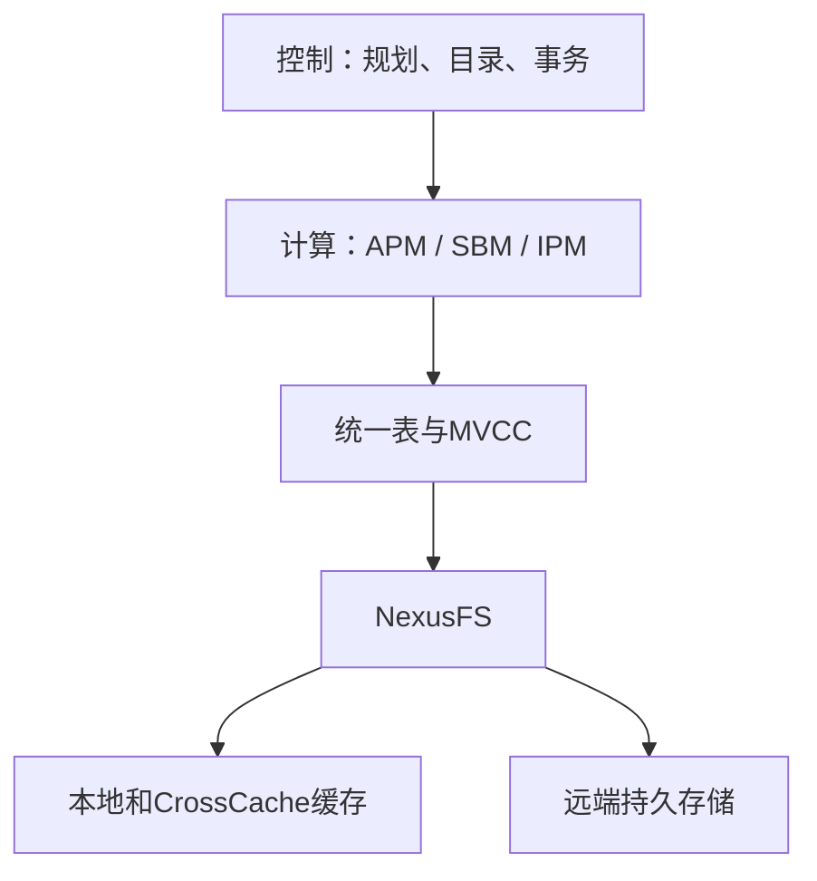

## 定义

ByteHouse 是 ByteDance 自研的云原生分析数据仓库，采用 **控制、计算、存储分层** 的 shared-storage 架构，同时支持结构化 OLAP 和非结构化向量检索。已服务 400+ 内部业务。

## 三层架构

### Control Layer

| 组件 | 职责 |
|------|------|
| Server | SQL 解析、语义分析、HBO 优化、分布式调度 |
| Catalog Manager | 版本化元数据存储 (ByteKV)，快照一致的 schema/分区/索引 |
| Global Transaction Manager | 论文§2称其支持serializable事务和一致快照读；详细并发控制证明未展开 |
| Daemon Manager | 后台任务编排：Compaction、Merge 调度 |

### Compute Layer

三种执行模式共享同一优化器和运行时：

- **APM (Analytic Pipeline Mode)**：分布式 MPP，shuffle/gather/broadcast
- **SBM (Staged Batch Mode)**：ETL 长任务，阶段重试 + shuffle 持久化
- **IPM (Incremental Processing Mode)**：增量执行，lineage 追踪 + 版本化算子

索引支持：Min-Max, Set, Bloom, HNSW/IVF 向量索引。Arrow 零拷贝数据交换。

### Storage Layer

详见 [ByteHouse 统一表引擎]({{ '/knowledge/ByteHouse-统一表引擎/' | relative_url }})。关键创新：

- **Sniffer 格式**：自描述列式，数据+索引+元数据 colocate
- **CrossCache**：独立 SSD 集群缓存，一致性哈希分片
- **NexusFS**：虚拟文件系统，统一本地 SSD + Cache + 对象存储

## 对比边界

本卡描述论文版本的ByteHouse。删除未逐一验证的当前竞品能力矩阵；比较Doris、ClickHouse或Snowflake应固定版本、部署模式和相同工作负载。

## 证据与适用条件

核验本地PDF：§2–3（页2–6）架构与存储，§4–6（页6–10）执行和优化，§7（页10–12）实验。ClickBench 43查询各跑5次取最快，较ClickHouse总延迟降低25.4%；向量实验为99%召回、1%标量过滤；CrossCache对照含无缓存、100%/50%本地命中。不同实验不能混为统一收益。细节见[精读分析]({{ '/knowledge/ByteHouse-精读分析/' | relative_url }})。

## 来源与关联阅读

- [ByteHouse-SIGMOD2026]({{ '/media/knowledge/3dcf012f0842-ByteHouse-SIGMOD2026.pdf' | relative_url }})
- [ByteHouse 多模态查询优化]({{ '/knowledge/ByteHouse-多模态查询优化/' | relative_url }})
- [Apache Doris 深度调研导航]({{ '/knowledge/Doris-深度调研/' | relative_url }})
- [事务模型深度调研：从 ACID 到全球分布式事务]({{ '/posts/transaction-model-survey/' | relative_url }})
