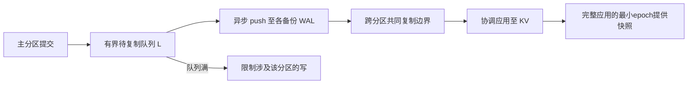

## 语义：一致的旧快照，不是零丢失同步复制

Rosé利用已有的跨分区全局快照机制，暴露主库历史的连续前缀，并让读到的前缀单调前进（原文§2.1、§4.1，PDF pp.2–3）。各分区完整应用epoch为e_i时，可读边界是`min_i(e_i)`。HLC/MVCC只是可用基础组件，不自动保证跨分区一致快照。

异步路径仍在远端持久化前确认写，因此主区失效可能丢失超出备份安全前缀的已确认写；“强语义”在这里指单调前缀，不应改写成全球实时线性一致或零数据损失。

## 原文 lag 公式需要辨析

原文§4.2.1 p.3写`effective lag=min(lag_i)`，与安全快照最慢分区的含义不一致，属于本次核对发现的疑似公式问题。

自构例：共同primary epoch E=10，两个备份到9和2，局部lag分别1和8，全局快照2落后8。由定义推得`E−min(e_backup)=max(E−e_backup)`。这项推导只在共同基准E下成立；不能把各primary的不同进度随意相减后取最小值。

## 回压的实际保证

§4.2的队列L限制待复制积压，满时对相应分区写回压。其他独立分区不直接被限流，但全局快照与跨分区事务仍可能受慢分区影响。§4.2.2承认分区完全停机可让时间lag无限增长，所以有界队列不等于无条件墙钟RPO上限。

该节可用性证明基于固定事务顺序、链路可用时等待θ腾出槽位等模型；`p^3`故障概率例隐含独立节点失败，不能用于相关机房故障。人工解除回压恢复可用性，也就放弃了对应的积压约束。

## 证据与工程范围

§5在单机Cloudlab模拟网络拓扑，Chablis集成原型与Yugabyte2.25.2.0-b359对照。Figure6展示两者均小于2秒切换；读吞吐/P99相对退化分别22%/15%与0%/0%。它证明该实验下协调应用的价值，不是任何部署都零退化。

[Rosé Coordinated Apply：将不可用尾部留在 WAL]({{ '/knowledge/Rosé-Coordinated-Apply-协调应用/' | relative_url }})解释WAL/KV分离；完整实验、原文疑点与反例见 [Rosé：分区数据库异步复制精读]({{ '/knowledge/Rose-精读分析/' | relative_url }})。

## 来源与关联阅读

- [Rose-CIDR2026]({{ '/media/knowledge/f97412009672-Rose-CIDR2026.pdf' | relative_url }})
- [事务模型深度调研：从 ACID 到全球分布式事务]({{ '/posts/transaction-model-survey/' | relative_url }})
- [分布式数据系统：一致性需要分层说明]({{ '/posts/wiki-synthesis-consistency/' | relative_url }})
