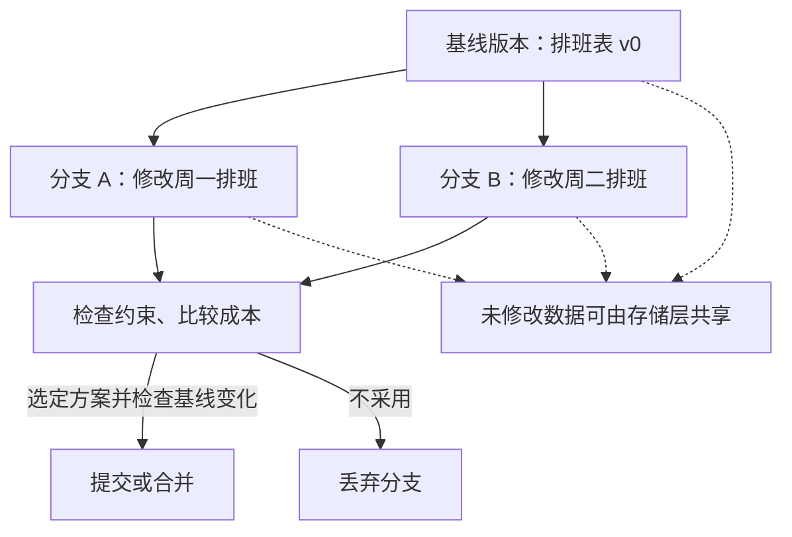

## 问题与概念（Agent-First Data Systems，§6）

当多个 Agent 从同一数据版本探索不同方案时，需要低成本创建、丢弃和比较分支。论文将需求称为 **Multi-World Isolation（MWI）**：逻辑上隔离各个“假设世界”，物理上尽量共享不变的数据。

这不是 ACID 的替代定义，也不意味着传统 ACID 只能串行执行。事务隔离、分支生命周期和合并语义是不同问题。旧稿的“90% 相同数据”“传统只有个位数分支”均缺少测量依据，不能作为设计参数。

## 机制设想与例子

图是解释性设计，并非论文给出的已实现协议。步骤为：固定基线版本；为每个假设建立独立变更集；在各自视图内执行约束检查；选择方案；在合并时检查主线自基线以来的变化。A、B 即使改不同记录，也可能一起违反“每班至少一名主管”的跨记录约束，因此**物理共享或 CoW 不自动解决合并冲突**。

论文讨论可借鉴 MVCC、数据版本管理与 copy-on-write，并引用 Bayou、TARDiS、ORPHEUSDB、Dynamo 等相关工作；这些系统具有不同一致性和冲突解决目标，不能视为同一种 MWI 实现。

## 证据与尚未定义的部分

论文引用 Neon 观察到 Agent 创建更多分支、更多回滚（20×、50×），但未给足比较群体、分母和统一工作负载。这是趋势性动机，不是分支事务 benchmark。论文没有提供 MWI 原型的性能、恢复实验或完整隔离/合并形式化语义。

待解决问题包括：读视图如何固定；分支间是否可读；主线变化如何检测；跨分支冲突、约束和失败合并如何处理；何时垃圾回收；共享缓存如何避免跨权限泄漏。分支丢弃也不能撤销已向外部系统发送的邮件、API 操作或数据。

## 可执行的评估思路（本卡片建议）

在固定数据集和并发分支数下，比较独立数据库副本、CoW 分支和候选共享实现；同时报告创建/丢弃延迟、增量存储、内存、查询延迟、合并冲突率及恢复正确性。不能只测分支创建速度就宣布事务语义成立。

[事务模型深度调研：从 ACID 到全球分布式事务]({{ '/posts/transaction-model-survey/' | relative_url }}) 可用于理解 MVCC 与快照隔离；[Agent-First Data Systems — Agent 优先的数据系统架构]({{ '/knowledge/Agent-First-Data-Systems/' | relative_url }}) 给出任务级动机。旧稿把 CockroachDB lease epoch 当作分支快照机制、把 Rosé 的日志/存储分离直接当作分支实现依据，均跨越了原论文支持范围，已移除。

## 来源与关联阅读

- [Agent-First-Data-CIDR2026]({{ '/media/knowledge/53835cce7452-Agent-First-Data-CIDR2026.pdf' | relative_url }})
