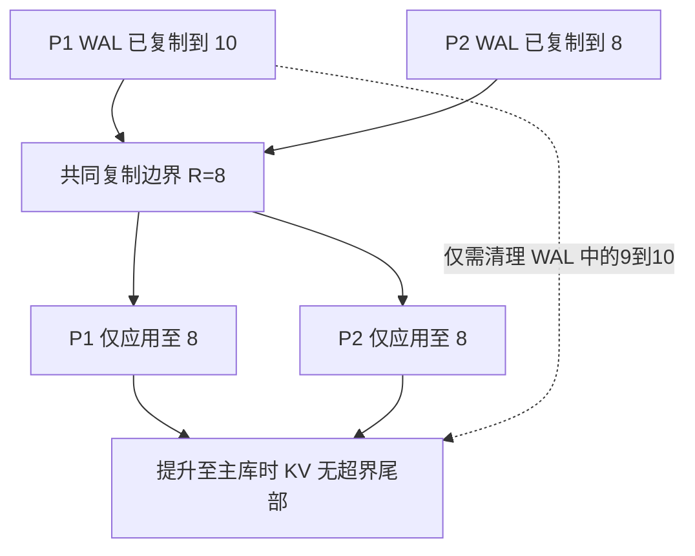

> 核对原文§4.3、Figures2–4（PDF pp.4–6）与§5.3 Figure6。这里的“协调”是共同安全应用边界，不要求所有CPU同时执行apply。

## 三个水位必须区分

1. 每个备份分区**完整复制到WAL**的epoch。
2. 所有分区复制水位的最小值R，即允许apply的上界。
3. 各分区**实际完整应用到KV**的进度；只读快照需要共同可读的应用边界。

复制可以超前，KV不能应用超出管理者许可的共同前缀。通知apply不等于apply立即完成。

这是自构两分区示例。若P1已经把9–10写入KV，则提升到8时必须删除或过滤这些记录；Rosé提前阻止这类应用，改为快速截断WAL尾部。原文只称快速trim，**没有给出任意日志存储下严格O(1)的保证**。

## 与Yugabyte基线的差别

§4.3.1的Figure3描述：按SST的max_ts判断是否超出恢复目标，再记录keep_ts；读取时过滤超界记录，compaction后续清理。Rosé避免把这些未来无效版本先写进KV，因此减少恢复后的过滤工作。这是特定恢复路径的比较，不是LSM结构必然低效的证据。

## 等待开销不是零成本定理

冷热分区示例中`dead_time_i=max(RT)−RT_i`。RT依赖本epoch数据量和网络带宽，较短epoch减少等待。Figure4假设较快分区延迟开始后仍可在慢分区完成前apply完，所以最终快照推进时间不变；若apply速度、负载或故障条件不同，需重新测量。

回压可以帮助仍在处理的掉队分区追赶，但完全停机分区仍会卡住共同水位；不能说队列有界就排除了所有全局停滞，见 [Rosé：分区数据库的异步复制]({{ '/knowledge/Rosé-异步复制协议设计/' | relative_url }})。

## 实验支持范围

§5.3：单机模拟，每区域两节点主备，均匀读写后断开一备份连接。Yugabyte2.25.2.0-b359与Rosé均小于2秒切换；前者读吞吐下降22%、P99上升15%，后者对应0%。作者只对比各自恢复前后的相对性能，不比较绝对吞吐。0%不是所有系统都“恢复后永远满性能”的保证。

来源与其他边界见 [Rosé：分区数据库异步复制精读]({{ '/knowledge/Rose-精读分析/' | relative_url }})。快照/日志截断还必须与宿主的事务元数据、持久性、读可见性和故障提升协议集成。

## 来源与关联阅读

- [Rose-CIDR2026]({{ '/media/knowledge/f97412009672-Rose-CIDR2026.pdf' | relative_url }})
- [LSM-Tree (Log-Structured Merge-Tree)]({{ '/knowledge/LSM-Tree/' | relative_url }})
- [LSM-Tree 合并优化 (Merge Optimization)]({{ '/knowledge/LSM-Tree-合并优化/' | relative_url }})
