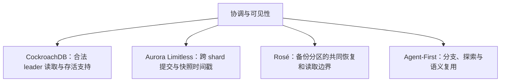
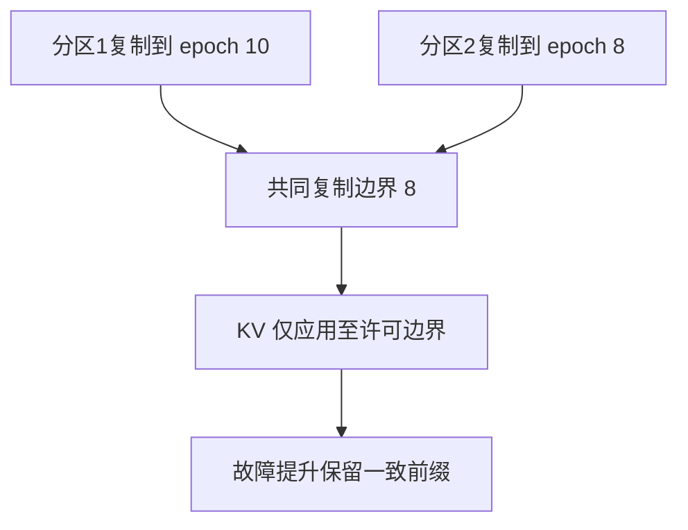

CockroachDB Leader Leases、Aurora Limitless、Rosé 和 Agent-First Data 研究的对象并不相同。将它们放在同一图里，是为了比较协调发生在哪里，而不是把某个方案看成另一方案的升级版本。

## CockroachDB：复制日志之上的读取权限

其 range 复制使用 Raft。Leader lease 和 liveness 支持允许在满足条件时减少读路径协调；不能写成 Multi-Paxos，也不能把没有检测到故障当作天然拥有有效 lease。[CockroachDB Leader Lease：共享维护与安全读授权]({{ '/knowledge/CockroachDB-Leader-Lease-整体设计/' | relative_url }})、[Liveness Fabric：有向支持关系]({{ '/knowledge/CockroachDB-Liveness-Fabric-故障检测层/' | relative_url }})、[Leader Fortification：强化 Raft 领导权]({{ '/knowledge/CockroachDB-Leader-Fortification/' | relative_url }}) 分别解释职责、支持关系和失效处理。

## Aurora Limitless：时间戳不替代提交协议

Router 与 shard 通过时间戳快照提供 RR/SI 与 RC 语义；多 shard 更新采用 lead-shard 参与的两阶段提交。HLC 处理读时间戳推进，commit wait 约束实时顺序，二者都不应被概括成“避免所有 2PC”。单 shard 与只读优化有自己的适用条件。

尊重实时顺序的 SI 仍可能存在 write skew，不能称为串行化。Router 没有专用 standby 也不代表没有持久元数据。实验里的 NOPM、NEWORD 平均延迟、扩容吞吐和 P99 是不同指标；原文个别百分比与表值不一致时，应列出重算过程，见 [Aurora Limitless 精读：时间戳事务与二维扩缩容]({{ '/knowledge/Aurora-Limitless-精读分析/' | relative_url }})。

## Rosé：共同水位与受控应用

备份分区各自复制 epoch，整体可用边界受到较慢分区约束。Coordinated Apply 不让已复制但超出共同许可边界的尾部先进入 KV，从而降低提升备库时清理超界版本的成本。

队列长度限制在途积压，不能保证完全停机分区在有限墙钟时间内追上。若统一 primary epoch 为 E，各 backup 到 e_i，则共同前缀落后量是 `E-min(e_i)=max(E-e_i)`；论文中相反的 min-lag 写法存在疑点，已在精读显式标注，而非当作已证结论沿用。

## Agent-First：把假设与已验证结果分开

分支事务、语义缓存和推测执行针对探索型工作流，不代表可以放松支付、外发消息等真实副作用的事务要求。原文的案例、微基准与愿景应分别阅读。[论文概览]({{ '/knowledge/Agent-First-Data-精读分析/' | relative_url }}) 记录实验设置和表格，不能把语义复用直接当成任意任务等价性证明。

## 共同的评审框架

对每项方案回答：谁有权写、什么时刻应答、读到哪个快照、崩溃后保留哪段历史、最慢分区是否阻塞整体、哪些外部副作用无法撤销。评价时固定故障模型与一致性目标，再比较吞吐、尾延迟和恢复时间。关联 [事务模型深度调研：从 ACID 到全球分布式事务]({{ '/posts/transaction-model-survey/' | relative_url }})、[分布式数据系统：一致性需要分层说明]({{ '/posts/wiki-synthesis-consistency/' | relative_url }})。

## 来源与关联阅读

- [Aurora Limitless 分布式架构]({{ '/knowledge/Aurora-Limitless-分布式架构/' | relative_url }})
- [Aurora Limitless 时间戳事务]({{ '/knowledge/Aurora-Limitless-时间戳事务/' | relative_url }})
- [Aurora Limitless 自适应扩缩容]({{ '/knowledge/Aurora-Limitless-自适应扩缩容/' | relative_url }})
- [Rosé：分区数据库的异步复制]({{ '/knowledge/Rosé-异步复制协议设计/' | relative_url }})
- [Rosé Coordinated Apply：将不可用尾部留在 WAL]({{ '/knowledge/Rosé-Coordinated-Apply-协调应用/' | relative_url }})
- [Agent-First Branch Transactions — Agent 优先的分支事务]({{ '/knowledge/Agent-First-Branch-Transactions-分支事务/' | relative_url }})
- [Agent-First Data Systems — Agent 优先的数据系统架构]({{ '/knowledge/Agent-First-Data-Systems/' | relative_url }})
- [CockroachDB 与 TiDB：事务和存储职责对照]({{ '/knowledge/CockroachDB-vs-TiDB-2026-对比/' | relative_url }})
- [CXL 3.0：内存池化与共享的区别]({{ '/knowledge/CXL-3.0-内存池化新范式/' | relative_url }})
