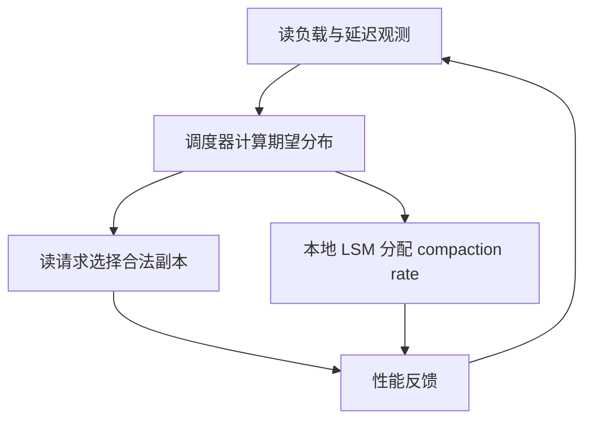

本次原文核对发现，旧笔记以“Silo 分布式 Compaction”命名的内容不对应所附论文。实际 PDF 是 FAST 2026 的 HATS。旧 WAF 调度、任务迁移协议及 62% / 57% 结果已撤回；保留旧路径仅为兼容链接，显示名称改为 HATS。

## HATS 在协调什么

压实干扰使不同副本的读取代价随时间变化；只均匀分发读请求无法消除延迟差异，一直推迟压实又会累积读放大。HATS 将合法副本间的读路由与各副本本地 compaction 预算放进同一反馈过程。

Raft 在这项设计中选出 scheduler，不替代 Cassandra 的用户数据复制协议。数据也不会随每次读调度迁移。因此它不能被画成远端 compaction 服务。

## 实驗支持哪些结论

论文以 Cassandra 5.0 为基础，默认 10 个四核/16GiB/SATA SSD 节点、10Gbps 网络、R=3、读响应数 1、写响应数 3，使用 YCSB、100M 记录及多轮运行。read-dominant 负载中，作者报告相对 C3/DEPART 的 P99 与吞吐改善；具体数值和图表位置见 [HATS 精读：分布式 LSM 的读请求与 Compaction 协同调度]({{ '/knowledge/LSM-Scheduling-精读分析/' | relative_url }})。这些结果不是通用 SLO 达标率，也没有验证所有强一致读取配置或千节点规模。

## 与其他路线比较

| 路线 | 调整的对象 | 应验证的额外代价 |
|---|---|---|
| [HATS 读与压实协同]({{ '/knowledge/Silo-分布式LSM-Compaction调度/' | relative_url }}) | 路由与本地预算 | 状态过期、调度震荡、写密集负载 |
| [CaaS-LSM：独立 Compaction 服务]({{ '/knowledge/CaaS-LSM-Compaction即服务/' | relative_url }}) | 压实计算的位置 | 网络、任务一致性、失败清理 |
| [Hailstorm：存算分离 LSM 的综述证据卡]({{ '/knowledge/Hailstorm-存算分离LSM数据库/' | relative_url }}) | 计算、存储池与卸载 | 原文实验仍待独立精读 |
| [Fluss KV 存储（RocksDB）]({{ '/knowledge/Fluss-KV存储-RocksDB/' | relative_url }}) | 流日志与 PK 状态接口 | 快照和日志的恢复边界 |

下一步实证问题是：同一硬件与一致性目标下，调度与卸载是否可组合、何时竞争同一网络预算，而不是仅比较不同论文摘要中的最大倍数。基础成本模型见 [LSM-Tree 存储引擎体系：成本模型到部署决策]({{ '/posts/wiki-synthesis-lsm-tree/' | relative_url }})。

## 来源与关联阅读

- [HATS：副本选择与 Compaction 配额]({{ '/knowledge/Silo-Compaction-迁移协议/' | relative_url }})
- [LSM-Tree (Log-Structured Merge-Tree)]({{ '/knowledge/LSM-Tree/' | relative_url }})
- [LSM-Tree 写放大 (Write Amplification)]({{ '/knowledge/LSM-Tree-写放大/' | relative_url }})
- [LSM-Tree 合并优化 (Merge Optimization)]({{ '/knowledge/LSM-Tree-合并优化/' | relative_url }})
- [LSM-Tree 自动调参：模型、过滤器与合并策略]({{ '/knowledge/LSM-Tree-自动调参/' | relative_url }})
- [LSM-Tree 与 RUM 猜想]({{ '/knowledge/LSM-Tree-RUM猜想/' | relative_url }})
- [LSM-Tree 硬件适配 (Hardware Adaptation)]({{ '/knowledge/LSM-Tree-硬件适配/' | relative_url }})
- [LSM-Tree 二级索引 (Secondary Indexing)]({{ '/knowledge/LSM-Tree-二级索引/' | relative_url }})
- [Fluss 存储引擎模块分析]({{ '/knowledge/Fluss-存储引擎/' | relative_url }})
- [PebblesDB：通过 Guard 组织分区 Tiering]({{ '/knowledge/PebblesDB-碎片化LSM-Tree/' | relative_url }})
- [Pacman：持久内存中的 Compaction 路线]({{ '/knowledge/Pacman-持久内存Compaction/' | relative_url }})
- [gLSM：GPU 加速 Compaction 的证据边界]({{ '/knowledge/gLSM-GPU加速Compaction/' | relative_url }})
- [ElasticBF：按热度激活 Bloom Filter 预算]({{ '/knowledge/ElasticBF-弹性BloomFilter/' | relative_url }})
- [Lethe：删除持久化也是 LSM 设计目标]({{ '/knowledge/Lethe-删除感知LSM引擎/' | relative_url }})
- [Bourbon：LSM 学习索引的证据与选型]({{ '/knowledge/Bourbon-Learned-Index-LSM/' | relative_url }})
- [REMIX：跨文件全局有序视图]({{ '/knowledge/REMIX-全局排序索引/' | relative_url }})
- [Nova-LSM：基于 RDMA 的组件化 LSM]({{ '/knowledge/Nova-LSM-分布式组件化LSM/' | relative_url }})
- [LSM-tree KV Store 综述（2020-2025）]({{ '/knowledge/LSM-tree-KV-Survey-综述/' | relative_url }})
- [Bigtable：分布式结构化存储系统]({{ '/knowledge/Bigtable-分布式结构化存储系统/' | relative_url }})
