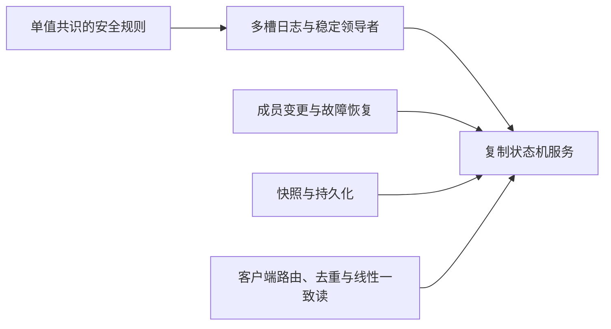

> 核对 Ongaro 博士论文 §2.3（pp.8–10）、§3.1 与 Ch.11；不是原稿所称的 Ch.3–4 专门讨论 Paxos。此卡讨论作者对理解与工程化的分析，不宣称 Paxos 无法实现高效可靠系统。

## 单值安全性没有替实现者决定所有接口

单次 Paxos 选择一个值；复制状态机还要串联多个日志位置，处理稳定 leader、日志缺洞、客户端重试、成员变化、持久化和快照。Multi-Paxos 可复用领导者准备阶段，避免每个槽位都做完整的两阶段通信，但完整服务仍需给这些组件确定语义。

## Ongaro 的设计判断

§2.3 指出单值 Paxos 较难理解，从单值协议到多值完整系统的组合也不直观；§3.1 以问题分解和缩减状态空间为 Raft 的设计取向。Raft 把领导者选举、复制和安全性纳入同一个明确协议，并继续讨论成员变更、压缩和客户端语义。

这是可理解性与规范完整性的比较，不是“Paxos 的数学证明有缺陷”。Howard 后续放宽 quorum 的工作说明经典条件有可优化空间，也不等价于证明经典 Paxos 不安全或所有实现困难都来自 majority quorum。

## 一个容易遗漏的工程例子

即便日志安全，若写入已执行但客户端未收到回复，盲目重试 `balance += 10` 仍会重复增加。需要将请求 ID、响应缓存、会话回收和快照一并设计。换成 Raft 也不会自动消除这部分工作，见 [Raft 客户端交互：去重、读屏障和会话]({{ '/knowledge/Raft-客户端交互/' | relative_url }})。

## 比较协议时保持名称准确

- Raft 与 Paxos 都能支持复制状态机；Raft 不是简单的 Multi-Paxos 产品实现。
- ZooKeeper 的协议是 Zab；Viewstamped Replication 也是独立算法，不能放进“Multi-Paxos 各家实现”表格。
- CockroachDB 的相关论文明确采用 Raft，见 [CockroachDB Leader Lease：共享维护与安全读授权]({{ '/knowledge/CockroachDB-Leader-Lease-整体设计/' | relative_url }})。

## 可理解性的实验证据

Ch.7 的双算法教学与测试中，43 名完成两份测验的参与者里 33 人在 Raft 上得分更高，配对均值 25.73 对 20.79（满分 60，§7.4.1、Figures 7.3–7.5）。这支持该实验设置下的理解优势；样本、题目和教学材料影响外推，不能直接推出实现缺陷率、生产吞吐或普遍开发成本。

进一步读 [Raft 共识算法协议核心]({{ '/knowledge/Raft-共识算法协议核心/' | relative_url }})、[Raft 集群成员变更]({{ '/knowledge/Raft-集群成员变更/' | relative_url }})、[Raft 日志压缩]({{ '/knowledge/Raft-日志压缩/' | relative_url }})；理论条件的另一条研究线见 [Paxos Quorum Intersection Revised]({{ '/knowledge/Paxos-Quorum-Intersection-Revised/' | relative_url }})。

## 来源与关联阅读

- [Raft 博士论文精读：从安全复制到可用系统]({{ '/knowledge/Raft-Dissertation-精读分析/' | relative_url }})
- [分布式数据系统：一致性需要分层说明]({{ '/posts/wiki-synthesis-consistency/' | relative_url }})
- [事务模型深度调研：从 ACID 到全球分布式事务]({{ '/posts/transaction-model-survey/' | relative_url }})
