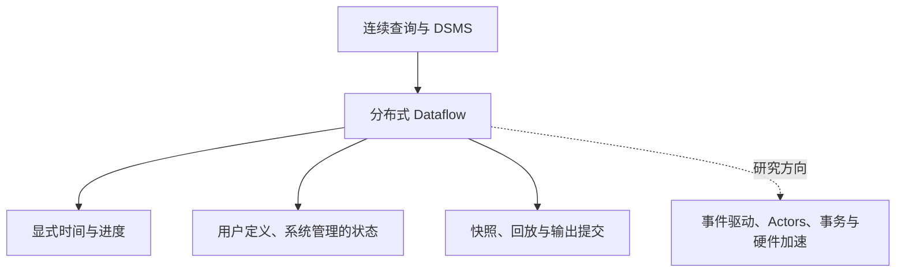

本综述以 SP-Survey 的 2023 年 v2 为历史框架，再连接 Flink / Fluss 的具体工程笔记。原文比较两代系统并展望可能的第三代，不能把展望写成 2022 年后所有系统已经实现的统一标准。

## 四条贯穿问题

1. **时间**：event time 与 processing time 不同；watermark 表达进度假设，不证明不会再有迟到事件。窗口触发和结果修正要和迟到策略一起设计，见 [Dataflow 模型]({{ '/knowledge/Dataflow-Model/' | relative_url }})、[流处理乱序数据管理]({{ '/knowledge/流处理乱序数据管理/' | relative_url }})。
2. **状态**：状态大小、访问分布和恢复方式决定后端选择。RocksDB 是 LSM 路线之一；FASTER 的 hash index + hybrid log 不应被误归为 LSM，见 [流处理状态管理]({{ '/knowledge/流处理状态管理/' | relative_url }})。
3. **恢复**：checkpoint 必须覆盖算子状态、输入位置及相应通道信息。Chandy–Lamport 原算法的 marker 规则和 Flink aligned/unaligned 工程实现不可直接等同，见 [流处理容错模型]({{ '/knowledge/流处理容错模型/' | relative_url }})。
4. **结果**：内部 exactly-once 状态处理不自动保证外部副作用 exactly-once。必须结合 source 可重放性、sink 幂等或提交协议，见 [流处理弹性与重配置]({{ '/knowledge/流处理弹性与重配置/' | relative_url }})。

## 新工程功能如何放进历史框架

[Apache Flink 2.3.0：功能与采用边界]({{ '/knowledge/Apache-Flink-2.3.0-版本发布/' | relative_url }}) 的 changelog 算子、物化表和恢复期间 checkpoint 解决具体接口与恢复问题；Native S3 FS 在该版为实验功能，不能当作已验证的生产替代。[Fluss 整体架构与 Kafka 2.7.2 对照]({{ '/knowledge/Fluss-整体架构/' | relative_url }}) 把结构化流、PK 状态和 Lake 集成放入存储系统，不因与 Kafka 概念相近就拥有完整线协议兼容性。

[Fluss PR #3420：Watermark 到 Paimon Snapshot]({{ '/knowledge/Fluss-PR-3420-Watermark-to-Paimon/' | relative_url }}) 应检查 watermark 对应哪个已提交快照，以及空闲分区、迟到数据和失败重试下如何推进。新增一个元数据字段并不自动建立端到端时间语义保证。

评价系统应把吞吐、尾延迟、状态规模、checkpoint 时间、恢复丢失/重复、扩缩容停顿和 sink 结果正确性一起测量。代际标签是阅读导航，不能替代同一工作负载下的比较。

## 来源与关联阅读

- [流处理系统代际演化]({{ '/knowledge/Stream-Processing-System-Generations/' | relative_url }})
- [LSM-Tree (Log-Structured Merge-Tree)]({{ '/knowledge/LSM-Tree/' | relative_url }})
- [Fluss 整体架构与 Kafka 2.7.2 对照]({{ '/knowledge/Fluss-流处理平台架构综述/' | relative_url }})
- [分布式事务与复制：2026 论文的不同问题边界]({{ '/knowledge/分布式数据系统事务与一致性新进展-2026综述/' | relative_url }})
- [Chandy–Lamport 分布式快照算法]({{ '/knowledge/Chandy-Lamport-分布式快照算法/' | relative_url }})
