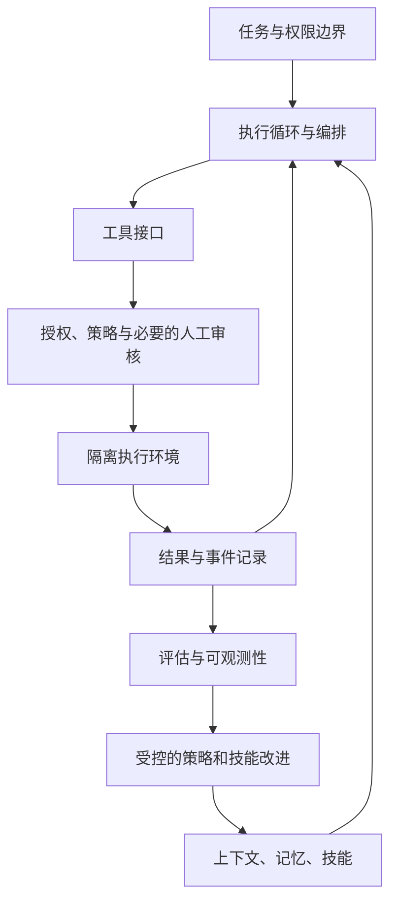

Agent 的效果取决于模型与运行环境共同作用。执行循环、工具、上下文、编排、可观测性、评估、治理之间存在依赖，却没有一套被所有系统采用的固定四层协议栈。本图按职责组织知识卡片，箭头表示信息流。

## 从循环到可恢复执行

[Custom Agent Harness — Middleware 架构]({{ '/knowledge/Custom-Agent-Harness-Middleware架构/' | relative_url }}) 描述可组合的运行逻辑；[Loop Engineering — 多层 Agent 循环架构]({{ '/knowledge/Loop-Engineering-多层Agent循环架构/' | relative_url }}) 区分任务循环和反馈改进；[Agent Fault Tolerance — 容错设计]({{ '/knowledge/Agent-Fault-Tolerance-容错设计/' | relative_url }}) 关注重试、持久状态及恢复。三者都需要定义副作用：重放模型状态不代表已经发出的邮件或付款可以重放。

重试应结合错误分类、幂等键、调用预算和人工介入。网关可集中实施配额和模型策略，但不能仅凭计费 token 判断所有成本，也不存在适合全部场景的固定退避公式或额度阈值。模型中立抽象降低部分迁移工作，仍需逐工具、消息和能力做适配验证。

## 安全由多个边界共同构成

沙箱约束进程可以触及什么；动作授权决定某次调用是否允许；信息流控制跟踪敏感数据去向；审核与日志服务于追责和恢复。这些机制不能互相替代。gVisor 不应被写成 microVM；凭证放在模型进程之外也不自动排除通过获准工具泄漏的可能。

[Parallax — Agent 安全架构]({{ '/knowledge/Parallax-Agent安全架构/' | relative_url }}) 的原文将推理与执行分离，并使用 Tier 0–3 的四层验证。其 assume-compromise 测试直接注入结构化调用：默认配置阻断 277/280 恶意动作，合法误报 0/50；最高安全配置阻断 280/280，同时误拦 18/50。数字来自作者自建测试，规则曾针对测试发现的问题调整，没有独立留出攻击集的等价保证。

延迟也不能省略：表 5 的 Tier 1 / Tier 2 P50 分别为 1947 / 2089 毫秒；更低的推理时间是讨论中的优化预期。Chronicle 可恢复受控资源的状态，不能让第三方忘记已外发的信息。完整条件见 [Parallax：认知与执行隔离的安全边界 — 精读分析]({{ '/knowledge/arxiv-2604.12986-精读/' | relative_url }})。

## 记忆不是天然可信的事实库

[Agent Memory Survey 2026 — 机制、评估与边界]({{ '/knowledge/Agent-Memory-Survey-2026综述/' | relative_url }}) 提供分类和评价视角；[Agentic Memory — Agent-First 语义缓存]({{ '/knowledge/Agentic-Memory-语义缓存/' | relative_url }}) 讨论复用的收益与失效条件。来源、时效、冲突、用户控制和检索权限决定记忆是否有用。成功率提升、token 节约、检索命中和错误记忆传播应分开度量。

[Hermes Agent：持久记忆、技能与执行循环]({{ '/knowledge/Hermes-Agent-自进化Agent框架/' | relative_url }}) 展示持久记忆与技能循环；“自进化”在这里主要是外部状态和流程更新，不是基础模型权重自动学习。压缩多个工具调用也不等于零上下文成本。

## 如何使用综述与工程文章

[Agent Harness Engineering 综述]({{ '/knowledge/Agent-Harness-Engineering-Survey综述/' | relative_url }}) 的框架和对照表是研究对象归纳；不同平台的完整/部分/不具备能力三态不能简化成随意的二元打勾。网页实践文章能提供设计线索，却不能替代统一实验。

建议建立版本化任务集，同时记录质量、成本、延迟、外部副作用、安全误报/漏报与恢复成功率。评价多 Agent 时再增加协作通信和共享状态成本。这里的建议是读者可执行的评估设计，不表示本知识库已运行这些实验。

## 来源与关联阅读

- [Agent Cost Control — Gateway 成本控制]({{ '/knowledge/Agent-Cost-Control-Gateway成本控制/' | relative_url }})
- [Agent Sandbox — 安全沙箱选型]({{ '/knowledge/Agent-Sandbox-安全沙箱选型/' | relative_url }})
- [Anthropic Agent 安全容器化实践]({{ '/knowledge/Anthropic-Agent安全容器化实践/' | relative_url }})
- [Model Neutrality — 模型中立与反锁定]({{ '/knowledge/Model-Neutrality-模型中立与反锁定/' | relative_url }})
- [Agent-First Data Systems — Agent 优先的数据系统架构]({{ '/knowledge/Agent-First-Data-Systems/' | relative_url }})
