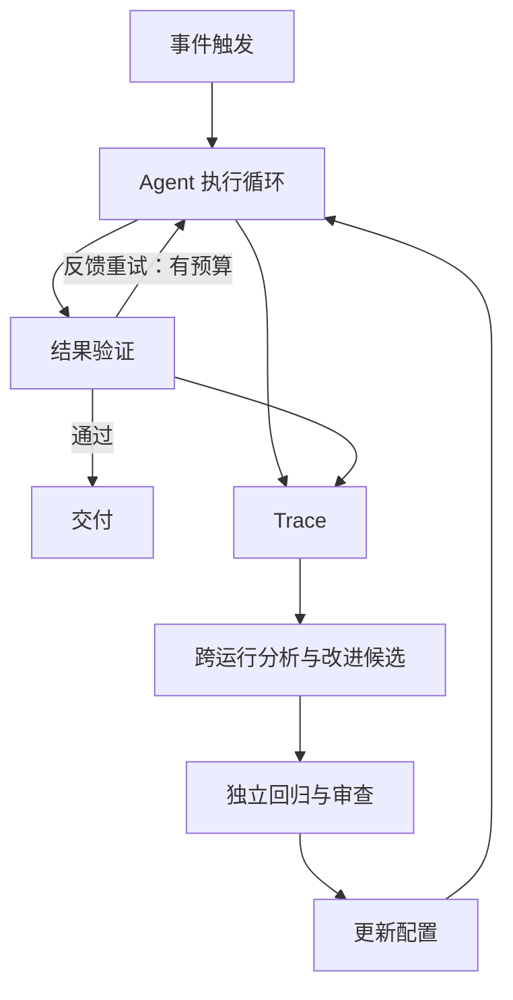

四种循环分别处理执行、结果验证、事件触发和跨运行改进。它们可以组合，但不要求所有系统都堆满四层。

[原文](https://www.langchain.com/blog/the-art-of-loop-engineering) 用文档 Agent 举例：链接/CI 检查负责可执行判据，事件连接持续工作，Trace 分析发现重复问题并请求修改 Harness。它没有提供每一层带来多少收益的消融实验。

- 验证循环提供反馈；grader 的覆盖与可靠性决定它能发现哪些错误，不能保证所有结果正确。
- 事件循环需要去重、限频和持久任务标识，避免重投产生重复副作用。
- 改进循环产生候选方案；以独立样本和人工判断接受变更，避免只追逐当前 grader 的分数。
- 总费用受调用数、上下文和频率影响；嵌套重试可放大费用，但不存在通用“层数越多必然指数增长”规律。

例如链接全通的文档仍可能写错参数语义，必须增加事实核验或测试；新增 grader 后又要检查其费用和误拦截。外层 deadline 应向内传播剩余预算，而不是机械要求比所有内层超时之和更大。

详读：[Loop Engineering — 四种循环与验证边界精读]({{ '/knowledge/the-art-of-loop-engineering-精读/' | relative_url }})；相关：[Agent Harness: Verification & Evaluation (V)]({{ '/knowledge/Agent-Harness-Verification-Evaluation评估/' | relative_url }})、[Custom Agent Harness — Middleware 架构]({{ '/knowledge/Custom-Agent-Harness-Middleware架构/' | relative_url }})、[Agent Fault Tolerance — 容错设计]({{ '/knowledge/Agent-Fault-Tolerance-容错设计/' | relative_url }})。

## 来源与关联阅读

- [Agent Cost Control — Gateway 成本控制]({{ '/knowledge/Agent-Cost-Control-Gateway成本控制/' | relative_url }})
- [Agent-First Data Systems — Agent 优先的数据系统架构]({{ '/knowledge/Agent-First-Data-Systems/' | relative_url }})
- [Agent 基础设施：执行、状态、治理与证据]({{ '/knowledge/AI-Infra-Agent基础设施体系综述/' | relative_url }})
