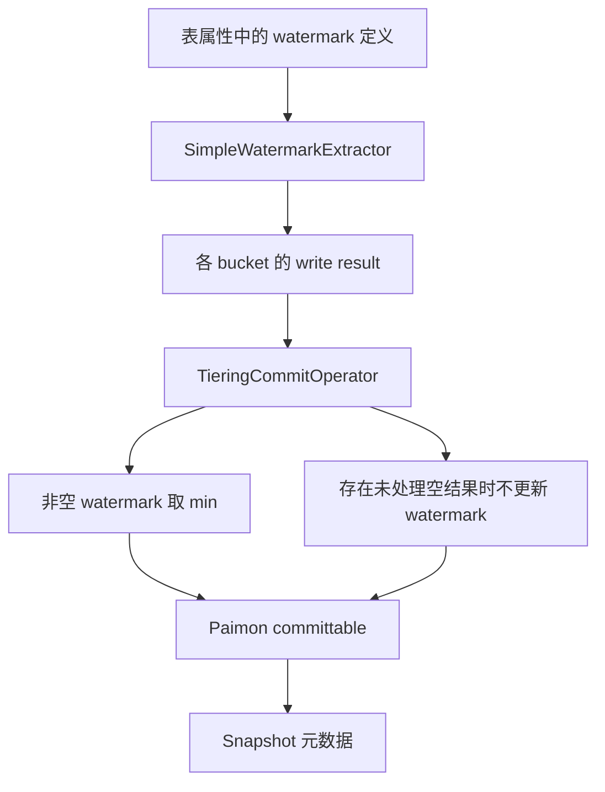

**核验时点：2026-10-05。PR 仍为 open，未合并。** 本文检查 GitHub PR head `be7eeafc35dd2a62bd9b5ff222a666c2700631ed` 的补丁，不代表任何已发布版本的能力，也没有在本地执行该 PR 的 Java 测试。

## 目标与数据路径

该变更在 Lake Tiering 写入结果中携带可空 watermark，经提交器聚合后传入 Paimon 的 snapshot 提交元数据。它保存的是处理进度信息，不能证明任何时间戳之前的数据绝不会迟到。

当前补丁跨 bucket 取 **minimum**，旧稿写 max 是错的；单 writer 内的聚合与跨 bucket 聚合不能混为一谈。提交器注释将不回退约束交由 lake committer 处理，不能只凭泛型约束就断言时间语义端到端无遗漏。

## 接口和兼容性

`LakeWriteResult` 暴露可空 watermark；`PaimonLakeCommitter` 将值放入 `ManifestCommittable`。`SimpleWatermarkExtractor` 只处理物理列的直接引用或减 interval 等有限表达式；不支持的定义返回 null，不能当作 Flink 任意 watermark 表达式求值器。

`PaimonWriteResultSerializer` 的当前格式版本由 1 升为 **2**，并可读取旧 v1、补 watermark=null。旧稿“v1 兼容 v0”已修正。类型安全只能约束接口，序列化、空结果、负值及故障重试仍需测试。

补丁包含提取、序列化、聚合与 Paimon 集成测试；“存在测试”不等于完整覆盖全部生产风险。需另验证空闲分区、强制完成、重试提交、表删除重建及跨版本恢复。

相关：[Fluss Lake 层与湖仓融合 — 实时存储 + 数据湖一体化]({{ '/knowledge/Fluss-Lake层与湖仓融合/' | relative_url }})、[Fluss Tiering 分层架构]({{ '/knowledge/Fluss-Tiering分层架构/' | relative_url }})、[流处理乱序数据管理]({{ '/knowledge/流处理乱序数据管理/' | relative_url }})。

来源：[PR #3420 与当前改动](https://github.com/apache/fluss/pull/3420/files)。GitHub API 返回 45 个改动文件；这是本次读取的快照，后续提交可能变化。

## 来源与关联阅读

- [Fluss PR #3420：Watermark 到 Paimon Snapshot]({{ '/knowledge/Fluss-PR-3420-Watermark-Paimon-精读/' | relative_url }})
- [Fluss 整体架构与 Kafka 2.7.2 对照]({{ '/knowledge/Fluss-整体架构/' | relative_url }})
- [Fluss 分布式协调层分析]({{ '/knowledge/Fluss-分布式协调/' | relative_url }})
