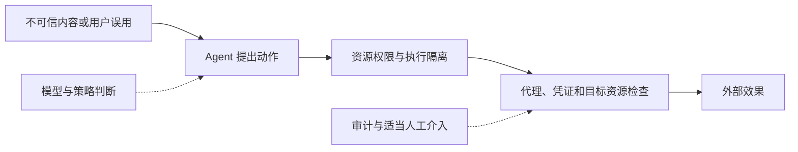

[Anthropic 2026-05-25 工程回顾](https://www.anthropic.com/engineering/how-we-contain-claude) 的重点是多种隔离边界如何与模型防御、外部内容控制配合，以及边界之外的自建代理/配置如何失效。它没有证明环境层绝不可绕过。

| 产品 | 文章描述的隔离方式 |
|---|---|
| claude.ai | 服务端会话级 gVisor 容器 |
| Claude Code | Seatbelt / bubblewrap 与人类监督 |
| Cowork | 本地 VM 执行代码；架构由全 loop 在 VM 转向 host loop + VM 执行 |

参考 devcontainer 不是 Cowork 的替代项；移至 host 的本地 MCP server 也不是天然被代码 VM 隔离。

## 三处容易误读的证据

- 93% 是权限提示的批准比例，不是用户自动批准比例；84% 是提示数量减少，不是攻击风险降低。
- 内部钓鱼例子对同一个恶意 prompt 重试 25 次，24 次外泄；不是 25 位受试用户。
- 允许域名上的攻击者账号仍可接收工作区数据，因此外置凭证和域名白名单不能保证绝无外泄。

信任提示前的项目配置、符号链接处理、代理接受的账号和本地 MCP 权限都应纳入边界验证。将审批数量减少视为体验指标，将越权/泄漏与误拦截作为单独安全指标。

[Parallax — Agent 安全架构]({{ '/knowledge/Parallax-Agent安全架构/' | relative_url }}) 可用于对比动作控制思路，但其直接注入工具用例与这里的产品事件不构成公平横评。详读：[How We Contain Claude — 产品隔离与失效案例精读]({{ '/knowledge/how-we-contain-claude-精读/' | relative_url }})；选型：[Agent Sandbox — 安全沙箱选型]({{ '/knowledge/Agent-Sandbox-安全沙箱选型/' | relative_url }})。

## 来源与关联阅读

- [Custom Agent Harness — Middleware 架构]({{ '/knowledge/Custom-Agent-Harness-Middleware架构/' | relative_url }})
- [Agent-First Data Systems — Agent 优先的数据系统架构]({{ '/knowledge/Agent-First-Data-Systems/' | relative_url }})
- [Agent 基础设施：执行、状态、治理与证据]({{ '/knowledge/AI-Infra-Agent基础设施体系综述/' | relative_url }})
