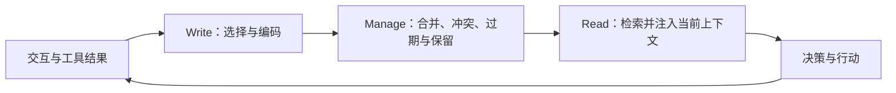

Pengfei Du（单作者），*Memory for Autonomous LLM Agents: Mechanisms, Evaluation, and Emerging Frontiers*，arXiv:2603.07670v1（2026-03-08，15 页）。这是一篇分类综述，没有在统一数据、模型和预算下重跑各系统。

## 统一问题：写什么、如何维护、何时读

记忆是模型可见上下文以外的持久状态与管理机制，不只是一套向量索引。论文用部分可观测决策过程解释记忆为何帮助状态估计；这不证明任何摘要都是充分统计量。

## 两个分类轴与机制族（§3–4）

| 轴 | 原文分类 | 容易误读的地方 |
|---|---|---|
| 时间/功能角色 | Working、Episodic、Semantic、Procedural | 工作记忆、经历、知识、技能不等于固定的数据库类型 |
| 表示载体 | Context、文本/向量、结构化、可执行、混合 | 可执行技能也是记忆；参数更新是相关方向，不能替换掉该分类 |

机制从上下文压缩、外部检索存储、结构化/图记忆，到反思与经验技能、学习式管理策略。MemGPT/Letta 不只是自动总结聊天，而是将有限上下文与外部存储协调；MemLLM 训练模型使用显式记忆读写，不能简单归为“把事实全写进模型权重”。

**例子（解释性）**：上次记录“支付接口为 v1”，本次工具读到“v2 已上线”。写入应保留新证据和时间；管理阶段标记旧版本适用范围；读取时按当前环境选择。把两条事实直接拼在一起，或只保留语义最相近的一条，都可能产生错误行动。

## 评估阅读法（§5）

LongMemEval、LoCoMo 等偏重长期对话记忆；MemoryArena 强调跨会话任务依赖；不同基准对记忆的定义、长度与工具环境不同。§5.4 的评价维度应覆盖任务正确性、检索质量、更新/遗忘能力、时间和费用。

本综述转述的各系统分数使用不同模型、数据和提示，不能直接排成榜单。论文内部一面提到 MemBench 的效率评价，一面指出尚缺系统化效率标准；应理解为“跨设置的可比性不足”，而非“所有工作都未测效率”。

建议在固定模型和预算下比较无记忆、完整历史、简单摘要、检索/结构化记忆；分别测旧事实保持、新事实替换、冲突处理、权限隔离以及下游行动成功率。此为评估建议，不是本次已完成的实验。

## 局限与关联

外部记忆容量也受存储、检索预算和权限约束；增加容量会增加陈旧知识与错误沉淀风险。把写–管–读类比 LSM 的写入/整理/读取有助理解，但不意味着相同一致性或压缩算法。

详读：[Memory for Autonomous LLM Agents — 精读分析]({{ '/knowledge/arxiv-2603.07670-精读/' | relative_url }})；相关：[Agent Harness: Context Management & Memory (C)]({{ '/knowledge/Agent-Harness-Context-Memory上下文管理/' | relative_url }})、[Agentic Memory — Agent-First 语义缓存]({{ '/knowledge/Agentic-Memory-语义缓存/' | relative_url }})。

## 来源与关联阅读

- [原始来源](https://arxiv.org/abs/2603.07670)
- [Agent-First Data Systems — Agent 优先的数据系统架构]({{ '/knowledge/Agent-First-Data-Systems/' | relative_url }})
- [Custom Agent Harness — Middleware 架构]({{ '/knowledge/Custom-Agent-Harness-Middleware架构/' | relative_url }})
- [LSM-Tree (Log-Structured Merge-Tree)]({{ '/knowledge/LSM-Tree/' | relative_url }})
- [Agent 基础设施：执行、状态、治理与证据]({{ '/knowledge/AI-Infra-Agent基础设施体系综述/' | relative_url }})
