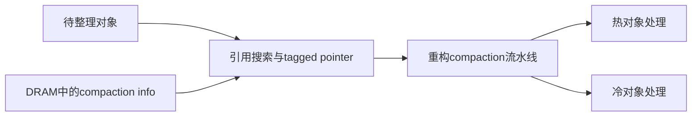

> **来源层级**：本次只核验本地2025 LSM综述的页18持久内存段、参考文献[114]（页35）。这是二级来源概念卡，不是Pacman独立原论文精读；原有`draft`审核状态不升级。

## 综述明确支持的结论

综述明确提到Pacman的reference search卸载、tagged pointer、DRAM驻留的compaction info、重构流水线以及冷热对象分离。引用为Wang等，USENIX ATC 2022。

## 已确认机制之间的关系

Compaction不只进行有序归并，还可能追踪对象引用、访问元数据和搬运对象。持久内存提供与块设备不同的访问方式，Pacman所讨论的优化包含减少引用查询成本与区分冷热对象；不能据此推断其就是给标准RocksDB加一块NVM作为普通缓存。

图只保留综述明确提及的组成，不画猜测的4-bit tag/60-bit指针、固定冷热层级和持久化次序。

## 走通示例（工程推论）

若对象A引用对象B，整理B的位置时，查找和修正引用可能消耗与搬运B相当的CPU。带标签的指针和compaction元数据可为这一类查找提供辅助，但必须保证并发访问和崩溃后不出现悬空引用。冷热分离的潜在收益是避免热对象更新反复带着冷对象搬家；收益依赖对象寿命和引用结构。

## 性能与持久性该如何核验

量化需同时给出对象尺寸、引用密度、冷热比例、PM型号、DRAM预算以及耐久化语义。写入PM不自动等于已跨故障持久化，是否需要flush/fence及何时发布新指针，必须看具体实现。

本地综述没有证明旧稿的30–60%搬运减少、20–35%DRAM减少、P99增加5–15%或O(N×M)降为O(N)；这些数字与复杂度已撤除。也不能把“DRAM驻留compaction info”改写成“所有metadata转移到NVM”。

相关：[LSM-Tree 硬件适配 (Hardware Adaptation)]({{ '/knowledge/LSM-Tree-硬件适配/' | relative_url }})、[LSM-tree KV Store 综述（2020-2025）]({{ '/knowledge/LSM-tree-KV-Survey-综述/' | relative_url }})。

## 来源与关联阅读

- [Rethinking LSM-tree based Key-Value Stores: A Survey]({{ '/knowledge/LSM-tree-KV-Survey-2025-精读分析/' | relative_url }})
- [LSM-tree-KV-Survey-2025]({{ '/media/knowledge/f758a8f69db0-LSM-tree-KV-Survey-2025.pdf' | relative_url }})
- [LSM-Tree (Log-Structured Merge-Tree)]({{ '/knowledge/LSM-Tree/' | relative_url }})
- [LSM-Tree 合并优化 (Merge Optimization)]({{ '/knowledge/LSM-Tree-合并优化/' | relative_url }})
