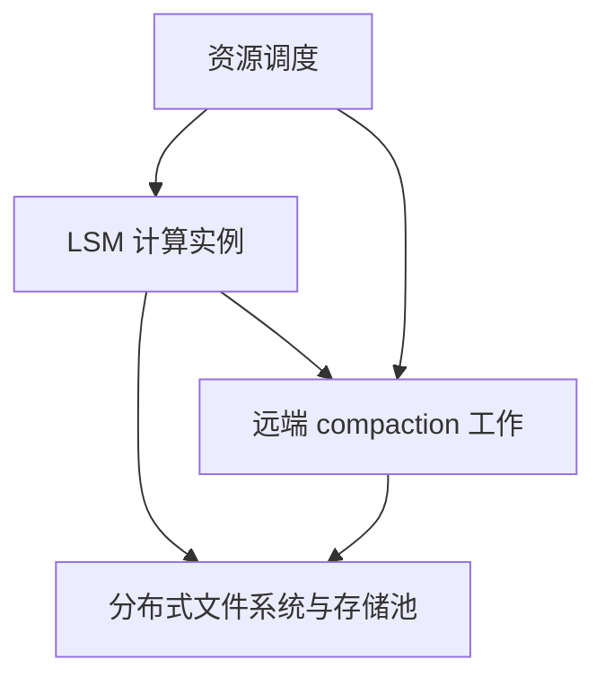

本卡目前依据 [Rethinking LSM-tree based Key-Value Stores: A Survey]({{ '/knowledge/LSM-tree-KV-Survey-2025-精读分析/' | relative_url }}) 所对应综述的 PDF 第 15 页和参考文献 [18]，尚未完成 Hailstorm 独立原文精读。不要将此卡作为可直接复现的实验报告。

综述支持的机制包括：以分布式文件系统分离计算与存储、存储池化、把 compaction 工作卸载到远端，以及在实例间平衡工作而不要求重新分片。它们讨论的是资源分工，不意味着负载均衡没有数据移动、网络或协调成本。

上图为本卡抽象示意，不对应原文具体组件名。旧稿的 FUSE 实现细节、2.3× / 22× 性能数字及其他系统归属没有从当前已核对材料得到支持，已撤回。后续获取原论文后，需要补充工作负载、网络条件、基线、读写放大和尾延迟，才能比较卸载收益。

文献：Laurent Bindschaedler、Ashvin Goel、Willy Zwaenepoel，*Hailstorm: Disaggregated Compute and Storage for Distributed LSM-based Databases*，ASPLOS 2020，pp.301–316，[DOI](https://doi.org/10.1145/3373376.3378504)。书目信息来自已核对综述的参考文献，DOI 不表示本次已取得原文。

关联：[LSM-Tree 合并优化 (Merge Optimization)]({{ '/knowledge/LSM-Tree-合并优化/' | relative_url }})、[LSM-Tree 硬件适配 (Hardware Adaptation)]({{ '/knowledge/LSM-Tree-硬件适配/' | relative_url }})、[存储计算分离数据库的尾延迟：日志链与后台竞争]({{ '/knowledge/存储计算分离数据库的-Tail-Latency/' | relative_url }})。

## 来源与关联阅读

- [LSM-Tree (Log-Structured Merge-Tree)]({{ '/knowledge/LSM-Tree/' | relative_url }})
- [LSM-tree KV Store 综述（2020-2025）]({{ '/knowledge/LSM-tree-KV-Survey-综述/' | relative_url }})
