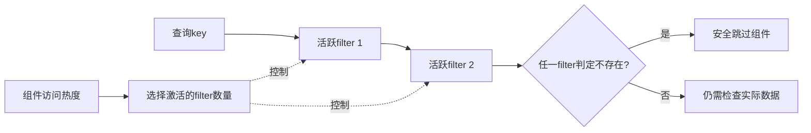

> 来源层级：本次直接核验2019综述§3.6.3（PDF第16页）；并未读到独立ElasticBF原论文。本卡保持draft。

## 机制：不是把key任意拆成若干子集

给定总预算k bits/key，把它拆为k1…kn份，构建多个较小filter；全部共同使用时提供与原整体filter相当的精度。根据访问热度激活或停用一部分filter，把内存优先给频繁查询的组件。

旧稿“每个unit只覆盖SSTable的1/N keys，可以任意关闭”混淆了按key分区和按过滤精度拆分。后者停用会增加误判和无效I/O，不应制造false negative；不能把停用一个key子集过滤器等同于该子集不存在。

## 例子与不变量（教学）

若冷组件只启用一组filter，热组件启用两组，热组件负查更可能提前排除；冷组件牺牲误判I/O换内存。无论启用多少，有“可能存在”都不能直接返回记录，必须精确查找；未启用filter不能被视为“不存在”。

与Monkey的区别：Monkey优化构建时不同大小层的内存分配；ElasticBF关注运行时热度变化。二者不能粗暴排列成谁“内存利用率必然更高”，要固定内存总量、热度与误判成本。

## 效果的适用范围

综述报告总预算较小、例如约4 bits/key时，减少误判I/O更有价值；达到10 bits/key时，误判I/O相对实际数据访问已经较少，收益有限。旧稿的30–60% I/O减少没有对应独立论文的实验条件，已撤除。

**工程推论**：需同时测filter检查CPU、内存回收成本、访问热度变化速度和真实I/O，而不是只优化理论FPR。与[LSM-Tree 自动调参：模型、过滤器与合并策略]({{ '/knowledge/LSM-Tree-自动调参/' | relative_url }})、[LSM-Tree (Log-Structured Merge-Tree)]({{ '/knowledge/LSM-Tree/' | relative_url }})及[LSM-tree KV Store 综述（2020-2025）]({{ '/knowledge/LSM-tree-KV-Survey-综述/' | relative_url }})共同阅读。

## 来源与关联阅读

- [LSM-based Storage Techniques: A Survey — 精读分析]({{ '/knowledge/LSM-Survey-精读分析/' | relative_url }})
- [LSM-Survey-VLDBJ2019]({{ '/media/knowledge/4698c9c3eedd-LSM-Survey-VLDBJ2019.pdf' | relative_url }})
