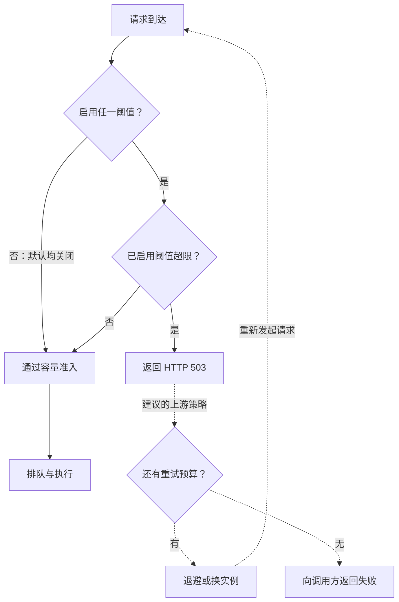
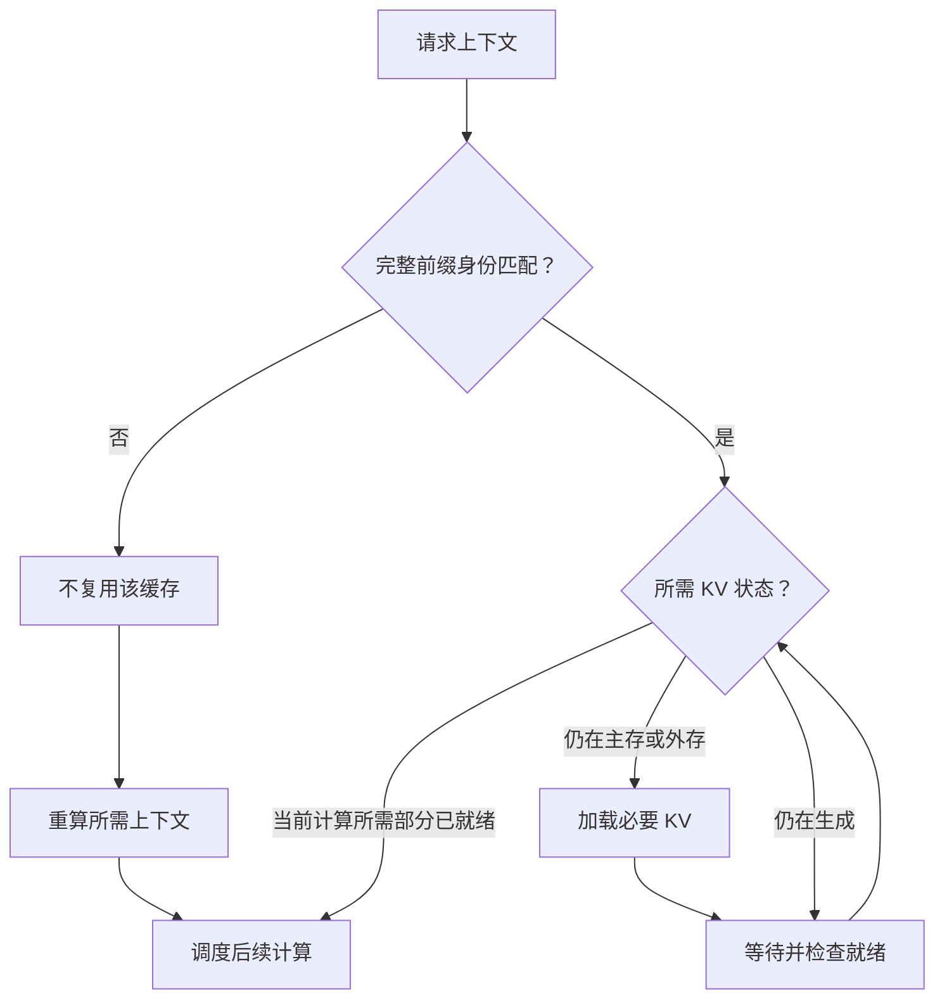

> 观察窗口：2026-09-04 09:00 至 2026-09-11 09:00（Asia/Shanghai）。文中时间均为北京时间；区分正式发布、主干合并与论文背景。

一条 AI 请求背后往往连接着几套独立演进的系统：入口负责接流量，推理引擎安排 GPU 工作，缓存系统保存昂贵的中间结果，数据平台准备训练和评估输入。平稳运行时，我们容易用吞吐和延迟概括它们；流量突增、存储切换或网络抖动时，决定服务质量的却是边界上的语义：引擎接下了多少做不完的工作，命中的 KV 是否属于同一上下文，重试之后到底交付了哪些数据。

本周 vLLM、SGLang 和 Ray 的几项变化恰好落在这些边界上。它们值得一起看，因为局部优化只有放进完整请求链路，才能判断是否降低了成本、是否引入了新的等待，以及是否仍然返回正确结果。

## 1. vLLM：过载时继续接单，是在积累首 token 延迟

LLM 服务中的排队不能只用请求数量描述。短问答与携带长文档的请求，即使都占一个连接，对 prefill 的需求也可能相差很大。持续接单可以让 GPU 始终有事可做，却也可能让队尾请求在开始生成之前就耗尽调用方的等待预算。此时吞吐仍然好看，用户感受到的首 token 延迟（TTFT）已经恶化；客户端超时再重试，还会把旧积压叠加成新流量。

vLLM 于 **9 月 9 日 16:54 发布 v0.29.0**，交付两个入口准入参数。`--max-num-queued-reqs` 限制等待与运行中的请求总数，`--max-num-queued-tokens` 限制仍处于 prefill 阶段的请求对应的 prompt token 总量。两者默认关闭，超过配置上限时返回 HTTP 503。实现 PR #49445 在 8 月 31 日合并，本周新增事件是正式版本发布。[发布说明](https://github.com/vllm-project/vllm/releases/tag/v0.29.0) · [PR #49445](https://github.com/vllm-project/vllm/pull/49445)

这两个旋钮回答的是不同问题：请求数给系统设置一个粗粒度容量上限，token 数进一步约束 prefill 工作量。它们让引擎把“已经忙不过来”显式反馈给上游，负载均衡器才有机会换实例或尽早失败。503 表达的是服务端容量不足；如果调用方把它当成无条件立即重试的信号，保护单实例的动作仍可能放大全局负载。因此，准入阈值、路由和重试预算需要共同设计。

**图 1｜vLLM 容量准入与上游重试边界**

*窄屏可横向滑动图示。*

图中仅展开这两个容量阈值；通过准入仍需等待调度。虚线表示本文建议的上游策略，由调用方实现，不是 vLLM 默认自动重试；预算应同时约束次数与总等待时间。

**以下是用于说明口径的推演，不是实测。** 假设某条经过压测的 prefill 路径能稳定处理每秒 10,000 个 token，希望其排队工作量大致不超过 2 秒，可以从 20,000 token 左右开始试验。但这只是量纲上的起点，实际 TTFT 还包含调度、执行和通信等时间，吞吐也会随模型、批次和负载变化；不能把这个乘法当成 SLA 保证。

当前实现还有一项重要限制：计数使用每个 prefilling 请求的**完整 prompt 长度**，不会减去 chunked prefill 已完成的部分或前缀缓存命中。继续推演，两个各带 12,000 token 的请求合计记作 24,000；即使其中大量前缀已经缓存，准入层也可能保守拒绝。这个取舍避免入口频繁跨进程查询调度器进度，代价是容量估计可能偏大。PR 也明确说明，若要精确追踪剩余工作量，需要补充引擎到 API 进程的进度信息。[计数限制与设计讨论](https://github.com/vllm-project/vllm/pull/49445)

我的判断是，应把这次变化用于建立可解释的过载边界。灰度时同时观察 TTFT 分位数、拒绝率、有效完成吞吐和重试次数，并分别覆盖长短 prompt、冷暖缓存及突发到达。只追求零拒绝，可能只是把拒绝转成了更晚、更昂贵的超时。同一版本还默认切换到 Model Runner V2，少量 ROCm 模型和未支持特性继续走旧路径，因此比较升级前后数据时，也要记录实际执行路径，避免把不同变化混为一种收益。[默认路径 PR #53183](https://github.com/vllm-project/vllm/pull/53183)

## 2. SGLang：缓存命中之后，还要回答“能否及时且正确地使用”

前缀缓存把已经计算过的上下文 KV 保存下来，后续请求可以复用。随着上下文增长，单卡显存无法保留所有热点，缓存便向主存和外部存储扩展。容量增大提高了保留旧上下文的机会，也引入了新问题：命中的数据可能仍在慢层，尚未加载；同样的 token 后缀可能来自不同前缀；多个并行 rank 对“已经准备好多少缓存”还可能有不同认识。

**SGLang v0.5.19 于 9 月 5 日 10:27 发布**，统一 radix tree 成为所有模型的默认缓存实现，并列入统一树的运行时 L3 存储挂载/卸载和 HiCache 流水线并行一致性修复。相关 PR 均在 8 月合并，本期按版本交付记录。[发布说明](https://github.com/sgl-project/sglang/releases/tag/v0.5.19) · [统一树默认启用 PR #35081](https://github.com/sgl-project/sglang/pull/35081)

先看性能层面的背景。OSDI 2026 的 **Strata** 在七月已经发表，本次补读了正式 PDF 的问题分析与设计章节，而不是把它算作本周新论文。其核心设计是让 GPU 保留便于逐层计算的布局、主存采用便于搬运的布局，用 GPU 辅助 I/O 在两者间转换；调度器再识别尚在生成的共享前缀，搭配加载和计算工作，并用其他可执行工作填补加载等待。设计也要限制 I/O kernel 对计算资源的争用。[Strata 正式 PDF，第 3、4 节](https://www.usenix.org/system/files/osdi26-xie-zhiqiang.pdf)

**用一个简化场景推演这种联系。** 多个 Agent 同时分析同一份长文档，各自只追加一个很短的问题。若文档 KV 在主存，新增 token 很少并不意味着请求便宜，因为它仍需等待大块历史状态进入 GPU；若第一个请求还在生成公共前缀，后来的请求又立即各算一遍，就会产生重复工作。调度时短暂等待共享前缀就绪，或把加载较重的请求与计算较重的请求组合，可能比按到达顺序塞满一个 batch 更合适。这里讨论的是成本结构，没有假定某个固定加速倍数，也不能据此认定本周每项 SGLang PR 都实现了论文的全部策略。

回到这次发布，缓存可用的前提首先是键的含义正确。#35269 补齐了统一树的运行时存储挂载能力，其中一个容易忽略的细节是：**挂载前已经建立的节点，可能没有面向外部存储的哈希。** 如果启用存储后直接从这些节点向下计算，哈希链会在中途重新开始。一个本应描述完整上下文的键就可能只描述后缀，使另一条上下文错误命中。[挂载与哈希补齐 PR #35269](https://github.com/sgl-project/sglang/pull/35269)

可以把它推演为两段对话：一段先讨论数据库再出现文本 Q，另一段一开始就是 Q。文本 Q 相同，其对应 KV 仍可能受前文影响。只检查后缀相同会混淆两者，错误甚至可能表现为“缓存命中率更高”。修复按父节点到子节点的顺序补齐历史节点哈希，恢复完整前缀语义后再启用存储。运行时操作仍存在空闲状态约束；“无需重启的管理能力”不能被理解为任意并发下都能无条件切换。

另一个边界在流水线并行。不同 rank 可能分别完成了不同数量的预取或加载事件，如果各自推进，就会对请求的缓存状态形成分歧。#27010 让调度线程协调事件消费数量，并在后台对预取长度做最小值归约，选择各方一致可用的长度。这里追求的是共同可执行的状态，代价是同步成本及对较慢参与方的等待。[HiCache PP 修复 PR #27010](https://github.com/sgl-project/sglang/pull/27010)

**图 2｜缓存复用的身份与就绪检查：本文概念模型**

此图用于拆开“身份相符、数据所在层、执行所需部分就绪”三个问题，假设模型与配置一致，不对应某个具体引擎的完整执行流程，也不把 Strata 与本周 SGLang 的不同改动合成为一套已实现系统。就绪检查针对当前计算所需的层或范围，不要求先搬完全部上下文；缓存命中本身不能跳过加载与同步条件。

因此，我更关心这轮升级能否通过几类状态转换验证：先预热再挂载、挂载后延伸既有前缀、存储反复切换，以及 rank 间预取速度不同。缓存层面要同时看输出一致性、实际加载量、等待时间和命中率。多存下数据解决的是容量问题；让调度器知道数据在哪里、何时可用，并保证引用正确，才把容量转成可用的服务能力。

## 3. Ray Data：重试成功之前，要先定义“从哪里继续”

训练数据处理经常需要对远端文件读取做自动重试。通常我们希望上游偶发抖动对下游透明：已经交付的记录不重复，尚未读取的记录不丢失。这个目标要求文件句柄、解析器和重试迭代器共享同一套恢复语义。任何一层把“继续读取”和“从头重放”理解反了，都可能在不抛异常的情况下生成一份不完整数据。

Ray 的 **#66011 于 9 月 9 日 14:06 合并到主干**，修复的正是这种静默丢失。PR 作者的复现使用 8 KiB 文件，每 1 KiB 生成一个 block，在第 3 次成功读取后注入一次瞬时错误；旧代码最终只交付 5 个 block，进程却成功退出，修复后交付完整 8 个。这是作者的故障注入结果，本期未独立运行该测试，也尚未确认修复进入正式发行版。[PR #66011](https://github.com/ray-project/ray/pull/66011)

将这份复现按 block 编号展开，错误就容易理解。第一轮已经交付 1、2、3，文件句柄停在第 4 块之前。重试器知道已输出三项，因此会在下一轮跳过前三项，以防从头重读产生重复。然而旧代码重新创建的是迭代过程，复用的仍是已经前移的句柄：第二轮实际读到 4、5、6、7、8，再把前三项“去重”，最终只剩 7、8。加上第一轮三项，结果就是 1、2、3、7、8；中间三块被悄悄扔掉。

修复把打开文件的动作放进每次重试工厂内部。每轮都从头重放，再由重试器跳过已经交付的部分，两个层次的约定终于一致。这不是免费的：后续尝试要重新解析前面的数据，持续失败时多层重试也可能延长退出时间。工程上可以接受额外工作换取正确结果，但需要给整个操作设置统一的时间预算，不能只分别配置每一层的重试次数。

影响范围也有明确边界。PR 报告涉及文本、二进制、指定列名的 CSV 与 Arrow JSON 等文件数据源路径，Parquet 不走该路径。不能把它扩写成“Ray 所有读取都会丢数据”，也不能从“改成重新打开文件”推导出整个管道已经具备 exactly-once：输入是否在重试期间变化、下游是否已有外部写入，仍是另外的契约。[复现、格式范围与修复说明](https://github.com/ray-project/ray/pull/66011)

对训练和评估系统，我的建议是把成功判断从“任务结束”推进到“输入输出可核对”。故障注入至少覆盖文件中部读取失败与下游提前停止，并验证行数、字节数或稳定标识的集合。在真实数据链路中，即使缺失只影响少量样本，也可能改变评估分布；重试路径理应与正常路径一样成为数据质量验证的一部分。

## 4. Ray Serve：扩缩容判断依赖同一套统计语义

同样的正确性问题也出现在控制面。**#65714 于 9 月 9 日 11:29 合并**，取消源端预聚合的可选路径，统一让 controller 聚合原始时间序列。不同来源各自计算的窗口均值相加，一般不能代表总量的时间加权均值；MAX/MIN 的组合也存在错误，扩缩容决策因此可能建立在不一致的负载定义上。[PR #65714](https://github.com/ray-project/ray/pull/65714)

集中统计会增加控制器处理压力。**9 月 11 日 07:58 合并的 #64281** 为此加入列式指标编码，减少逐点 Python 对象构造，但原文明确写明本提交是 **runtime no-op**，尚未接入生产者和消费者。因此其完整链路基准代表后续目标，不能算作本周已交付的加速。值得继续追踪的是接入实现、混合版本兼容性和正式发布，而非提前复述倍数。[PR #64281](https://github.com/ray-project/ray/pull/64281)

把这些变化放在一起看，后续评估可以沿三条线展开：请求进入之前有没有明确容量边界，复用状态之前能否证明身份与就绪状态，失败恢复之后能否证明数据完整。吞吐是这些条件成立之后的优化目标。下一轮更值得深挖的选题，是把前缀复用、准入控制和重试预算放进同一组突发负载实验，观察局部优化如何影响整条链路。

论文背景已补读 Strata 的正式 PDF 第 3、4 节及相关图示，未复现其评测，故不引用性能倍数。它于七月发表；本期其他会议论文的窗口覆盖仍不足，不能据此断言本周没有新系统论文。范围与待确认项见 [核验范围说明](https://github.com/BryantChang1992/ai_memory_chang_ai_team/blob/main/docs/drafts/weekly/2026-09-11/review.md)。
