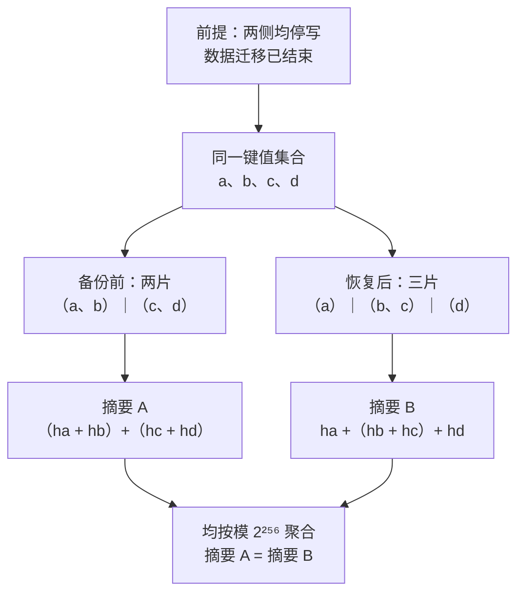
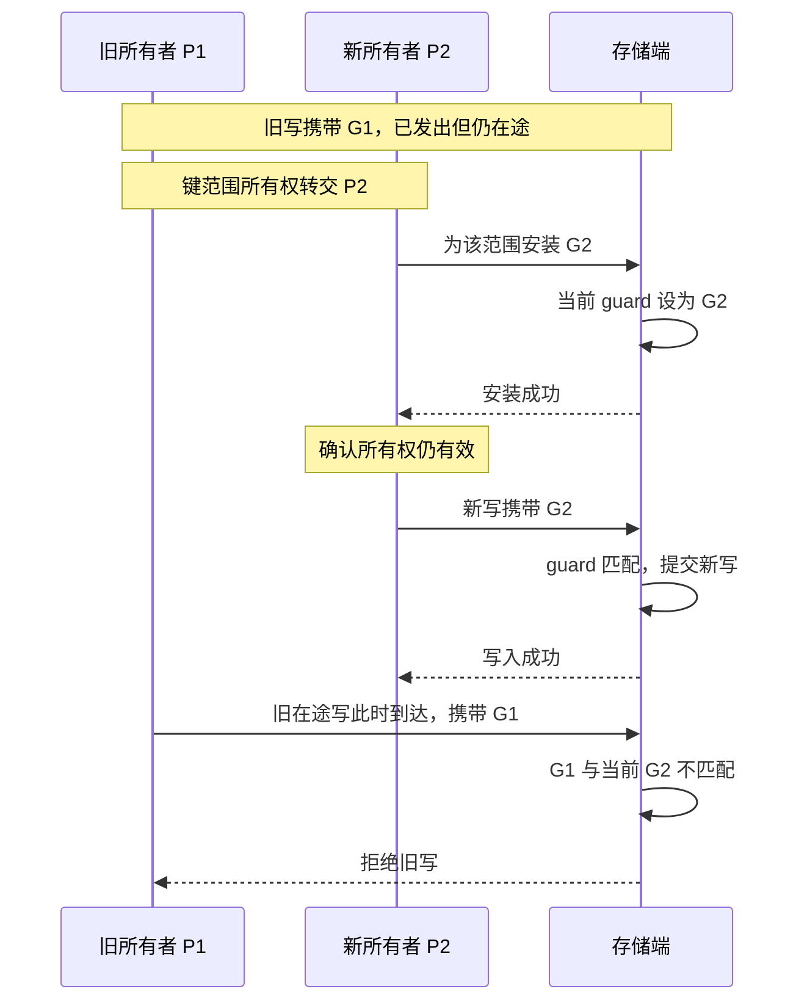

> 本期窗口为 2026-09-04 09:00—2026-09-11 09:00（北京时间）。文中四项社区变化均已在窗口内合并到主分支，尚未确认进入正式发布版本；WriteGuards 是七月发表的论文背景。

一次恢复任务显示成功，是否意味着恢复后的内容与原数据一致？一次删除放进了 SQL 事务，是否就不会误伤并发创建的文件？一次对象读取已经超时，后台任务还有没有机会把失败改成成功？

本周 FoundationDB、JuiceFS 和 Ceph 的几项变更，分别触及这些容易被上层状态掩盖的边界。它们处理的机制不同，却值得放在一起读：**正确性保证需要落到最终读取、修改或发布结果的位置，并说明在那个时刻仍然成立的条件。**

## 恢复结束与内容一致，需要两份证据

FoundationDB 的 [PR #13866](https://github.com/apple/foundationdb/pull/13866)于北京时间 9 月 9 日 00:01 合并，新增 `RangeDigest`，用于核对备份前与恢复后的键值内容。这里的难点并不是选一个哈希函数：恢复以后，数据可能分到不同服务器，原来的一个分片也可能变成多个。如果校验结果绑定物理分片，逻辑数据没有变化，指纹也可能因为布局变化而不同。

RangeDigest 对每个键值对做带长度前缀的编码，然后计算 SHA-256；服务器在本地累加叶子哈希，各范围的摘要继续进行模 2²⁵⁶ 加法聚合。[设计文档与实现](https://github.com/apple/foundationdb/pull/13866/files)

```text
leaf(k, v) = SHA-256(len(k) | k | len(v) | v)
digest     = Σ leaf(k, v) mod 2²⁵⁶
```

上式简写了原实现的长度编码。它最有用的性质是加法可交换、可结合：先算哪一段、由哪台服务器算、分成多少组，都不改变最终结果。例如，备份前由两台服务器分别计算 `{a,b}` 和 `{c,d}`，恢复后由三台服务器计算 `{a}`、`{b,c}` 和 `{d}`，只要每个相同的键值对恰好进入聚合一次，最终摘要就一致。这是机制推演，不是本期新增的实验结果。

**图 1：分片方式改变，逻辑摘要保持一致**

*窄屏可横向滑动图示。*



图中 `ha` 代表键值对 `a` 的叶子哈希，其余类推。这是静止数据集的简化结构：每个键值对必须恰好计入一次；可交换聚合允许重新分组，并不负责消除迁移中的重复读取。

计算下沉也改变了校验的数据路径：完整数据在持有它的存储服务器上读取、计算，聚合传输摘要，避免把全部内容送往外部校验客户端。但全量扫描的成本仍在，磁盘读取和 CPU 都会与其他工作争用。PR 复用已有审计限速与批处理控制；不能把“网络传输减少”直接换成任意业务负载下的性能收益。

### 为什么停写还不够？

当前实现明确要求两个条件：**停止写入，并等待数据迁移结束，即 `moving_data = 0`。** 它们分别保护不同的不变量。[PR 中的前提说明](https://github.com/apple/foundationdb/pull/13866)

停写保护的是“读取同一份逻辑状态”。各服务器按各自当前读版本计算，没有共同固定的集群版本。假设某个事务同时改变两个分片的数据，校验可能在一边读到提交前的值、在另一边读到提交后的值。这样的组合不一定对应任何真实存在过的集群快照。

停止迁移保护的是“每个键值对恰好算一次”。即便没有业务写入，某个键从服务器 A 迁到 B 时，A 可能在交接前计算过它，B 又在交接后计算一次；相反的时序也可能漏算。可交换加法解决分组差异，却不具备去重能力：同一个叶子多加一次就是不同的集合。由此也能看出，只为未来实现增加一个固定读版本，并不足以自动解决所有问题，还需要与该版本一致的所有权或覆盖关系。

对使用者来说，RangeDigest 更适合放进受控的恢复演练：保存静止源数据的指纹，恢复到目标环境，确认迁移收敛，再比较内容。指纹相同提供高置信度的意外损坏检测，不能写成数学上绝无碰撞的证明；该设计也明确排除了攻击者主动构造碰撞的场景。生产系统的验收可以保留两个独立结果：恢复流程是否完成，以及在约定条件下内容核验是否通过。让后者成为单独的记录，才能发现“任务成功，但验收数据不一致”。

## 名字没变，删除的对象可能已经变了

JuiceFS 的 [PR #7476](https://github.com/juicedata/juicefs/pull/7476)于北京时间 9 月 9 日 14:30 合并，修复 SQL 元数据路径中的目录项身份检查。原路径可以先从事务快照读到目录项，再按父目录和名称修改它；在 MySQL 的相关读写语义下，后面的修改可能作用于更新的行。因此，“在同一个事务里”不足以说明两步操作面对同一个对象。

下面按 PR 描述抽出一个简化时序，**属于机制推演，不是本期复现实验**；省略其他锁和元数据更新：

| 时刻 | 操作 A：删除 `d/a` | 操作 B：重命名文件 |
|---|---|---|
| T1 | 读到 `d/a → inode1` | |
| T2 | 尚未删除 | 把另一个文件移到 `d/a`，提交后指向 `inode2` |
| T3 | 执行按父目录和名称匹配的删除 | |

如果 T3 只问“现在有没有叫 `a` 的目录项”，它可能删掉 B 刚放进去的对象，而后续统计或回收动作仍依据 A 先前读取的 inode。名字相同只说明路径相同，无法说明对象身份连续。

修复把判断推进到修改语句：条件中带上目录项的 inode、类型以及适用的行 ID，并检查受影响行数。身份不符时返回 `errEdgeChanged`，让事务基于新快照重试。对于批量删除，即使前面部分行已删除，后面检查失败也需要由事务回滚，避免只完成一部分操作。[代码补丁](https://github.com/juicedata/juicefs/pull/7476/files)

行 ID 的意义还涉及 ABA：目录项先存在、被删除、又以同名重建，甚至再次指向同一个 inode，名称和目标看似回到了起点，目录项本身却已是新的一代。修改条件必须能区分这种重建，否则“值看起来没变”会掩盖对象经历过替换。

这种做法可以迁移到采用 SQL 保存任务、租约或资源映射的系统：读取对象后若要执行有副作用的动作，应检查修改时仍匹配所读的身份或版本，并明确失败后的回滚与重试范围。代价是冲突会显式暴露为重试，热点路径的吞吐和尾延迟需要另行评估。已有 PR 测试针对辅助函数的陈旧身份、ABA 和回滚不变量，作者明确未覆盖公开 Rename/Unlink 的并发端到端验证；本期也没有补做这项实验。

## 超时结束的是等待，后台操作还可能继续

JuiceFS 另一项 [PR #7500](https://github.com/juicedata/juicefs/pull/7500)在北京时间 9 月 4 日 10:11 合并，处理 `load` 和 `loadRange` 的迟到读取结果。旧回调直接修改外层函数的返回错误，而超时封装并不等待工作回调彻底结束。

这里最容易误读的一点是：函数已经返回给调用者的错误，不会被未来一条赋值“追溯修改”。危险窗口发生在**外层函数已经走上超时返回路径，但仍在执行 defer、尚未完成返回**的阶段。结合 PR 描述，可以推演这样的交错：

1. 外层等待超时，准备返回失败；后台 GET 仍未结束。
2. 外层执行返回前的清理，命名返回变量仍是共享状态。
3. 后台 GET 此时返回成功，把共享 `err` 赋为 `nil`，数据页却还没有完成填充。
4. 外层最终交出错误的成功状态，上层可能继续使用未正确填满的页面。

修复将后台 GET 的结果放入单独状态，只有超时封装确认成功完成后，调用方才接收结果。补丁同时避免回调直接写外层返回错误，并依赖成功路径与回调完成之间的同步关系。[读取路径补丁](https://github.com/juicedata/juicefs/pull/7500/files)

这一点对异步存储客户端很实用：取消信号、等待结束、结果可见、缓冲区可回收，是四个不同的事件。隔离结果能阻止迟到任务把失败覆盖为成功；底层请求是否真正停止、内存何时能复用，仍需独立保证。故障注入也应安排“先超时、后成功”的交错，而不能只让请求永远不返回。检查对象包括错误码，还包括缓存是否被发布、引用是否提前释放，以及重试与旧任务是否共享可写缓冲区。

## WriteGuards：把失效判断交给最终接收写入的存储端

上面的两个 JuiceFS 问题，一个关心目录项身份，一个关心本地异步结果。OSDI '26 的 [WriteGuards](https://www.usenix.org/conference/osdi26/presentation/mao-ziming-writeguards)进一步讨论跨节点所有权。这篇论文发表于七月，属于本期背景阅读；本次已读[正式 PDF](https://www.usenix.org/system/files/osdi26-mao-ziming-writeguards.pdf)的动机与核心机制，未复现性能实验。

论文提出的情况是：缓存节点 P1 发出写入，随后键范围交给 P2；P2 从存储读到旧值并缓存，P1 滞留在途中的写入才到达存储并提交。于是存储已更新，P2 却继续返回旧缓存。缓存层知道“P1 已失去所有权”，并不能让已经离开 P1 的请求自动失效。甚至普通的数据版本检查也可能放过它：P2 刚才只是读取，数据版本尚未改变，P1 的条件写仍能成功。

WriteGuards 在存储端按键范围维护 guard。新所有者先为范围安装新值，后续写入携带 guard，存储只接受与当前值匹配的请求。旧写入即使晚到，也会因 guard 不符被拒绝。按范围记录可以摊薄逐键维护元数据的成本，但要求缓存的接管流程、分片边界变化和存储写路径共同配合。

**图 2：新 guard 安装成功后，旧在途写入被拒绝**



图示简化了单个键范围的协议，省略分片变化、失败重试及缓存失效步骤。P2 在 guard 安装成功并确认所有权仍有效后才发出新写；存储端依据处理写入时的当前 guard 校验，旧请求的发送时间不构成放行依据。

论文还强调 guard 安装本身的时序约束：有效安装须在同一所有权期间开始并结束，重试使用新的唯一值。同一所有权期间，覆盖同一个键的安装调用不能重叠。可见一个 token 只是机制的一部分，协议还必须约束谁能安装、何时能使用，以及超时重试以后如何判断有效性。

这与目录项身份检查的共同点，是在副作用真正发生处判断请求是否仍有效；区别是前者防止误改被替换的目录项，WriteGuards 防止旧所有者迟到的写入。它与超时隔离也有关联，但后者只决定本地是否接受结果，不会自动撤销已经发送到远端的写入。工程上应分别回答“我还接受这个结果吗”和“接收端还允许这项操作生效吗”，避免用一个超时参数承担两种保证。

## Ceph 的提醒：检查本身也有生命周期

[Ceph PR #71568](https://github.com/ceph/ceph/pull/71568)于北京时间 9 月 8 日 02:07 合并，把 RGW 去重的默认数据池能力检查从启动阶段移到实际处理阶段。此前空集群尚未创建数据池，检查会以 `ENOENT` 失败；新路径在池不存在时跳过去重工作。纠删码池的操作限制仍然保留，变化在于何时要求资源存在。

这为前面的主线补上一点：检查应该位于保证成立的位置，也应区分“条件暂未建立”和“条件已经遭到破坏”。空集群、首次建池和首次写入，值得与稳态运行一起进入存储系统的回归场景。该 PR 没有新增测试，后续还需跟踪回归覆盖和发布归属。

这些案例可以转成一组具体的系统审查问题：核验的是否为同一版本、同一集合？修改时是否仍是原对象？超时以后谁还能发布结果？所有权失效能否阻断已经在途的请求？它们对应不同机制，应分别形成可观察、可测试的约束。
