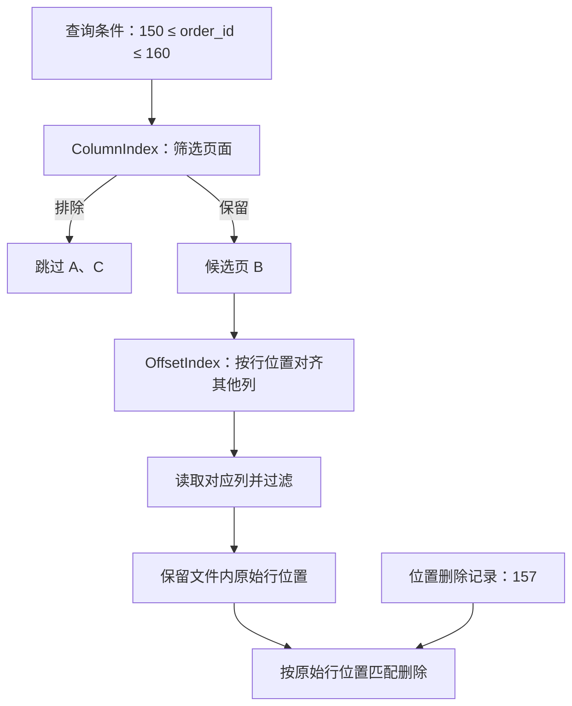
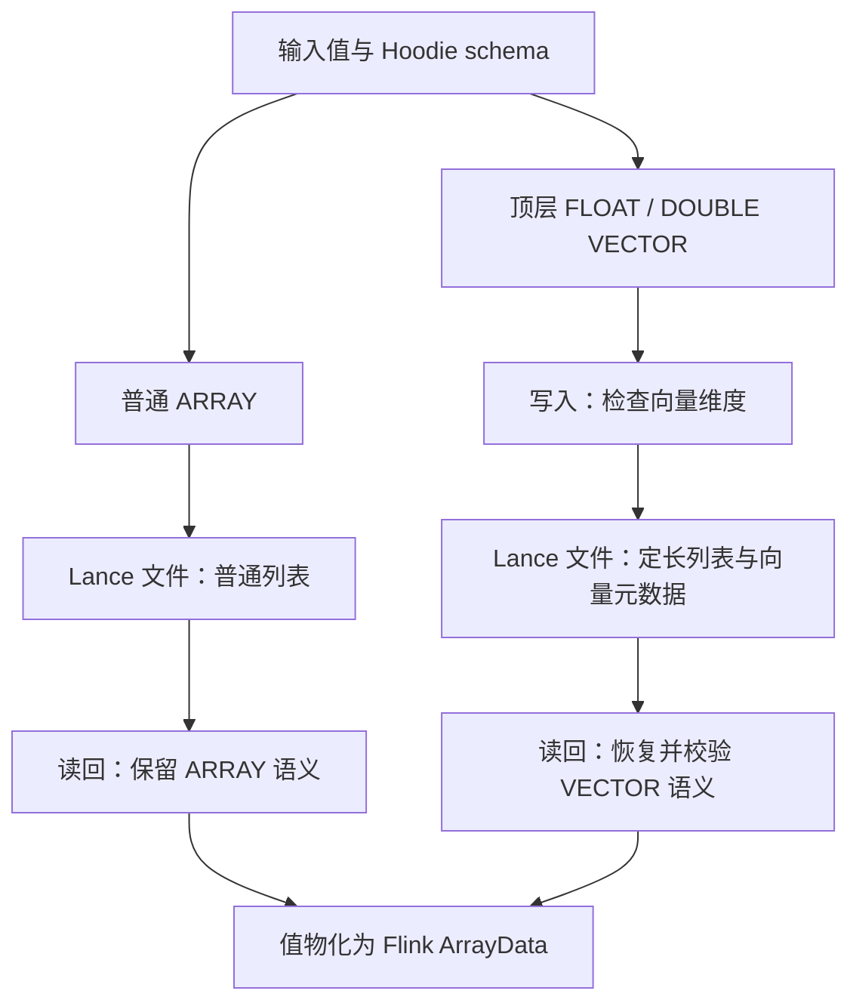

**2026 年 9 月 4 日 09:00—9 月 11 日 09:00（北京时间）**

湖仓的一张表，往往由一种引擎写入、另一种引擎查询，中间经过表元数据、文件格式和连接器的多次转换。能打开同一个文件，只说明这些组件接通了。读取端是否利用文件已有的索引，类型转换是否保留原值，异常关闭是否把未完成的输出变成可见文件，都需要另外回答。

本周的几项改动正好落在这些连接处。下面先展开 Trino/Iceberg 的页级跳读和 Hudi/Flink 的 VECTOR 读写，再看时间戳精度、schema 历史与 Delta 失败写入。文中日期均为实际合并时间；**所选改动已合入开发分支，尚未核验稳定发行版归属**。所有数值示例均明确标为推演，不代表实测。

## 页级跳读：文件里有索引，查询端还得真正使用它

Trino [PR #30971](https://github.com/trinodb/trino/pull/30971) 于 **9 月 7 日 11:36** 合入 `master`，让 Iceberg 连接器利用已有 Parquet 页索引。这项变更值得关注的地方，是一次查询优化同时碰到了读取效率、跨列对齐和删除正确性。

先看索引解决什么问题。Parquet 的一个 row group 内，各列继续分成数据页。仅知道整个列块的值范围，未必能排除其中大部分页面；如果每页的统计值只在页面头里，判断“这页不用读”也需要先访问它。Page Index 将页级信息单独组织起来：`ColumnIndex` 根据值范围定位候选页，`OffsetIndex` 按行位置定位其他列的对应数据。两者配合，读取端才有机会直接越过不相关页面。这是既有文件格式能力，并非本周新增的格式设计。[Parquet 官方说明](https://parquet.apache.org/docs/file-format/pageindex/)

可以用一个**教学推演**理解其作用。假设 `order_id` 已按值排序，每页恰好容纳以下记录，且文件已经写出可用索引：

| 数据页 | 文件内原始行位置 | `order_id` 范围 | 查询 `150 ≤ order_id ≤ 160` |
|---|---|---|---|
| A | 0—99 | 0—99 | 可排除 |
| B | 100—199 | 100—199 | 需要读取并过滤 |
| C | 200—299 | 200—299 | 可排除 |

这里先排除 A、C，再处理 B；这并不意味着已经测得“三倍加速”。索引读取、其他投影列、文件布局和实际 I/O 都有成本。若各页值范围高度重叠，能跳过的内容也可能很少。页索引给出的是有条件减少读取的机会。

本周补丁把这种机会接入 Iceberg 的读取路径。此前该连接器强制关闭 column index，并给 `ParquetReader` 传入空谓词；即使文件携带索引，reader 也无法据此生成页级候选行范围。新路径传入实际谓词，加入 `parquet_use_column_index` 会话属性，并按 Iceberg field ID 匹配文件列，避免仅按列名对照。[变更正文与实现](https://github.com/trinodb/trino/pull/30971/files)

减少读取后，原始行位置必须保持不变。继续上面的推演：如果位置删除记录要删除文件内行位置为 157 的数据，跳过 A 以后，它的文件内位置仍是 157，不能被重新编号为 57。否则查询看起来更快，删除对象却可能错位。因此这次 PR 特别覆盖 position deletes、deletion vectors、UPDATE/MERGE 和 `$row_id` 等路径，并比较开启、关闭跳读时的结果。

**图 1：跳过页面，仍按原始行位置匹配删除**

*窄屏可横向滑动图示。*



图中沿用上面的教学数据，假设文件已有可用页索引；行位置 157 不因跳读变成 57。连线表示信息依赖，不代表引擎算子的完整执行顺序。

还有一个影响评估的前提：**该 PR 明确说明，Trino 的 Iceberg writer 当时仍不生成页索引**。所以 Trino 自己通过 CTAS/INSERT 写出的文件，不会仅因升级 reader 就自动获得这项收益。部署评估应先确认写入端产出了什么，再确认查询端用了什么。对名为 `iceberg` 的 catalog，可以用 `SET SESSION iceberg.parquet_use_column_index = false` 做关闭对照，比较结果、扫描行数与读取字节；这比只比较一次 SQL 耗时更容易解释变化来源。

## VECTOR 往返：数组外形相同，列的约束可能不同

Hudi 的 Lance VECTOR 写入 [PR #19831](https://github.com/apache/hudi/pull/19831) 和读取 [PR #19842](https://github.com/apache/hudi/pull/19842)，分别于 **9 月 4 日 17:08**、**9 月 8 日 12:18** 合入 `master`。支持范围为顶层 FLOAT/DOUBLE VECTOR。这两项补丁共同处理了一个跨引擎问题：数据的数值能够保存下来，声明这些数值应如何解释的 schema 也必须跟着走。

考虑两个**用于说明类型差异的例子**：`samples` 存一组数量不固定的浮点采样值，`embedding` 存一个声明为三维的向量。某一行里，它们都可能长成 `[0.1, 0.2, 0.3]`，在 Flink 层都能以数组表达。但对下一行，`samples` 长度变成四通常仍符合原来的数组类型；`embedding` 长度变成四，则违反三维向量的约束。仅观察这一行的数组形状，无法恢复列的完整语义。

旧 Lance writer 主要从 Flink `RowType` 转换，遗漏了 Hoodie schema 已经知道的 VECTOR 身份。新实现将 Hoodie write schema 传到 writer：普通 ARRAY 继续采用原表示，声明的 FLOAT/DOUBLE VECTOR 使用 Arrow `FixedSizeList`，并检查实际维度。文件 schema 中还保存 `hoodie.vector.columns` 元数据，为后续读取保留向量身份。编码与既有 Spark Lance 路径对齐，是此次互操作的具体落点。

这个决定也改变了错误出现的位置。对于声明为三维、实际只有两个元素的非空向量，写入端应尽早拒绝，避免把不满足约束的数据留给另一个引擎解释。值为 `null` 的向量与长度为零的非空数组，也需要分开测试：前者涉及可空性，后者涉及维度检查。这是根据类型约束推导的验收要点。

读取补丁完成了另一半工作。它识别 Arrow 定长列表，结合文件元数据、元素类型和维度恢复 VECTOR schema，并校验请求与文件是否一致；原来的普通 List 读取继续保留。最终值仍通过现有数组转换路径物化为 Flink `ArrayData`。因此，文件里的定长表示有助于保留约束，却不能据此推导读取过程已经零拷贝，或向量计算已经加速。

**图 2：值可以共用数组容器，类型语义仍需分别保存**



图中只展示此次支持的类型路径；末端合流表示值的物化容器相同，ARRAY 与 VECTOR 的 schema 约束仍不同。图示不包含 INT8、嵌套向量或 schema evolution，也不表示新增向量检索能力。

| 环节 | 此次需要保留的信息 | 验收关注点 |
|---|---|---|
| Flink → Lance | 普通数组／VECTOR 的区别、元素类型、维度 | 合法向量与普通数组分别走预期表示 |
| Lance → Flink | 文件中的向量身份与类型约束 | 维度不匹配能否明确失败，空值能否往返 |
| 更新与整理 | 写入后仍可恢复的同一列语义 | 投影重排、upsert、compaction 后是否一致 |

读取 PR 已加入真实 Lance 文件往返以及 COW/MOR upsert-read、MOR compaction 的相关覆盖。对使用方而言，这提供了有价值的验证场景清单；本次没有独立复跑上游测试。当前边界同样明确：INT8 向量、嵌套向量、Lance schema evolution 不在支持范围内。向量能够保存、还原和检查维度，也不代表此次已实现 ANN 索引或向量检索服务。

## 时间戳精度：先取整，再计算余数，会丢掉什么

Iceberg [PR #18001](https://github.com/apache/iceberg/pull/18001) 于 **9 月 7 日 17:22** 合入 `main`，修复 Flink 数组、Map 内时间戳在特定 `StructRowData` 转换路径丢失微秒的问题。它与 VECTOR 案例相似：外层容器仍可读取，内部值却已经发生变化。

旧路径对 `LocalDateTime` 等值先得到毫秒，再从这个已经取整的值计算“毫秒内的纳秒”。例如原文中的 `.123456` 会变成 `.123`。一旦剩余的 456 微秒被舍去，再乘回去也无法恢复。新算法先保留完整微秒数，再拆成两部分：

```text
示意计算，非完整源码：
epochMillis  = floorDiv(epochMicros, 1000)
nanoOfMillis = floorMod(epochMicros, 1000) × 1000
```

`floorDiv` 与 `floorMod` 的配合还处理了负时间。以 **epoch 前 1 微秒**作算术推演：微秒数为 `-1`，可拆成 `-1` 毫秒加上 `999000` 纳秒，合起来仍是 `-1` 微秒。若错误地把负数除法直接向零截断，就难以保持同样的余量约定。

补丁修改了 Flink 1.20、2.1、2.2、2.3 对应源码目录，并增加 epoch 前后时间戳的数组回归用例。工程验收应覆盖实际出现的转换路径：同一个时间值位于顶层字段、数组或 Map 时，不能只用“表能读、列类型没变”判断精度保留。这里没有证据说明所有 Flink 时间戳路径都曾受影响。

## Paimon：通过 REST 查询 schema 历史

Paimon [PR #9673](https://github.com/apache/paimon/pull/9673) 于 **9 月 8 日 22:09** 合入 `master`，为 REST Catalog 增加展示用的历史 schema 查询。客户端可读取 `LATEST`、`EARLIEST` 或指定 schema ID，并按 ID 倒序分页获取完整 `TableSchema`。

它解决的是可观察性问题。排查读写两端理解不一致时，当前 schema 往往不够，还需要知道结构曾经如何变化。历史入口可以成为数据目录、结构差异展示和排障工具的基础。不过，将某次作业实际使用的 schema 与历史记录对应起来，仍是接入方需要补齐的上下文，不能单凭“最新 schema”推断旧任务当时的视图。

这次新增的是 REST GET 路径，原有 get/alter/rollback 继续采用既有实现。相应测试还覆盖旧服务端不提供新接口时，原有操作不调用这些入口。升级接入时应分开检查“新历史查询是否可用”和“已有表操作是否兼容”，避免把功能探测失败误判为整个 Catalog 不可用。

## Delta Kernel：释放资源不能代替成功提交

Delta [PR #7221](https://github.com/delta-io/delta/pull/7221) 于 **9 月 10 日 00:42** 合入 `master`，处理输入迭代器失败后仍可能发布部分 Parquet 输出的问题。这个失败路径容易被成功测试遗漏：writer 已经收到一部分输入，后续读取抛错，资源清理自动调用 close；底层仍可能 flush、补上 footer 并发布文件。文件结构能够关闭，并不证明预定输入已经处理完毕。

补丁为输出流加入 `abort()` 状态。它表达的是“本次输出应丢弃”，资源释放仍由后续 close 完成。临时文件再 rename 的路径可以放弃发布并清理临时输出；支持真正 abort 的底层流可以撤销正在进行的上传。这样，结束资源生命周期与认可写入结果成为两个明确的决定。

保障仍取决于文件系统实现。代码注释特别指出：直接写目标地址、底层流又不支持 abort 时，不能仅凭该标记确保 close 不发布输出。自建 Kernel connector 因而需要核对自己的 abort/close 契约。一个有针对性的故障注入，是在输入已经交付部分记录后主动抛错，观察目标 checkpoint 是否曾经可见，以及重试是否得到完整结果；仅检查异常是否被抛出，覆盖不了发布阶段。

## 把兼容性验收落到具体路径

本周案例给出的共同启发，是按数据经过的路径组织验收：写入端是否保留类型与索引，读取端是否正确解释它们，过滤后是否维持行身份，失败后是否阻止不完整结果生效。可以先选一条真实业务链路，保留输入、往返结果和异常场景，再逐项引入新能力。这样更容易解释一次升级改善了哪里，也更容易看清仍由文件布局、配置或底层存储承担的条件。

本文将官方已合并实现与工程推演分开表述；Parquet 页索引说明为背景资料，未作为本周新进展。版本发布归属和生产环境表现仍需后续验证。
