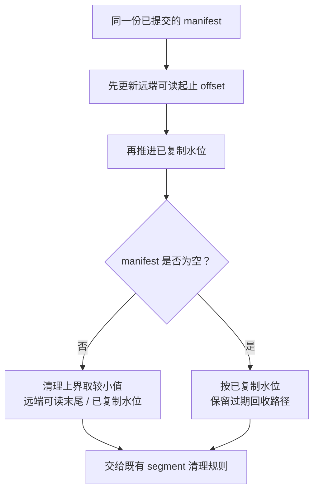
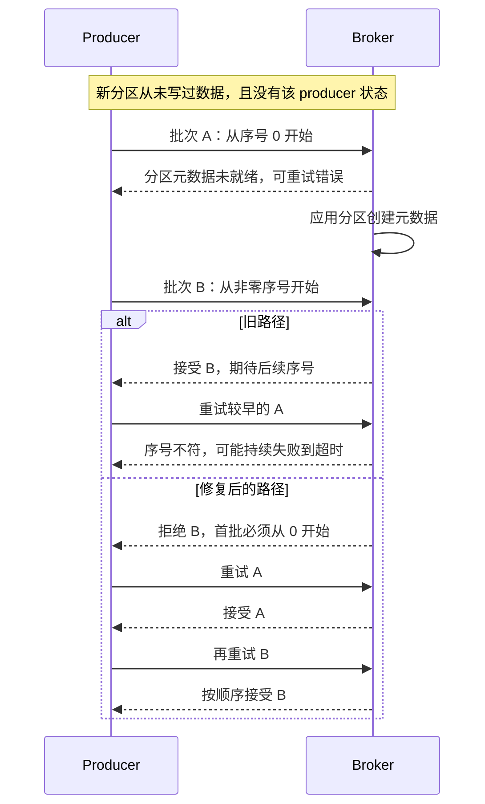
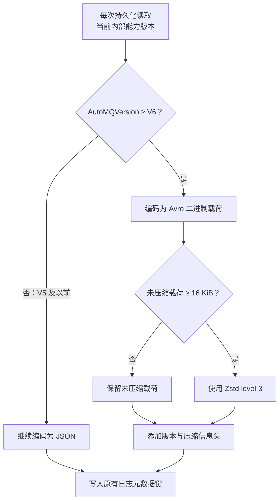

**2026 年 9 月 4 日 09:00—9 月 11 日 09:00（北京时间）**

“写入成功”听起来像一个简单事件：数据进了存储，客户端收到确认，后续就可以读取。但在分层日志系统里，这句话至少涉及三种状态：字节已经持久化，元数据已经让这些字节可被定位，日志顺序也已经确定。它们由不同组件维护，发生时间未必一致。

本周 Kafka、AutoMQ、Fluss 的几项改动，恰好提供了观察这些边界的切口。Fluss 调整远端日志可读范围与本地清理的先后顺序；Kafka 修复新分区第一批消息的序号检查；AutoMQ 同时改进日志元数据的编码与删除重放。把这些案例放在一起，可以讨论三个具体问题：有副本为什么还可能读不到，幂等为什么仍然依赖初始化状态，以及共享存储上的元数据为什么也需要单独设计。本文所选实现均确认在本周合并，尚未核实正式发行版归属。

## Fluss：上传成功之后，还隔着一个“读得见”的条件

分层日志把本地 segment 的内容放入远端存储后，需要允许本地空间逐步回收。这里的 segment 可以理解为一段连续日志，manifest 则记录远端日志的组织与可读范围。读取者不仅需要对象实际存在，还要能根据当前元数据找到对应 offset。

Fluss [PR #4254](https://github.com/apache/fluss/pull/4254) 于 9 月 10 日 20:49 合入 `main`。关键改动是将同一份已提交 manifest 的远端起止 offset 与复制水位放进统一更新路径，并明确顺序：先更新远端可读范围，再推进复制水位，最后触发本地清理。[实现差异](https://github.com/apache/fluss/pull/4254/files)

为什么顺序重要？下面是解释竞态的简化推演，数字不是事故记录。假设一个非空远端日志的可读末尾暂时是 200，复制水位准备推进到 300。offset 范围采用右开区间表示。

| 时刻 | 清理一侧看到的状态 | 读取一侧看到的状态 | 可能结果 |
|---|---|---|---|
| 更新开始前 | 只清理已确认可回收的旧段 | 远端可读取到 200 之前 | 两边一致 |
| 若先把复制水位推进到 300 并清理 | 可能回收 200—300 范围的本地段 | 仍只知道 200 之前可远端读取 | 中间范围可能暂时无可用读路径 |
| 先更新可读边界，再触发清理 | 读路径已能识别新范围 | 远端副本可被定位 | 本地回收有了必要前提 |

这里不一定发生了数据物理丢失。问题可能是字节仍在远端，但负责路由读取的状态尚未更新，导致 fetch 在一个时刻找不到合适的数据来源。对依赖连续日志推进的消费者，这样的可读性空隙同样会表现为失败或重试。

新代码还给非空 manifest 的清理增加了一道上界约束：

```text
本地清理上界 = min(远端可读末尾, 已复制水位)
```

这个关系来自补丁，而上面的 200/300 是说明性数字。它表达的不是“复制多少就删多少”，而是回收范围不能越过当前远端读路径已能覆盖的末尾。空 manifest 有专门分支：当远端旧段全部过期时，仍需允许保留策略前进，不能直接套用同一公式阻塞清理。

**图 1｜Fluss 先公布可读范围，再计算本地清理边界**

*窄屏可横向滑动图示。*



*这张图对应补丁中的更新顺序与边界选择，未展开所有保留策略。连线不代表这些状态更新构成一个跨线程原子事务。*

这是一项**顺序与边界约束**，不意味着函数内部所有状态更新因此成为了一个跨线程原子事务。它启发的工程检查也应具体：在 manifest 生效、offset 更新和本地删除之间插入并发读取，观察该范围是否始终有可用来源；再覆盖空 manifest、恢复后的首个非空范围等生命周期。只验证对象是否上传成功，无法覆盖这些问题。

本周 Fluss 还有 Flink 2.2 lookup join 的 bucket shuffle [PR #3675](https://github.com/apache/fluss/pull/3675)。显式使用 `LOOKUP('table' = 'c', 'shuffle' = 'true')`（`c` 为维表别名）后，探测流可以按 Fluss bucket 路由，改善缓存局部性。代价是增加一次明确的分发选择；桶数、并行度与热点分布共同决定收益，不能由“按桶路由”直接推出负载均衡。该能力依赖有效 bucket key 和 Fluss Catalog 提供的桶数，不带 hint 时维持原分布。

## Kafka：幂等重试仍然需要正确的第一步

Kafka 的幂等生产会使用 producer 身份和批次序号判断请求次序及重复。直觉上，既然请求可重试，即使到达先后发生变化，系统最终应该恢复。但这依赖 broker 对“第一批合法请求”有正确判断。

[PR #23234](https://github.com/apache/kafka/pull/23234) 于 9 月 9 日 15:25 合入 `trunk`，针对自动建主题后立即并发生产的场景。按 PR 描述简化，可以得到下面的时间线：

1. producer 向刚创建的分区发送 A、B 两批数据，A 的序号较早。
2. A 到达时，broker 尚未应用分区创建元数据，返回可重试错误。
3. B 到达时，分区已经就绪，但没有该 producer 的已有状态。旧实现接受了这个较晚的首批序号。
4. A 随后重试，broker 已期待 B 之后的序号；A 又不是已写入数据的重复，因此无法靠去重缓存解释，可能一直失败到交付超时。

问题出在“没有 producer 状态”被当成可以接受任意首批序号。新条件更严格：**如果分区从未追加过记录，也没有该 producer 的状态，第一批序号必须为 0。** 较晚的 B 先被拒绝，才能为较早请求的重试留出正确的序列起点。[生产者状态检查补丁](https://github.com/apache/kafka/pull/23234/files)

**图 2｜新分区并发生产：为什么要先拒绝较晚的批次**



*这是 PR 所述竞态的简化时序，展示 A 能及时重试成功的一条路径；若 A 已交付超时，后续恢复还涉及 producer epoch 处理。它不适用于“曾经写过数据、现在旧状态不可见”的所有分区。*


限定“从未追加过记录”很关键。一个分区也可能曾经有数据，日志后来因保留策略或删除操作被清理；另一种情形是 producer 状态已经过期，而日志记录仍然存在。若把这些情形都当成新分区，强制每个 producer 重新从 0 开始，就可能把正常的后续写入也挡住。因此代码利用日志进度区分“从未写过”与“现在看起来没有旧状态”。

对工程使用者，这个案例说明幂等是一组跨请求的协议约束，测试需要覆盖请求重排与元数据可见性的交叉，而不仅是把完全相同的请求发送两次。自动创建主题、立即开始负载、多个请求同时在途，正好把这些条件组合在一起。交付超时也应作为数据链路的显式失败处理，不能因为配置了幂等就忽略发送结果。

### 回收时钟为什么不能完全相信记录时间？

另一项 Kafka [PR #22873](https://github.com/apache/kafka/pull/22873) 于 9 月 6 日 20:52 合并。分层日志的时间保留原先参考 segment 内最大的记录时间戳。如果某条记录带有远远超前的时间，整个 segment 按该依据看起来就还很“年轻”，即便早已上传，也可能长期占据本地空间。

修复只在启用远端复制、且最大记录时间戳在未来时，回退到 segment 的 `lastModified` 计算年龄；上传完成后才允许删除的既有检查继续生效。非分层日志路径没有因此统一改用文件时间。

它与 Fluss 的改动解决不同问题：Kafka 这一项调整“何时满足时间保留条件”，Fluss 调整“满足回收条件时，远端读路径是否已经就绪”。评估分层日志时，需要把保留资格、数据持久化和可读性三个条件分别验证，不能只依赖一个看起来已经前进的水位。

## AutoMQ：日志很大时，描述日志的数据也会成为负担

对象存储容纳日志字节，并不会自动消除管理日志的成本。系统仍要记录逻辑 segment 与底层存储的对应关系，并在切换、持久化和恢复时处理这些元数据。随着 segment 数量增长，描述结构自身的体积也会增长。

AutoMQ [PR #3574](https://github.com/AutoMQ/automq/pull/3574) 与 [#3576](https://github.com/AutoMQ/automq/pull/3576) 于 9 月 4 日分别合入 `1.8` 和 `main`，将 `ElasticLogMeta` 从单一 JSON 表示推进到兼容两种格式的编码方案。这里包含三个彼此相关的选择。

**首先是体积与编码成本。** 新格式采用 Avro 二进制表示；未压缩的 Avro 载荷达到 16 KiB 时再使用 Zstd level 3，小载荷保持未压缩。可以把它理解为把“减少结构表示的冗余”和“是否值得增加一次压缩”分开决定。作者给出的体积结果对应特定规模的逻辑分区，不能直接换算成恢复速度：恢复还会受到读取、解压、解码、对象重建及其他状态加载的影响。

**其次是迁移时机。** 写入策略跟随当前 AutoMQ 内部能力版本：V6 及以上写新格式，V5 及以前继续写 JSON；读端识别两者。实现每次持久化时读取当前版本，所以格式切换可以随后续持久化发生，而不要求立即主动重写所有历史元数据。这里的 V6 是内部能力版本，不是产品发行版本。[编码与持久化路径](https://github.com/AutoMQ/automq/pull/3576/files)

**最后是错误处理。** 读端只有在新格式标识不匹配时才尝试 JSON。一旦识别为 Avro envelope，却发现版本、属性或内容非法，就直接失败。这个边界有实际意义：格式兼容不能把已经识别出的损坏重新解释成另一种格式，否则最初的错误可能在后续阶段表现得更难定位。双读能力也不能替代完整的混合版本和降级兼容验证。

**图 3｜AutoMQ 元数据写入：版本门槛与压缩门槛分别判断**



*V6 是内部能力版本；16 KiB 指压缩前 Avro 载荷大小。图只展示写入策略，读取端仍需识别旧 JSON 与新格式，并拒绝已识别新格式中的损坏。*


### 重放中的“删除”，必须同时作用于已提交状态和待处理状态

同周的 [#3575](https://github.com/AutoMQ/automq/pull/3575)、[#3577](https://github.com/AutoMQ/automq/pull/3577)、[#3578](https://github.com/AutoMQ/automq/pull/3578) 分别把一项配置重放修复带入 `1.7`、`main`、`1.8`，按同一个变化记录。

可以用一个简化例子理解。基础 image 中尚没有主题 T 的配置，但本轮 delta 已收到了它的配置变更。接着重放主题删除记录，如果清理逻辑只检查基础 image，就会漏掉仍在 delta 中的配置。再创建同名主题时，旧值便可能残留。修复让删除同时检查基础状态与本轮变更，并清理累积配置。[配置重放差异](https://github.com/AutoMQ/automq/pull/3575/files)

这类缺陷不能只靠“重启后能恢复”来验收。更有针对性的序列是：配置更新尚在同一轮重放中时删除主题，再以相同名称创建，检查新主题是否只拥有它自己的配置。名称可复用，而旧对象状态必须有明确的终止边界。

## 跟踪 KIP/FIP，要问清楚方案改的是哪一层

本周有实际实现变化的两个 KIP，说明提案接受与使用者可依赖的 API 之间仍有距离。

| 提案 | 本周事件 | 为什么值得关注 |
|---|---|---|
| [KIP-909：DNS 失败处理](https://cwiki.apache.org/confluence/spaces/KAFKA/pages/240884528/KIP-909+DNS+Resolution+Failure+Should+Not+Fail+the+Clients) | 9 月 10 日 03:09，[#23364](https://github.com/apache/kafka/pull/23364) 合入 `trunk`，Streams/Connect 强制同步 bootstrap DNS | 异步失败需要调用方销毁并重建已失效客户端，而这两个框架尚未适配该契约，正值配置会被覆盖为 0 |
| [KIP-939：参与外部 2PC](https://cwiki.apache.org/confluence/spaces/KAFKA/pages/255071659/KIP-939+Support+Participation+in+2PC) | 9 月 5 日 00:41，[#23356](https://github.com/apache/kafka/pull/23356) 合入 `4.4` 分支，撤回部分 2PC 公共 API | 原文仍为 Accepted；发布分支收回 API 不代表提案被撤回，也不能把内部实现进度当成完整能力已交付 |

对读者来说，KIP-909 涉及的不仅是“DNS 由同步改为异步”，还包括错误在什么时候出现、哪个组件负责恢复。KIP-939 则提示跨系统事务需要完整的公共协议与恢复行为，仅有部分接口不足以构成应用可以依赖的契约。

长期的共享存储方向，本期建立了以下设计基线。三项原文均为 Under Discussion，没有把它们当作本周新提案，也不据此推断已进入 Kafka 正式版本。

| 提案 | 主要设计层次 | 后续值得追问的工程问题 |
|---|---|---|
| [KIP-1163 Diskless Core](https://cwiki.apache.org/confluence/spaces/KAFKA/pages/350783976/KIP-1163+Diskless+Core) | 数据批次存入对象存储，协调器负责批次坐标与分区内顺序；本地数据作为缓存 | 数据 I/O 与排序分离后，写确认、缓存读取和兼容语义如何衔接？ |
| [KIP-1164 Diskless Coordinator](https://cwiki.apache.org/confluence/spaces/KAFKA/pages/350783984/KIP-1164+Diskless+Coordinator) | 以内部元数据日志为事实来源，SQLite 作为可重建的本地物化状态 | 流水处理中的 pending 状态、已复制日志和本地状态，怎样在故障后重新对齐？ |
| [KIP-1183 Unified Shared Storage](https://cwiki.apache.org/confluence/spaces/KAFKA/pages/357960226/KIP-1183+Unified+Shared+Storage) | 抽象 log / segment，使经典与共享存储实现可以共存，并提出可选 Stream 层 | 抽象是否能覆盖不同后端的追加、读取与裁剪语义，同时控制上层维护成本？ |

这三项不能简单按“都用了对象存储”归为同一种方案：Core/Coordinator 对数据与排序职责做了具体分工，Unified Shared Storage 更强调扩展日志实现的边界。比较它们时，需要分别考察兼容语义、协调成本和后端适配范围；仅比较是否声称节约存储费用，容易漏掉真正的实现差异。

Fluss [FIP 目录](https://cwiki.apache.org/confluence/spaces/FLUSS/pages/372214312/Fluss+Improvement+Proposals) 中的 FIP-3、FIP-6、FIP-9 则分别对应 Iceberg 分层、union read 解耦和 CoordinatorServer 高可用，目录均列为 Accepted。后续将继续跟踪湖格式读写语义、连接器边界和旧 leader 的 fencing。FIP-9 的目标 1.0 仍只是目录信息；本期未完整复核邮件投票或实际发行归属。

对 AutoMQ，另有 [#3584](https://github.com/AutoMQ/automq/pull/3584) 在 9 月 8 日合入 `1.8`，记录合并上游 Kafka 3.9.2。它与上述 KIP 状态分别跟踪，不能仅凭上游合并标题就断言某个 KIP 在 AutoMQ 中已经完整交付。

下一轮最有价值的观察，是这些约束有没有继续延伸到恢复和版本兼容路径：复制水位与可读范围能否在故障后保持一致，新格式能否在真实升级流程中安全迁移，提案 API 又何时形成应用能够依赖的稳定行为。这比重复记录“又支持了一项功能”更能帮助判断一个方案是否适合进入自己的系统。
