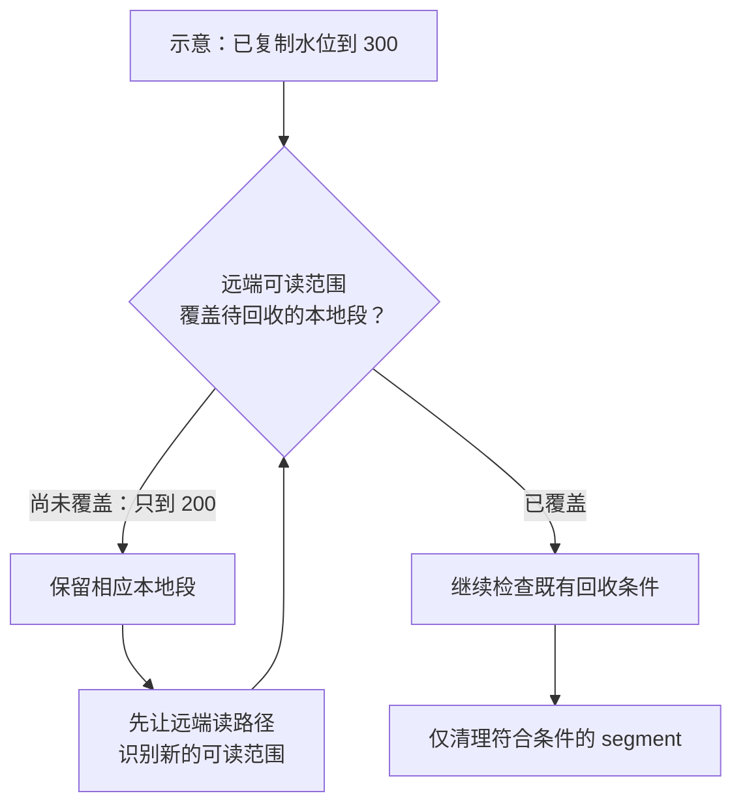

**2026 年 9 月 4 日 09:00—9 月 11 日 09:00（北京时间）**

一条数据链路在平稳负载下跑通，并不难证明；当文件读取中断、主题刚刚创建、日志副本迁移，或者推理请求突然涌入时，“成功”的含义就需要重新检查。任务结束可能仍有数据缺块，远端对象已经存在却暂时不能被读取，缓存命中也可能指向错误的上下文。

本期最值得带走的三个判断是：**类型与元数据决定跨引擎互操作的实际边界；存储回收和故障恢复需要明确状态生效的顺序；AI 服务的容量与缓存必须连同失败重试一起评估。** 下文逐项解释这些判断。vLLM、SGLang 收录的是本周版本发布；其余所选实现只确认本周合并，尚未核实正式发行版归属。七月论文用于补充设计背景。

## 数据湖处理：能读到一列，还要确认读回的是同一个值

湖仓互操作容易被概括为“某引擎支持某种表格式”。但从文件到引擎内部对象，中间还隔着类型转换、字段映射、删除语义和元数据解释。文件成功打开，仅说明这些环节没有立即报错。

Iceberg 本周合并的修复，发生在 Flink 读取数组、Map 内时间戳的转换路径：旧代码先把时间值降为毫秒，再计算毫秒内余量，因而可能丢掉微秒。例如原值小数部分为 `.123456`，转换后可能只剩 `.123`。补丁保留足够精度，再拆出毫秒与剩余纳秒。[Iceberg #18001](https://github.com/apache/iceberg/pull/18001)

这类错误为什么值得关注？可以做一个场景推演：两条业务事件只相差几十微秒，进入下游引擎后时间值被压成相同值，原本用于排序或比较的依据便发生变化。数据行数完全相同，常规“能否读取”的验收也会通过。因此，跨引擎测试至少需要同时覆盖嵌套类型和边界值，而不只是比对顶层列名及记录数量。这是由机制推导出的风险场景，并非本期发现的线上事故。

Trino 的另一项改动，为 Iceberg reader 增加 Parquet 页级跳读：利用文件里的列索引与谓词，在读取更细粒度的数据页时跳过不可能命中的部分。收益有一个容易忽略的前提——**文件必须已经带有相应索引**。该 PR 明确指出，Trino 的 Iceberg writer 当时仍不生成这些索引，因而开启读取能力不等于所有既有数据都会自动减少扫描。[Trino #30971](https://github.com/trinodb/trino/pull/30971)

其他变化继续细化这条链路。Paimon REST Catalog 增加展示用的 schema 历史查询，便于追溯结构变化；Hudi 补齐 Flink 对 Lance 顶层 FLOAT/DOUBLE VECTOR 的读写，区分普通数组与固定维度向量，并保留向量身份。这分别解决元数据可观察性和类型保真问题，不能扩大为新的远程 schema 修改体系或向量检索服务。[Paimon #9673](https://github.com/apache/paimon/pull/9673) · [Hudi 写入](https://github.com/apache/hudi/pull/19831) · [Hudi 读取](https://github.com/apache/hudi/pull/19842)

Delta Kernel 则处理失败写入的另一面：输入迭代到一半抛出异常，资源清理仍会关闭 writer；若 close 继续 flush 并写 footer，部分输出就可能成为一个看起来有效的文件。新增 abort 路径把“结束资源使用”与“成功发布输出”分开，但保障仍依赖临时文件机制或底层输出流的 abort 能力。[Delta #7221](https://github.com/delta-io/delta/pull/7221)

对湖仓使用者，这些案例建议把验收拆成三层：值和类型能否往返保真，读取优化所依赖的文件元数据是否真的存在，失败后的输出是否仍会变得可见。详细的页索引示例、VECTOR 边界与失败路径见[数据湖处理分稿]({{ '/posts/tech-research/week-11/lakehouse/' | relative_url }})。

## 流存储：数据已经复制，为什么仍然可能读不到？

分层日志通常需要将本地 segment 放到远端，再逐步释放本地空间。这里至少有两个不同进度：数据已经复制到哪里，以及当前元数据允许读取者访问到哪里。只有前者前进，后者没有跟上，本地回收就可能跑得太快。

Fluss 本周的修复把更新顺序明确下来：对同一份已提交 manifest，先更新远端可读起止 offset，再推进复制水位并触发本地清理。非空 manifest 的清理上界还被限制为“远端可读末尾”与“已复制水位”的较小值。[Fluss #4254](https://github.com/apache/fluss/pull/4254)

用一组说明性数字理解：若复制水位已经到 300，而读路径暂时只知道 200 之前可以从远端读取，此时删除对应的本地段，就可能让 200—300 这段范围暂时没有可用读路径。字节或许一直存在，缺的是读请求可以依赖的定位状态。修复让本地删除等待必要的可读条件；空 manifest 仍有专门的过期回收逻辑，不能把同一个规则无条件套到所有生命周期。

**图 1｜从“已复制”到“可安全回收”，中间还有读路径检查**

*窄屏可横向滑动图示。*

*图中数字沿用上文推演，展示非空 manifest 的核心约束。复制完成不会绕过可读性和其他回收条件；空 manifest 的特殊路径见流存储分稿。*

Kafka 另一个本周修复处理“第一批消息”的顺序。自动建主题后，较早请求可能因为分区元数据尚未就绪而失败，较晚请求却在元数据就绪后先被接受。此时较早批次的重试会落在 broker 期待序号之前，可能持续失败到交付超时。新检查要求：从未写过记录且没有该 producer 状态的分区，首批序号必须从 0 开始。它维护的是幂等协议的初始条件，并不是简单增加重试次数。[Kafka #23234](https://github.com/apache/kafka/pull/23234)

另一项 Kafka 变化调整分层日志的回收时钟：记录携带未来时间戳时，改用文件修改时间作为本地时间保留依据，仍保留上传完成后才可删除的检查。AutoMQ 则为日志元数据增加 Avro 编码和条件压缩，并修复主题删除重放遗漏本轮待处理配置的问题。前者关注何时满足回收资格，后两者关注描述日志的成本与状态清理；它们都需要在相应的故障或生命周期场景下验证。[Kafka #22873](https://github.com/apache/kafka/pull/22873) · [AutoMQ #3576](https://github.com/AutoMQ/automq/pull/3576) · [#3575](https://github.com/AutoMQ/automq/pull/3575)

因此，本周更有价值的演练是交叉制造状态变化：manifest 生效时并发读取，分区创建时并发生产，配置仍在重放时删除并重建主题。它们检验的是两个组件对同一个对象是否仍有一致理解。[流存储分稿]({{ '/posts/tech-research/week-11/streaming/' | relative_url }})进一步给出失败时序、回收关系图，以及共享存储 KIP 的设计层次对照。

## 分布式存储：恢复任务完成，不等于内容已被核对

备份恢复之后，逻辑数据可能落到不同的服务器，分片数量和边界也可能变化。如果校验结果依赖物理布局，就无法直接比较恢复前后；若把全部数据搬给外部客户端计算，校验本身又可能带来很高的传输成本。

FoundationDB 新增的 RangeDigest 在数据所在服务器计算键值内容的叶子哈希，再用可交换、可结合的加法聚合摘要。这样，数据分成两片或三片，聚合顺序如何，只要每个相同键值对恰好计算一次，结果就不受分组方式影响。计算仍需全量读取，优化的是计算位置与摘要汇总方式。[FoundationDB #13866](https://github.com/apple/foundationdb/pull/13866)

其当前前提尤其值得单独看：**停写保护同一份逻辑状态，停止迁移保护每个键恰好被计算一次。** 前者不成立，不同服务器可能混合读到不同提交时刻的数据；后者不成立，同一个键可能在迁移前后的两个位置重复计入，或被遗漏。因此它适合受控的静止数据集恢复核验，不能直接当作在线一致快照的审计工具。摘要也不是绝无碰撞的数学证明。

JuiceFS 的目录项修复从另一个角度检查对象身份：操作读到路径 `a` 指向 inode1，另一个事务随后让同一路径指向 inode2，原操作若仍只按名称删除，就可能误伤新对象。修复将身份条件带入真正的修改语句，并通过受影响行数触发重试。一个名字可以复用，但“仍是我刚才读到的那个目录项”需要额外证据。[JuiceFS #7476](https://github.com/juicedata/juicefs/pull/7476)

同周 JuiceFS 还隔离了超时后迟到的读取结果，防止后台回调在外层返回尚未完成的窗口中覆盖错误状态；Ceph 则把 RGW 去重的池能力检查从启动阶段移到实际处理阶段，避免空集群尚未建池就初始化失败。这分别提示我们关注结果发布资格和资源生命周期。[JuiceFS #7500](https://github.com/juicedata/juicefs/pull/7500) · [Ceph #71568](https://github.com/ceph/ceph/pull/71568)

这些改动可以转化为更具体的验收记录：恢复后比对的是什么状态，修改时匹配的是什么身份，超时后还有谁能交付结果。聚合公式、目录项时序和 WriteGuards 的所有权机制见[分布式存储分稿]({{ '/posts/tech-research/week-11/distributed-storage/' | relative_url }})。

## AI Infra：容量、缓存命中与重试，必须放到同一条链路里

LLM 请求数相同，不代表积压工作量相同。短问答和长文档请求对 prefill 的需求不同；如果入口持续接单，GPU 看起来始终很忙，队尾用户的首 token 延迟却可能越来越差。客户端超时再发一次，又会把旧积压叠加成新流量。

vLLM **v0.29.0 在 9 月 9 日发布**，交付请求数和 prompt token 数两类准入上限，超限返回 503。请求数覆盖等待与运行中的请求，token 计数关注仍处于 prefill 的请求。两个阈值默认关闭，因此版本升级之后还需要主动配置容量边界。[vLLM 发布说明](https://github.com/vllm-project/vllm/releases/tag/v0.29.0) · [准入实现](https://github.com/vllm-project/vllm/pull/49445)

这套估计有意保守：它使用完整 prompt 长度，没有扣除已完成的 chunked prefill 或前缀缓存命中。若两个各带 12,000 token 的请求均已接纳且仍处于 prefill，相关计数合计为 24,000；即便公共前缀已经缓存，也不一定获得准入折扣。这是说明性计算，不是吞吐评测。它降低了入口与内部进度同步的复杂度，代价是有时会提前拒绝。合理评估应同时观察拒绝率、有效完成吞吐、TTFT 和上游重试，零拒绝未必意味着更好的服务。

**SGLang v0.5.19 在 9 月 5 日发布**，默认采用统一 radix tree，并包含 L3 存储热挂载与流水线并行缓存一致性相关实现。其一项细节很有代表性：挂载存储之前建立的缓存节点可能没有完整存储哈希，必须先按父子顺序补齐，否则一个键可能只代表后缀，错误复用另一个上下文的 KV。相同的文本片段出现在不同前文之后，并不意味着可复用同一份状态。[SGLang 发布说明](https://github.com/sgl-project/sglang/releases/tag/v0.5.19) · [哈希补齐](https://github.com/sgl-project/sglang/pull/35269)

缓存容量变大之后，命中还可能伴随慢层加载与并行 rank 等待。因此，缓存评估需要同时确认身份正确、数据就绪和加载代价，而不只统计命中率。OSDI '26 Strata 的设计讨论了布局、I/O 与调度如何配合，适合为这类评估提供背景；论文方案与某个本周 PR 的具体范围仍需区分。

数据准备链路也出现了一项清晰的重试案例。Ray 的一项文件数据源修复指出：重试迭代器准备“从头重放，再跳过已交付项”，底层却复用了已经前移的文件句柄，于是把后面的真实数据再跳过一遍，任务可能成功但缺块。修复每次重试重新打开文件，让两层契约一致，代价是重复读取和解析；Parquet 不走这条路径。[Ray Data #66011](https://github.com/ray-project/ray/pull/66011)

Ray Serve 同周还统一由 controller 聚合扩缩容指标；关联列式编码组件虽已合并，但尚未接入运行链路，不能采用其完整链路基准作为本周已交付加速。[指标聚合](https://github.com/ray-project/ray/pull/65714) · [编码边界](https://github.com/ray-project/ray/pull/64281) · [AI Infra 分稿]({{ '/posts/tech-research/week-11/ai-infra/' | relative_url }})

## 提案跟踪：设计被接受以后，还要继续看交付边界

本期首次建立状态基线，下表只展开有本周实现事件的 KIP。原文的 Accepted 本身不是本周新增变化。

| 提案 | 本周变化 | 对使用者的意义 |
|---|---|---|
| KIP-909 | Streams/Connect 强制同步 bootstrap DNS | 异步失败需要重建已失效客户端，框架尚未适配此恢复契约。[#23364](https://github.com/apache/kafka/pull/23364) |
| KIP-939 | `4.4` 分支撤回部分 2PC 公共 API | 原文仍为 Accepted；不能把提案接受、内部实现和公共能力交付视为同一步。[#23356](https://github.com/apache/kafka/pull/23356) |

KIP-1163/1164/1183、FIP-3/6/9 的长期观察与设计层次对照见[流存储分稿]({{ '/posts/tech-research/week-11/streaming/' | relative_url }})。后续将分别核对实现范围与实际发行，不把目录目标当作交付证据。

## 用论文把本周案例放回更长的设计问题

本期背景论文均发表于七月，不计作本周新论文。我们读取了 [WriteGuards](https://www.usenix.org/system/files/osdi26-mao-ziming-writeguards.pdf) 的动机与核心正确性机制，以及 [Strata](https://www.usenix.org/system/files/osdi26-xie-zhiqiang.pdf) 的问题分析和设计章节，未复现评测。

WriteGuards 讨论缓存所有权已经切换后，旧节点的在途写入如何在存储端被拒绝。它帮助区分两个容易混淆的保证：本地不再接受迟到结果，与远端不再允许旧操作生效。Strata 则把多层上下文缓存放入 I/O 和调度问题中，提示“保存更多”与“更快使用”需要不同机制。论文与本周实现的关系是设计问题上的对照，不能把一个系统的结论直接套到另一个系统。

后续值得继续讨论两个选题：**分层日志如何证明本地副本可以安全删除？共享上下文的加载、准入和重试预算应该怎样共同设计？** 前者可以沿 manifest、可读水位与恢复路径深入，后者可以用突发流量和冷暖缓存组合实验检验。本期其他会议论文的窗口筛查仍不完整，详细证据和边界见 [来源清单](https://github.com/BryantChang1992/ai_memory_chang_ai_team/blob/main/docs/drafts/weekly/2026-09-11/sources.json) 与 [核验范围说明](https://github.com/BryantChang1992/ai_memory_chang_ai_team/blob/main/docs/drafts/weekly/2026-09-11/review.md)。
